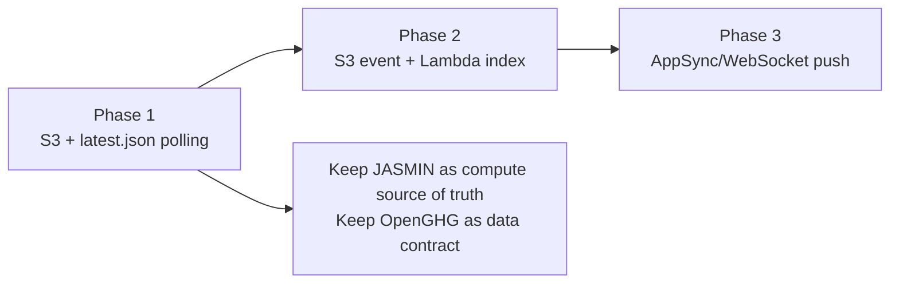
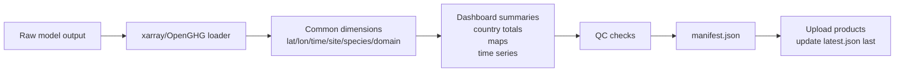
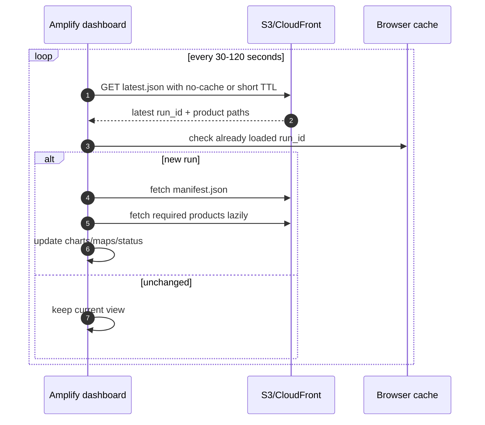
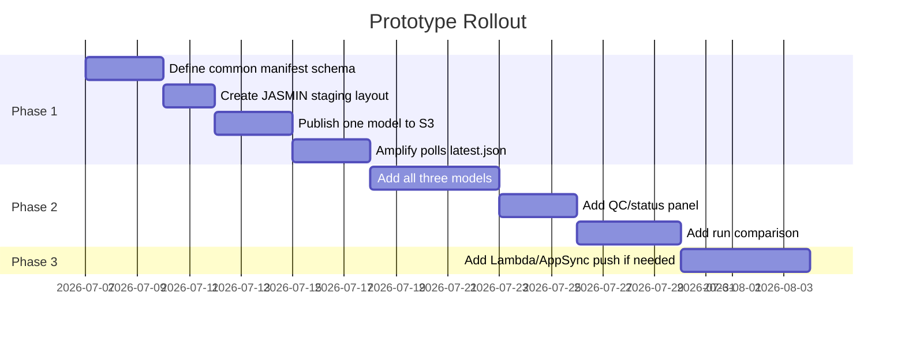

# Implementation Notes For A Low-Budget Responsive Dashboard

## Preferred Architecture

Use **Option 1 now**, with a deliberate migration path to **Option 2**.



## Decision Matrix

| Option | Budget | Responsiveness | Complexity | Best For | Main Tradeoff |
|---|---:|---:|---:|---|---|
| Option 1: S3 polling | Lowest | Good, 30-120 sec | Low | First production prototype | Polling is not true push |
| Option 2: Event-driven push | Low-medium | Excellent | Medium | Live user experience | More AWS services |
| Option 3: Queue-backed ingestion | Medium | Excellent | Higher | Production robustness, bursts, retries | More ops and monitoring |
| Option 4: GitOps rebuild | Very low runtime | Slow | Low-medium | Infrequent static releases | Not suitable for frequent live updates |

## JASMIN Side

### Required Pieces

- Shared JASMIN workspace for model code, configs, outputs, logs, and dashboard staging.
- OpenGHG object stores for shared observations, footprints, boundary conditions, and flux priors.
- A reproducible Python environment for each model, ideally Pixi/Conda/Mamba modules or containerised jobs if available.
- A common post-processing environment with:
  - `openghg`
  - `openghg_inversions`
  - `xarray`
  - `netcdf4` / `h5netcdf`
  - `zarr`
  - `pandas`
  - `awscli` or `rclone`
- A run registry file or lightweight SQLite database in the workspace to track submitted/running/published/failed runs.

### Scheduling Options

| Scheduler | Good For | Notes |
|---|---|---|
| cron -> `sbatch` | Simple periodic jobs | Good first option. Cron should submit Slurm jobs, not run models directly. |
| Slurm job arrays | Repeating over sites/species/months | Good for parallel model windows. |
| Slurm dependencies | Model -> postprocess -> publish chains | Use `--dependency=afterok:<jobid>` for clean handoff. |
| Cylc | Operational scientific workflows | Good if you already use suite-style atmospheric workflows. |
| Nextflow/Snakemake | Explicit DAGs, reproducibility | Good if model dependencies grow. |
| GitHub Actions | Triggering only, not heavy compute | Can call a JASMIN endpoint or create a request file, but should not run the science workload. |

### JASMIN Workflow Contract

Each model should end in a common OpenGHG-aware publishing step:



## Common Dashboard Product Contract

### Minimum Manifest Fields

```json
{
  "schema_version": "openghg-dashboard/v1",
  "run_id": "ch4-europe-model-a-2026-07-07T120000Z",
  "created_at": "2026-07-07T12:00:00Z",
  "status": "published",
  "model": {
    "name": "Model A",
    "version": "x.y.z",
    "git_commit": "abc123"
  },
  "openghg": {
    "version": "x.y.z",
    "object_store": "jasmin-store-name"
  },
  "domain": "EUROPE",
  "species": "ch4",
  "period": {
    "start": "2026-07-01",
    "end": "2026-07-07"
  },
  "products": {
    "flux": "runs/<run_id>/products/flux.zarr",
    "concentration": "runs/<run_id>/products/concentration.parquet",
    "map_summary": "runs/<run_id>/products/map_summary.geojson"
  },
  "qc": {
    "status": "passed",
    "warnings": []
  }
}
```

### Suggested Product Formats

| Product | Preferred Format | Dashboard Use |
|---|---|---|
| Full science gridded output | NetCDF or Zarr | Download/reproducibility, deeper analysis |
| Browser-friendly time series | Parquet or JSON | Fast chart loading |
| Country/region totals | Parquet/JSON | Tables and comparisons |
| Map rasters | Cloud-Optimized GeoTIFF, Zarr, or precomputed PNG tiles | Fast maps |
| Vector overlays | GeoJSON or PMTiles | Boundaries, footprints, stations |
| Run metadata | JSON | Latest pointer, filters, provenance |

## AWS Side For Option 1

### Minimal Services

- AWS Amplify Hosting for the existing frontend.
- S3 bucket for dashboard data.
- Optional CloudFront distribution if you need tighter cache control than Amplify defaults.
- IAM user/role with write access only to the dashboard bucket/prefix from JASMIN.

### S3 Prefix Layout

```text
s3://<dashboard-bucket>/
  latest.json
  catalog.json
  runs/
    <run_id>/
      manifest.json
      products/
        flux.nc
        flux.zarr/
        country_totals.parquet
        stations.json
      logs/
        qc.json
```

### Frontend Behaviour



## AWS Side For Option 2

### Additional Services

- S3 Event Notifications or EventBridge.
- Lambda ingest function.
- DynamoDB table for run metadata.
- AppSync subscriptions or AppSync Events for WebSocket push.
- Optional Cognito if dashboard access is restricted.

### DynamoDB Table Shape

| Partition Key | Sort Key | Attributes |
|---|---|---|
| `domain#species` | `created_at#run_id` | status, model, period, manifest path, QC summary |
| `latest` | `domain#species` | latest run ID and manifest path |

## Security And Governance

- Use least-privilege AWS credentials on JASMIN.
- Prefer an IAM role or short-lived credentials if your institutional setup supports it.
- Restrict writes to `s3://<bucket>/incoming/` or `runs/`; do not allow delete unless needed.
- Use S3 bucket policies and CORS limited to the Amplify dashboard domain.
- Keep sensitive input paths, credentials, and user names out of public manifests.
- Include provenance, but avoid exposing raw JASMIN filesystem paths if the dashboard is public.

## Monitoring

### JASMIN

- Slurm job status and exit codes.
- Model runtime and memory.
- OpenGHG store availability.
- Publisher success/failure.
- Transfer success/failure.
- Last successful `latest.json` update time.

### AWS

- S3 object count and storage.
- Lambda errors/throttles if using Option 2/3.
- SQS queue depth and DLQ messages if using Option 3.
- DynamoDB read/write throttles if using Option 2/3.
- Amplify build/deploy status.

## Practical First Milestones



## Official AWS References

- AWS Amplify Hosting: https://docs.aws.amazon.com/amplify/latest/userguide/welcome.html
- Amazon S3 Event Notifications: https://docs.aws.amazon.com/AmazonS3/latest/userguide/EventNotifications.html
- AWS Lambda: https://docs.aws.amazon.com/lambda/latest/dg/welcome.html
- AWS AppSync real-time subscriptions: https://docs.aws.amazon.com/appsync/latest/devguide/aws-appsync-real-time-data.html
