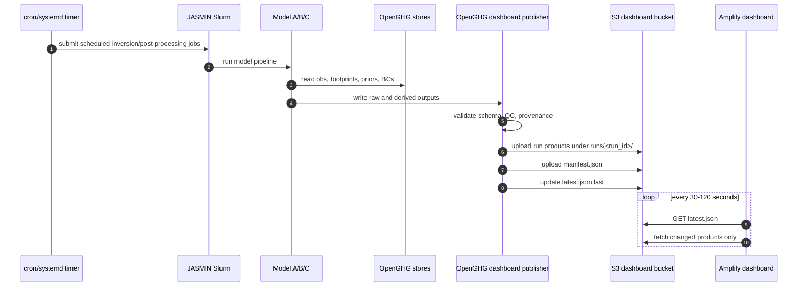

# Option 1: Low-Budget S3 Polling Dashboard

Best first version: low cost, simple, resilient, and compatible with AWS Amplify static hosting.

```mermaid
flowchart LR
    subgraph JASMIN[JASMIN HPC Workspace]
        SCHED[Scheduler\ncron -> sbatch\nor Slurm job array]
        subgraph MODELS[Three Model Pipelines]
            M1[Model A\nOpenGHG inputs]
            M2[Model B\nOpenGHG inputs]
            M3[Model C\nOpenGHG inputs]
        end
        OGHG[OpenGHG Object Stores\nobs, footprints, flux, BCs]
        POST[OpenGHG Normalisation\nstandard units, coords,\nmetadata, provenance]
        QC[QC + Validation\nschema checks\nmissing vars\nrange checks]
        PUB[Dashboard Publisher\nNetCDF/Zarr/Parquet/GeoJSON\nmanifest.json]
        SYNC[Transfer Step\naws s3 sync or rclone\nleast-privilege IAM]
    end

    subgraph AWS[AWS Low-Cost Data Plane]
        S3[(S3 dashboard bucket\nruns/<run_id>/products\nruns/<run_id>/manifest.json\nlatest.json)]
        CF[CloudFront or Amplify CDN\ncache latest.json lightly]
    end

    subgraph FRONTEND[AWS Amplify Hosted Dashboard]
        APP[React/Vue/Svelte/Next SPA]
        POLL[Poll latest.json\n30-120 sec interval]
        FETCH[Fetch products\nlazy load by variable/time/domain]
        VIEW[Maps, charts, tables,\nrun comparison, status badges]
    end

    SCHED --> M1
    SCHED --> M2
    SCHED --> M3
    OGHG --> M1
    OGHG --> M2
    OGHG --> M3
    M1 --> POST
    M2 --> POST
    M3 --> POST
    POST --> QC
    QC --> PUB
    PUB --> SYNC
    SYNC --> S3
    S3 --> CF
    CF --> POLL
    APP --> POLL
    POLL --> FETCH
    FETCH --> VIEW

    classDef jasmin fill:#e8f3ff,stroke:#2364aa,color:#111;
    classDef aws fill:#fff4d6,stroke:#b88700,color:#111;
    classDef ui fill:#edf8e9,stroke:#3a7d44,color:#111;
    class SCHED,M1,M2,M3,OGHG,POST,QC,PUB,SYNC jasmin;
    class S3,CF aws;
    class APP,POLL,FETCH,VIEW ui;
```

## Operational Flow

## Components

| Layer | Suggested Software | Purpose |
|---|---|---|
| JASMIN scheduling | cron submitting `sbatch`, Slurm job arrays, or Cylc/Nextflow/Snakemake later | Start models and post-processing reliably |
| Scientific data | OpenGHG object stores | Common source of obs, footprints, boundary conditions, flux priors |
| Output normalisation | Python, xarray, OpenGHG Inversions post-processing | Convert each model to common dashboard schema |
| Artefact format | NetCDF for science, Zarr for chunked cloud reads, Parquet for tables, GeoJSON/PMTiles for maps | Dashboard-friendly products |
| Transfer | AWS CLI, rclone, or JASMIN transfer node | Push published artefacts to S3 |
| AWS storage | S3 | Cheap durable data plane |
| Frontend | AWS Amplify Hosting | Existing dashboard hosting |

## Budget Profile

- Very low AWS cost.
- No always-on backend.
- Latency depends on model runtime plus upload time plus polling interval.
- Good first production prototype.

## Risks And Mitigations

- **Partial uploads**: write run products first, then `manifest.json`, then `latest.json`.
- **Stale dashboard cache**: set low cache TTL for `latest.json`; longer cache for immutable run products.
- **Credential exposure**: use a narrow IAM user/role that can write only the dashboard S3 prefix.
- **Large NetCDF reads in browser**: generate smaller dashboard products, map tiles, or pre-aggregated time series.

