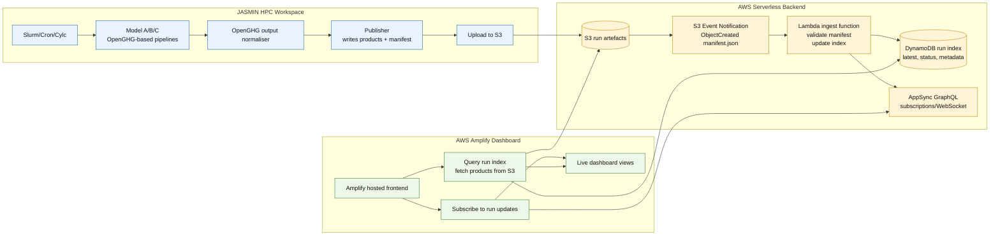
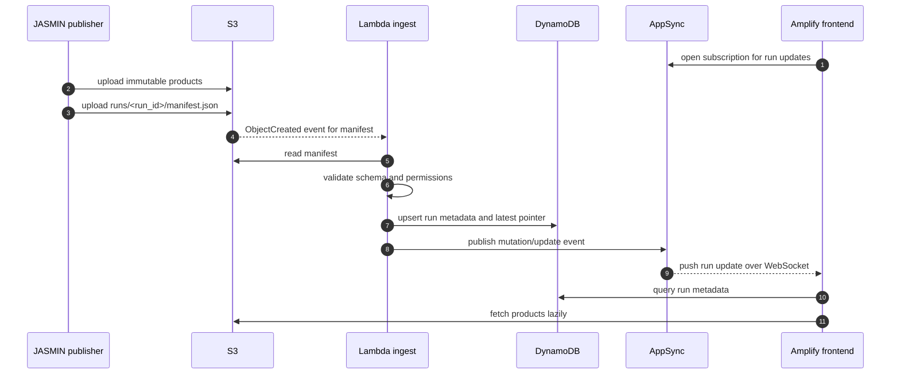

# Option 2: Event-Driven Push Dashboard

Use this when the dashboard should update almost immediately after a run lands, without frontend polling.

## Event Flow

## Components

| Layer | Suggested Software | Purpose |
|---|---|---|
| Upload | AWS CLI/rclone from JASMIN | Same as Option 1 |
| Event trigger | S3 Event Notifications or EventBridge | Notify AWS when a manifest appears |
| Processing | Lambda | Validate manifest, enrich metadata, update indexes |
| Metadata index | DynamoDB | Fast latest/run lookup for frontend |
| Live push | AppSync subscriptions or AppSync Events | WebSocket updates to connected dashboard clients |
| Frontend | Amplify + Amplify client libraries | Hosted dashboard with real-time updates |

## Budget Profile

- Still low cost for modest usage.
- More AWS moving parts than Option 1.
- Better perceived responsiveness.

## Risks And Mitigations

- **At-least-once S3 events**: make Lambda idempotent using `run_id` and manifest checksum.
- **Bad manifest**: write failed validation status to DynamoDB and do not update latest pointer.
- **WebSocket complexity**: keep polling fallback in the frontend.
- **Browser overload**: push only metadata events; fetch large products separately.

