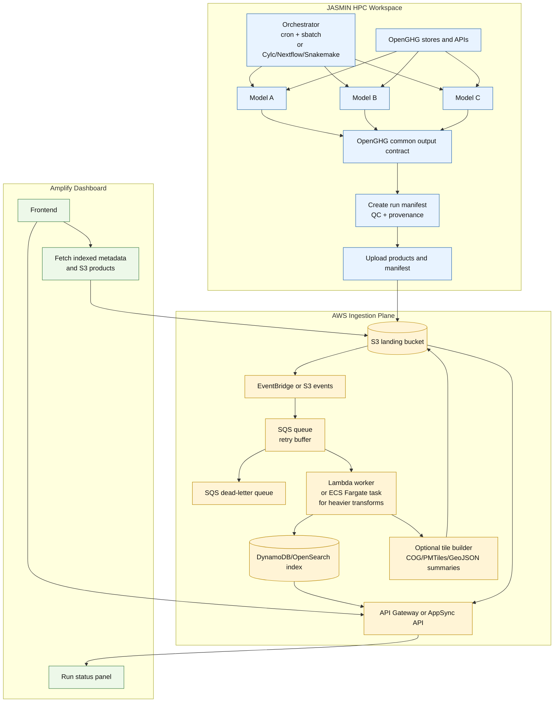
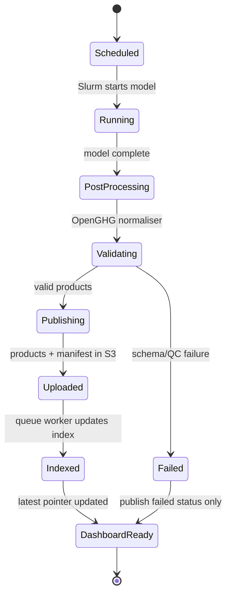

# Option 3: Queue-Backed Robust Ingestion

Use this if multiple models finish close together, outputs are large, or you want retries and dead-letter handling.

## State Machine

## Components

| Layer | Suggested Software | Purpose |
|---|---|---|
| JASMIN orchestration | cron+Slurm for simple, Cylc/Nextflow/Snakemake for dependency graphs | Coordinate three model pipelines |
| Transfer | AWS CLI, rclone, Globus then AWS import if needed | Move only dashboard products to AWS |
| Queue | SQS | Retry buffer and burst smoothing |
| Worker | Lambda for light manifests, ECS Fargate for heavy transformations | Validate, index, generate derived dashboard assets |
| Failure handling | SQS DLQ, CloudWatch alarms | Avoid silent ingestion failures |
| Index | DynamoDB for simple run metadata, OpenSearch for text/spatial search | Dashboard discovery and filtering |

## Budget Profile

- Moderate but still serverless.
- Good resilience for production.
- More setup than Options 1 and 2.

## Risks And Mitigations

- **Too much transformation in Lambda**: use Lambda for metadata only; precompute scientific products on JASMIN or use Fargate.
- **Queue backlog**: expose backlog metrics in a dashboard admin panel.
- **Duplicate events**: idempotent worker keyed by `run_id` + manifest checksum.
- **Schema drift between models**: version the OpenGHG dashboard contract.

