# Option 4: GitOps / Amplify Rebuild

Use this only when updates are infrequent and a rebuild-per-run is acceptable. It is simple to reason about but not ideal for highly responsive dashboards.

```mermaid
flowchart LR
    subgraph JASMIN[JASMIN HPC Workspace]
        MODELS[Model A/B/C\nOpenGHG pipelines]
        EXPORT[Export small dashboard JSON\nor static site data bundle]
        BOT[GitHub deploy token\ncommit data bundle]
    end

    subgraph GITHUB[GitHub]
        REPO[(Dashboard repository)]
        ACTIONS[Optional GitHub Actions\nschema check]
    end

    subgraph AWS[AWS Amplify Hosting]
        AMPLIFY[Amplify connected branch]
        BUILD[Amplify build]
        CDN[Amplify CDN deploy]
    end

    subgraph USER[Users]
        UI[Dashboard loads latest deployed build]
    end

    MODELS --> EXPORT --> BOT --> REPO
    REPO --> ACTIONS --> AMPLIFY
    REPO --> AMPLIFY
    AMPLIFY --> BUILD --> CDN --> UI

    classDef jasmin fill:#e8f3ff,stroke:#2364aa,color:#111;
    classDef gh fill:#f3f3f3,stroke:#555,color:#111;
    classDef aws fill:#fff4d6,stroke:#b88700,color:#111;
    classDef ui fill:#edf8e9,stroke:#3a7d44,color:#111;
    class MODELS,EXPORT,BOT jasmin;
    class REPO,ACTIONS gh;
    class AMPLIFY,BUILD,CDN aws;
    class UI ui;
```

## When This Works

- Output bundles are small.
- Updates happen hourly/daily, not every few minutes.
- You want a fully static dashboard with no runtime AWS backend.
- You want every dashboard data release versioned in Git.

## When To Avoid

- Large NetCDF/Zarr artefacts.
- Frequent model runs.
- Need live status indicators.
- Need user-specific filtering over many runs.

## Budget Profile

- Very low runtime cost.
- Build minutes and repository bloat can become the hidden cost.

## Better Variant

Keep GitHub for dashboard source code only, but publish data to S3 as in Option 1. This avoids committing scientific output artefacts while preserving Amplify’s Git-based deployment workflow.

