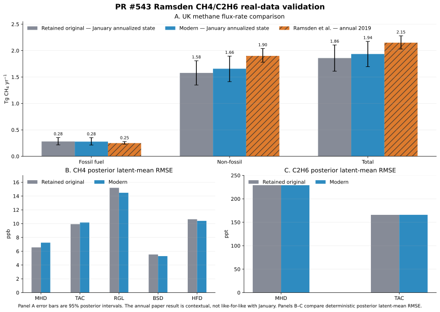

Ramsden real-data validation
============================

Outcome
-------

The experimental implementation at model commit ``f0d27d7`` closely
reproduces the retained original January 2019 inversion. The annualized UK
fossil-fuel methane posterior mean changes by only 0.96%, all 49 regional 95%
posterior intervals overlap, and the regional fossil-fuel posterior-mean
correlation is 0.980.

Observation-space posterior latent means are also nearly identical. The
original-versus-modern correlations are 0.9983 for methane and 0.999963 for
ethane.

The validation also reproduces the principal scientific warning in the
original analysis: both ethane model-error parameters concentrate at their
50 ppt upper bound. Modern ethane 90% posterior-predictive coverage is only
32.9% at MHD and 40.4% at TAC. This supports the implementation as a faithful,
runnable historical comparison; it does not establish that the current
ethane likelihood is scientifically production-ready.

What was tested
---------------

The validation used retained real-data observations and sensitivity matrices
for January 2019:

.. list-table:: Final validation configuration
   :header-rows: 1
   :widths: 28 72

   * - Item
     - Configuration
   * - Code
     - Experimental model at ``f0d27d7``.
   * - Period
     - 1--31 January 2019, nominal four-hour observations.
   * - Methane observations
     - 331 values at MHD, TAC, RGL, BSD, and HFD; numeric units ppb.
   * - Ethane observations
     - 117 values at MHD and TAC; numeric units ppt.
   * - Spatial state
     - 49 retained quadtree basis regions, with identical reconstructed maps
       for both channels.
   * - Methane design
     - Fossil and non-fossil source terms plus four boundary terms.
   * - Ethane design
     - Fossil source term only plus four boundary terms.
   * - Coupling
     - Shared 49-region fossil methane scaling state; no non-fossil ethane
       contribution.
   * - Likelihood
     - Independent Gaussian channels with measurement error plus inferred
       absolute site-month model error; ``min_error=0``.
   * - Sampler
     - Four NumPyro NUTS chains; 1,000 tuning and 1,000 retained draws per
       chain; target acceptance 0.9.

Priors followed the paper's printed specification:

* fossil and non-fossil scaling:
  zero-truncated Gaussian with mean 1 and standard deviation 0.5;
* methane model error: ``Uniform(10, 50)`` ppb by site and month;
* ethane model error: ``Uniform(20, 50)`` ppt by site and month;
* methane boundary scaling:
  zero-truncated Gaussian with mean 1 and standard deviation 0.05;
* ethane boundary scaling:
  zero-truncated Gaussian with mean 1 and standard deviation 0.5; and
* physical molar ethane:methane ratio:
  ``0.075 * Uniform(0.1, 2.7)`` independently by region.

Terminology and truth
---------------------

This is a real-data inversion. There is no known state-space or flux truth and
no flux-recovery score.

The closest comparator is the retained original January 2019 posterior. It
uses the same retained observations, designs, basis state, and month, but a
historical sampler and a different effective methane model-error prior.

The paper is a second, less direct comparator. It reports monthly inversions
summarized as annual 2015--2019 UK totals. January's annualized flux rate and
an annual result are not like-for-like.

Observation-space bias and RMSE below compare deterministic posterior latent
means with retained observations. Posterior-predictive coverage instead uses
simulated posterior observations and includes likelihood uncertainty. Neither
kind of observation-space agreement demonstrates emission accuracy.

Input provenance and limitations
--------------------------------

The retained output supplied observations, timestamps, source-separated
designs, boundary designs, site stacking, state ordering, and the gridded
basis representation. Its provenance identifies:

* UKGHG/EDGAR fossil and non-fossil methane sources;
* an ethane fossil inventory already scaled by the reference ratio 0.075;
* a zero non-fossil ethane contribution; and
* a 49-region sensitivity-driven quadtree basis.

The exact historical measurement-error arrays were not retained. Methane
within-bin variability and ethane repeatability were reconstructed from frozen
observation products. One missing TAC ethane repeatability value was filled
with that site's positive median. This is the main input-level limitation on a
strict original-versus-modern comparison.

The available current OpenGHG object store did not contain usable footprint
and observation products for rebuilding this historical case. The validation
therefore converted the retained designs into canonical prepared datasets
rather than rerunning modern retrieval and preparation.

Sampling diagnostics
--------------------

The final four-chain run completed both likelihoods and posterior-predictive
generation with zero divergences.

.. list-table:: Modern sampling diagnostics
   :header-rows: 1
   :widths: 45 30

   * - Diagnostic
     - Value
   * - Maximum unrounded R-hat
     - 1.0051
   * - Minimum bulk effective sample size
     - 1,447
   * - Minimum tail effective sample size
     - 556
   * - Mean acceptance probability
     - 0.941
   * - Maximum tree depth
     - 8
   * - Divergences
     - 0

The paper used an adaptive random-walk Metropolis-Hastings sampler, discarded
the first 50%, and retained every 100th subsequent sample. It did not report
chain count, R-hat, effective sample sizes, or equivalent modern convergence
diagnostics, so convergence cannot be compared directly.

Flux-space results
------------------

The retained per-region UK prior-flux weights were recovered by dividing each
stored regional posterior flux trace by its scaling trace and taking the
median over draws. Their sums exactly reproduce the stored fossil and
non-fossil country priors. Applying the same weights to the modern posterior is
valid because basis-map and state ordering were checked exactly.

The table reports annualized January methane flux rates in Tg CH4 yr-1, not
twelve-month annual totals.

.. list-table:: Annualized January UK methane flux
   :header-rows: 1
   :widths: 22 28 28 22

   * - Sector
     - Retained original mean (95% interval)
     - Modern mean (95% interval)
     - Change in mean
   * - Fossil fuel
     - 0.28094 (0.21625--0.35400)
     - 0.27825 (0.21405--0.35210)
     - -0.96%
   * - Non-fossil
     - 1.57795 (1.34910--1.80753)
     - 1.65733 (1.41293--1.89559)
     - +5.03%
   * - Total
     - 1.85888 (1.61077--2.10658)
     - 1.93557 (1.69621--2.17447)
     - +4.13%

The fossil-fuel aggregate, which is the quantity the added ethane channel is
intended to constrain, is reproduced within 1%. The larger aggregate change is
in the methane-only non-fossil sector.

Regional state results
----------------------

The following metrics compare posterior summaries for the same 49 basis
regions. Scaling states and ratio multipliers are dimensionless.

.. list-table:: Regional state comparison
   :header-rows: 1
   :widths: 34 22 18 26

   * - Parameter
     - Correlation of posterior means
     - RMSE of posterior means
     - Regions with overlapping 95% intervals
   * - Fossil methane scaling
     - 0.9799
     - 0.1409
     - 49/49
   * - Non-fossil methane scaling
     - 0.8889
     - 0.1444
     - 49/49
   * - Ratio multiplier
     - 0.9369
     - 0.2087
     - 49/49

The physical molar ratio means moles of ethane divided by moles of
fossil-fuel methane. Because the retained ethane design already contains
0.075, it equals ``0.075 * ratio_multiplier``.

.. list-table:: Physical ethane:methane ratio
   :header-rows: 1
   :widths: 52 24 24

   * - Summary
     - Retained original
     - Modern
   * - Unweighted mean over all region-draw values
     - 0.08209
     - 0.08320
   * - UK fossil-methane-flux-weighted mean
     - 0.08969
     - 0.09121
   * - Weighted 95% interval
     - 0.07061--0.11703
     - 0.07125--0.11663

The weighted mean changes by 1.7%.

Observation-space results
-------------------------

The table compares deterministic posterior latent means with observations.
Methane bias and RMSE are in ppb; ethane values are in ppt.

.. list-table:: Site-level posterior latent-mean fit
   :header-rows: 1
   :widths: 16 18 33 33

   * - Gas
     - Site
     - Retained original bias, RMSE
     - Modern bias, RMSE
   * - CH4
     - MHD
     - -1.610, 6.561
     - -1.883, 7.242
   * - CH4
     - TAC
     - -2.498, 9.929
     - -2.702, 10.163
   * - CH4
     - RGL
     - -3.402, 15.198
     - -2.041, 14.480
   * - CH4
     - BSD
     - -0.629, 5.530
     - +0.393, 5.292
   * - CH4
     - HFD
     - +0.867, 10.640
     - +0.564, 10.406
   * - C2H6
     - MHD
     - -3.267, 229.104
     - -3.982, 229.018
   * - C2H6
     - TAC
     - +11.159, 165.840
     - +11.510, 165.908

Overall methane RMSE changes from 10.126 to 10.004 ppb, and overall ethane
RMSE from 206.038 to 206.003 ppt. Pointwise original-versus-modern latent-mean
correlations are 0.99831 for methane and 0.999963 for ethane.

Modern 90% posterior-predictive coverage is 93.3--100% across methane sites,
32.9% for ethane at MHD, and 40.4% for ethane at TAC. Historical coverage
cannot be computed on the same definition because the retained file does not
contain equivalent likelihood-level predictive draws or the original
measurement-error vector.

Model-error and boundary results
--------------------------------

The four boundary states for each channel are numerically close. They are not
assigned compass names here because the retained boundary-column ordering
cannot be established safely from the output alone.

.. list-table:: Boundary posterior means
   :header-rows: 1
   :widths: 18 41 41

   * - Channel
     - Retained original
     - Modern
   * - CH4
     - 1.00177, 1.00357, 0.95488, 0.99873
     - 1.00065, 1.00294, 0.96018, 0.99906
   * - C2H6
     - 1.10707, 1.19605, 0.00531, 0.80497
     - 1.10547, 1.18075, 0.00531, 0.80432

Monthly site-level absolute model-error means are:

.. list-table:: Absolute model-error posterior means
   :header-rows: 1
   :widths: 24 38 38

   * - Channel and site order
     - Retained original
     - Modern
   * - CH4: MHD, TAC, RGL, BSD, HFD (ppb)
     - 6.591, 7.861, 4.686, 4.090, 9.108
     - 10.218, 10.628, 10.365, 10.286, 10.685
   * - C2H6: MHD, TAC (ppt)
     - 49.964, 49.898
     - 49.964, 49.896

The methane values are not like-for-like: the modern validation imposed the
paper's printed 10 ppb lower bound, whereas the retained implementation used a
zero lower bound. Both implementations give virtually identical ethane model
error and press the 50 ppt upper bound.

Primary figure
--------------

         and ethane posterior latent-mean RMSE.
   :width: 100%
   :align: center

   Panel A compares annualized UK methane flux rates in Tg CH4 yr-1. Error bars
   are 95% posterior intervals. Retained-original and modern bars represent
   January states; hatched paper bars are annual 2019 values shown only for
   scale. Panels B and C compare deterministic posterior latent-mean RMSE by
   site for methane in ppb and ethane in ppt.

Comparison with Ramsden et al. (2022)
-------------------------------------

The modern regional posterior-mean physical ratios span 0.0386--0.1997, with
median 0.0674. This is inside the paper's 2015--2019 regional range 0.009--0.2
and is consistent in scale with the independent ratios quoted there:
approximately 0.06 for UK gas leaks and 0.088 (0.04--0.18) for sampled North
Sea plumes. Those external observations are sparse and local, so this is
context rather than a validation score.

The paper's annual 2019 methane estimates and the modern January annualized
state are:

.. list-table:: Paper context versus the modern January state
   :header-rows: 1
   :widths: 26 37 37

   * - Sector
     - Paper annual 2019
     - Modern January annualized state
   * - Fossil fuel
     - 0.25 (0.23--0.28)
     - 0.278 (0.214--0.352)
   * - Non-fossil
     - 1.90 (1.78--2.04)
     - 1.657 (1.413--1.896)
   * - Total
     - 2.15 (2.03--2.28)
     - 1.936 (1.696--2.174)

Units are Tg CH4 yr-1 and intervals are 95% posterior intervals. All interval
pairs overlap, but seasonal and annual averaging prevent a stronger
reproduction claim.

The paper also reports that adding ethane lowers fossil emissions by about 15%
relative to a methane-only inversion and reduces fossil interval width by 15%
on average and up to 35%. The present validation has no matched methane-only
counterfactual, so those claims were not tested.

Paper inconsistencies affecting interpretation
-----------------------------------------------

Three inconsistencies in the paper matter for exact reproduction:

#. The methods state a methane model-error prior of ``Uniform(10, 50)`` ppb,
   but the results report an overall mean of 7.75 ppb and say 75% of site-month
   means lie between 5 and 10 ppb. Those results are impossible under the
   printed prior. The retained ``Uniform(0, 50)`` implementation resolves the
   contradiction.
#. The paper prints the ethane model-error bounds in ppb, while its ethane
   figures use pmol mol-1, equivalent to ppt. The retained data and
   configuration also support ppt.
#. The text describes one fixed-ratio sensitivity case as April 2019, while
   the corresponding figure caption says May 2015.

Implementation differences
--------------------------

The modern port preserves the paper-shaped equations, not the historical
software stack:

* PyMC/NumPyro NUTS and ArviZ replace the custom adaptive random-walk sampler
  and bespoke output format.
* Prepared canonical datasets replace the historical loaders, cache, and
  configuration parser.
* Source labels, state indexes, basis maps, unit scales, ratio provenance, and
  boundary configuration are validated explicitly.
* The direct physical ratio and the multiplier of a pre-scaled tracer design
  are represented separately.
* The module does not reproduce historical gridded/country post-processing.

The historical generalized branch also contains documented correctness
problems, including a stale boundary proposal state, brittle posterior slicing,
and omission of the sampled ratio from ethane gridded/country output. The
comparison therefore uses explicit state variables, methane aggregate fluxes,
boundary states, physical ratios, and observation latent means rather than the
suspect stored national ethane result.

Assessment and follow-up
------------------------

The evidence supports computational fidelity of the modern forward model and
posterior target for this retained January case:

* fossil UK methane flux is reproduced within 1%;
* all regional 95% posterior intervals overlap;
* fossil and ratio spatial patterns agree strongly;
* boundary states and observation-space latent means are nearly identical; and
* the distinctive ethane model-error ceiling is reproduced.

It does not establish full reproduction of the paper. That would require:

* all 60 monthly inversions for 2015--2019;
* the exact original measurement-error inputs;
* a matched methane-only counterfactual; and
* the paper's annual aggregation and uncertainty comparison.

The low ethane posterior-predictive coverage should remain visible in any
future milestone work. A generic linked-tracer API should preserve the
successful shared-state and ratio contracts while making data preparation,
unit provenance, predictive diagnostics, and tracer-aware output explicit.

Reference
---------

A. E. Ramsden et al. (2022), "Quantifying fossil fuel methane emissions using
observations of atmospheric ethane and an uncertain emission ratio",
*Atmospheric Chemistry and Physics* 22, 3911--3929,
`doi:10.5194/acp-22-3911-2022
<https://doi.org/10.5194/acp-22-3911-2022>`_.
