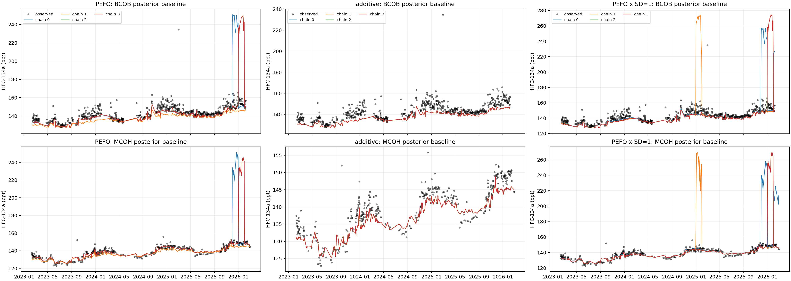
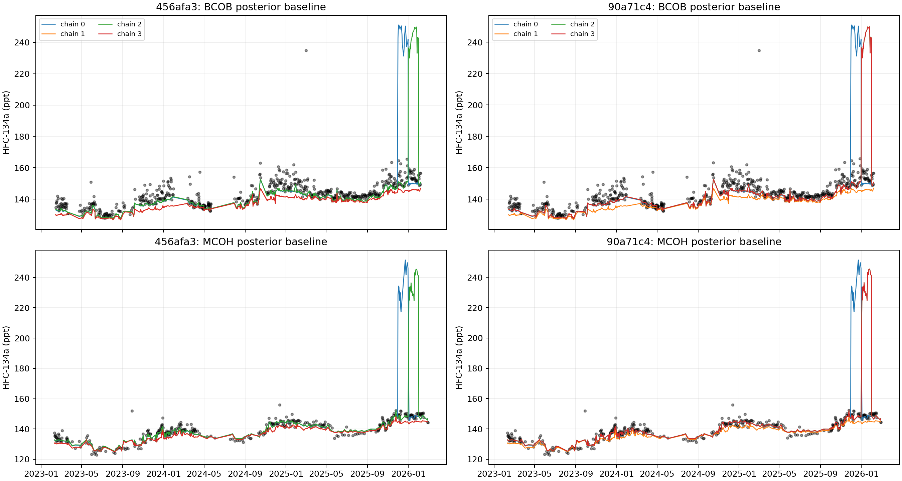
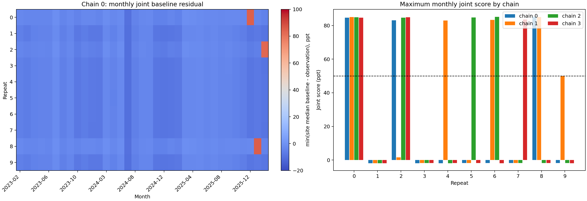
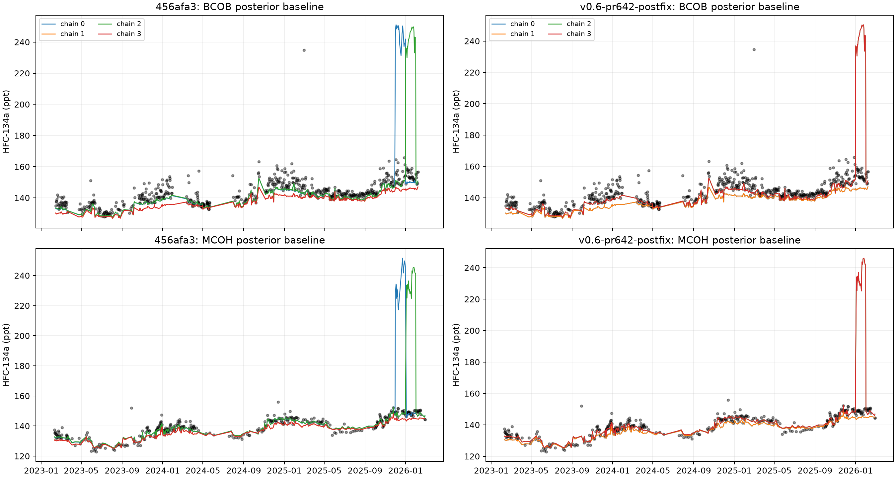

# Issue 637 HFC-134a diagnostic figures

These figures accompany the controlled `af0e8662` and `90a71c4` HFC-134a
Central Asia reproductions described in issue #637.

## February 2026 posterior baseline by chain

Posterior mean baseline in concentration space, in ppt. Solid coloured lines
show individual `af0e8662` chains; dotted lines show `90a71c4` chains. The red
line is the archived anomalous output, the dashed black line is the archived
normal output, and crosses are observations. Failed chains occupy high-BC,
high-sigma states 70--100 ppt above observations.

## Full posterior mean time series

Deterministic posterior mean concentration prediction, in ppt, for each
archived product and the four-chain pooled reproduction summaries. Pooling is
shown only to visualize the disagreement; these nonconverged traces are not
scientifically valid for pooled publication.

## Seeded likelihood control

Exact `90a71c4` source, identical serialized inputs, NumPyro, GCC 12.3,
four chains, 30,000 retained draws, and random seed 637. The PEFO arm retains
the production fractional-error likelihood and `Uniform(0, 0.1)` sigma. The
additive arm uses response-independent absolute sigma with a monthly,
site-specific `HalfNormal(5 ppt)` prior.

PEFO reproduced the failure: maximum BC R-hat 2.402, minimum bulk ESS 4.85,
and maximum between-chain baseline disagreement 106.26 ppt. The additive arm
had maximum R-hat 1.00021 across x/BC/sigma, minimum bulk ESS 39,598, and only
0.065 ppt maximum baseline disagreement. The black high observation in the
additive BCOB panel is a real isolated observation, not a modelled-baseline
excursion.

Tabular results: [diagnostics](hfc134a_likelihood_seed637_diagnostics.csv) and
[per-chain summary](hfc134a_likelihood_seed637_chain_summary.csv).

The third panel is a same-seed PEFO sensitivity which narrows the emissions
LogNormal arithmetic standard deviation from 2 to 1. It also fails: maximum BC
R-hat 1.917, minimum bulk ESS 5.51, and 130.31 ppt maximum between-chain
baseline disagreement. All four chains have substantially worse summed log
likelihood than the healthy chain in the original PEFO control. Narrowing the
emissions prior therefore does not remove the PEFO pathology for this seed.

## Same-seed comparison across merge `328cf1c`

Exact `456afa3` (pre-merge) and `90a71c4` (post-merge) source, explicit
NumPyro, GCC 12.3, random seed 637, four chains, and 30,000 retained draws.
Both revisions fail: maximum BC R-hat is 2.095 and 2.402 respectively, and
maximum between-chain posterior-baseline disagreement is 106.37 and 106.26
ppt. Chains 0 and 2 enter nearly identical high-BC/high-sigma states on both
revisions; chain 3 is healthy before the merge but failed afterward.

Observations, errors, minimum errors, `H`, `H_bc`, site/month indices, and the
zero-sensitivity mask are exactly equal. The model graph changed: the legacy
model samples all 200 emissions states, while merged RHIME fixes 60
zero-sensitivity states and samples 140 active states. This changes NumPyro's
initialized position and warm-up trajectory even under the same top-level
seed, but the pre-merge failure shows that the pathological PEFO geometry did
not originate in the merge.

Tabular results: [diagnostics](hfc134a_merge_seed637_diagnostics.csv),
[per-chain summary](hfc134a_merge_seed637_chain_summary.csv), and
[input comparison](hfc134a_merge_seed637_input_comparison.csv).

## Ten short pre-merge repeats

Exact `456afa3`, explicit NumPyro, GCC 12.3, four chains, 1,000 tuning plus
1,000 retained draws, and ten recorded seeds (`637100`--`637109`). A chain is
classified as spiked when a calendar month's smaller site-level median of
posterior-mean baseline minus observation exceeds 50 ppt at BCOB and MCOH.
This is an observation-space diagnostic in ppt, not a scientific posterior
acceptance test.

Chain 0 spiked in 3/10 repeats; at least one chain spiked in 8/10. Across all
40 chains, 15 spiked. Four repeats contained the February 2026 spike, including
one chain-0 occurrence. Fourteen of 15 winning spike months were December 2025,
January 2026, or February 2026. Thus chain-first output exposes the failure
intermittently, while the underlying multi-chain problem occurs in most short
runs and is strongly concentrated at the end of the inversion window.

Tabular results: [repeat summary](hfc134a_456_short_repeat_summary.csv),
[per-chain summary](hfc134a_456_short_chain_summary.csv), and
[diagnostics](hfc134a_456_short_diagnostics.csv). The
[monthly scores](hfc134a_456_short_monthly_scores.csv) contain the plotted
observation-space statistic for every repeat, chain, site pair, and month.

## v0.6 CENTRALASIA backport replay

Draft PR #642 backports Ben's CENTRALASIA domain work onto exact tag `v0.6.0`.
Its first seeded replay exposed four prior-only January 2023 boundary states:
the configured inversion began in January, while retained observations began
in February. The follow-up commit drops BC states with no sensitivity at any
retained observation after all sites have been combined.

The post-fix H_bc matrix is 969 by 148 and is byte-for-byte equal to the
`456afa3` matrix. The run still fails convergence: chains 2 and 3 enter the
January 2026 high-BC/high-sigma state, while chains 0 and 1 are healthy.
Maximum R-hat is 1.645 for emissions, 1.733 for BC, and 1.730 for sigma;
minimum bulk ESS is about 6, with zero divergences. Maximum between-chain
posterior-baseline disagreement is 104.61 ppt.

The compaction is a valid v0.6 bug fix and explains why changing a seemingly
irrelevant state layout changes seeded chain trajectories. It does not repair
the PEFO posterior geometry.

Tabular results: [diagnostics](hfc134a_v06_pr642_postfix_diagnostics.csv),
[per-chain summary](hfc134a_v06_pr642_postfix_chain_summary.csv),
[H_bc comparison](hfc134a_v06_pr642_postfix_hbc_comparison.csv), and
[monthly spike summary](hfc134a_v06_pr642_postfix_monthly_spikes.csv).
