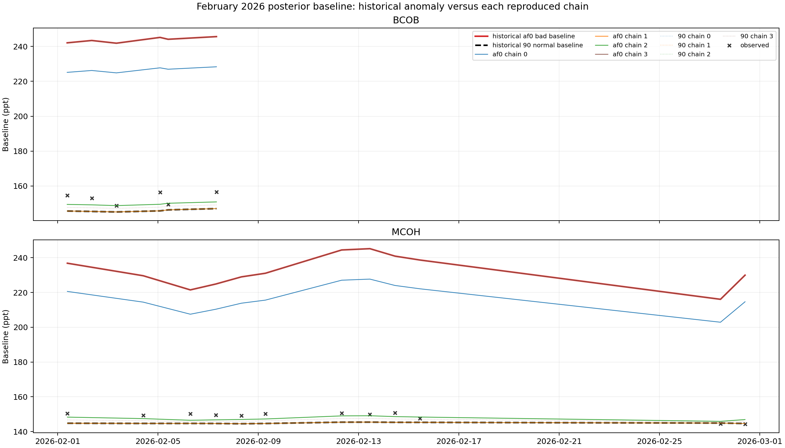
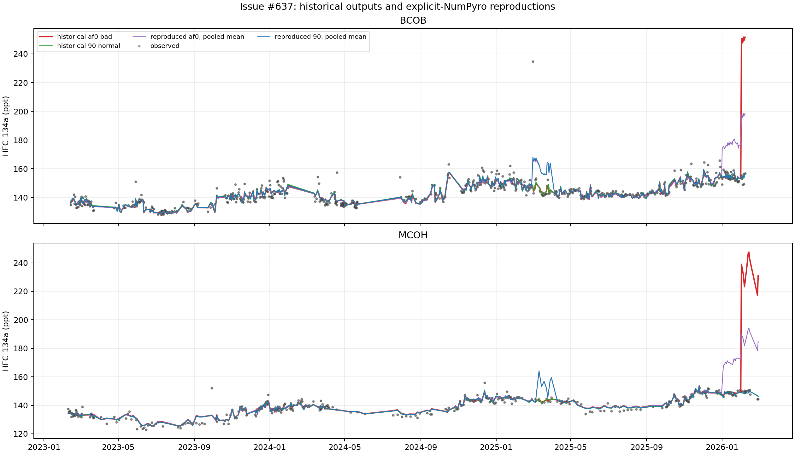

# Issue 637 HFC-134a diagnostic figures

These figures accompany the controlled `af0e8662` and `90a71c4` HFC-134a
Central Asia reproductions described in issue #637.

## February 2026 posterior baseline by chain

Posterior mean baseline in concentration space, in ppt. Solid coloured lines
show individual `af0e8662` chains; dotted lines show `90a71c4` chains. The red
line is the archived anomalous output, the dashed black line is the archived
normal output, and crosses are observations. Failed chains occupy high-BC,
high-sigma states 70--100 ppt above observations.

## Full posterior mean time series

Deterministic posterior mean concentration prediction, in ppt, for each
archived product and the four-chain pooled reproduction summaries. Pooling is
shown only to visualize the disagreement; these nonconverged traces are not
scientifically valid for pooled publication.
