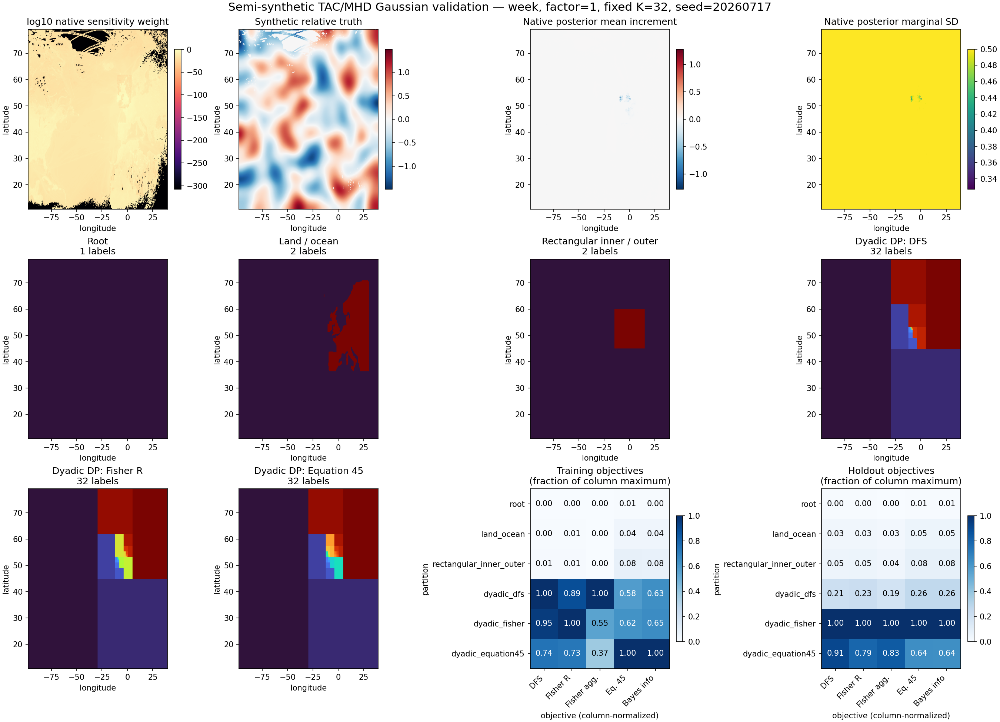

# Semi-synthetic TAC/MHD dyadic Bocquet validation

This is an experimental validation of the independent-relative-error Gaussian model. It does not alter or exercise a production inversion path.

## Experiment contract

The centered innovation is `innovation = G @ relative_truth + epsilon` with `epsilon ~ N(0, R)` and `R = data.error**2 + explicit_model_error_ppb**2`. The explicit model error is 5 ppb. Stored real mole-fraction values and stored boundary contributions are not used.

Search mode: **native_grid**, `coarsen_factor=1`. The default is native resolution and no coarsening is applied silently.

The holdout is the blocked interval [2019-01-07T00, 2019-01-08T00) with 287 training rows and 46 holdout rows. Every selected dyadic partition uses training rows only.

## Partition objectives

| subset | partition | regions | DFS | Fisher | agg. Fisher | Eq. 45 | Bayes info |
|---|---|---:|---:|---:|---:|---:|---:|
| training | Root | 1 | 0.0023152 | 0.022043 | 0.0023206 | 0.16909 | 0.084548 |
| training | Land / ocean | 2 | 0.017512 | 0.18519 | 0.017822 | 1.3679 | 0.684 |
| training | Rectangular inner / outer | 2 | 0.034116 | 0.37294 | 0.03531 | 2.6556 | 1.3281 |
| training | Dyadic DP: DFS | 32 | 3.7876 | 30.211 | 15.437 | 19.207 | 10.874 |
| training | Dyadic DP: Fisher R | 32 | 3.6 | 34.083 | 8.4797 | 20.687 | 11.118 |
| training | Dyadic DP: Equation 45 | 32 | 2.8055 | 24.728 | 5.7331 | 33.311 | 17.173 |
| holdout | Root | 1 | 0.0010412 | 0.0020475 | 0.0010423 | 0.012147 | 0.0060739 |
| holdout | Land / ocean | 2 | 0.0072773 | 0.014888 | 0.0073302 | 0.10108 | 0.050555 |
| holdout | Rectangular inner / outer | 2 | 0.010853 | 0.023753 | 0.010968 | 0.16653 | 0.083293 |
| holdout | Dyadic DP: DFS | 32 | 0.049714 | 0.1003 | 0.051063 | 0.5181 | 0.25938 |
| holdout | Dyadic DP: Fisher R | 32 | 0.23136 | 0.43582 | 0.27252 | 1.9604 | 0.98983 |
| holdout | Dyadic DP: Equation 45 | 32 | 0.21034 | 0.34503 | 0.2274 | 1.2489 | 0.62861 |

DFS, base-error Fisher, aggregation-aware Fisher, Equation 45, and Bayesian information gain remain separate columns. Equation 45 omits a factor of one half; Bayesian information gain includes the conventional factor of one half.

Dyadic partitions are selected from training rows only. Holdout rows then define a fresh Gaussian update used to score how much held-out DFS, Fisher information, posterior-mean update, and projected KL each fixed partition retains. Under the exact Bocquet reduction, held-out predictive density is partition-invariant because the unresolved covariance is retained; predictive density is therefore a closure check rather than a ranking metric.

## Native-grid additive selection-objective bounds

| rows | native DFS | native Fisher | native Eq. 45 |
|---|---:|---:|---:|
| training | 12.773 | 70.5466 | 64.2966 |
| holdout | 1.97248 | 3.56912 | 9.834 |
| all_rows | 14.065 | 74.1157 | 67.5301 |

These are bounds for the three additive dynamic-programming objectives. Aggregation-aware Fisher and Bayesian information gain are retained as separate evaluation metrics and are not assigned scalar-node bounds here. The PNG also shows the native base-error sensitivity weight, synthetic truth, and all-row native posterior mean increment and marginal SD maps.

## Provenance and timings

Raw metrics: [dyadic_bocquet_metrics.csv](dyadic_bocquet_metrics.csv). The JSON manifest records the complete fixture/source hashes, rectangle, seed, covariance, objective conventions, and timings.

| stage | seconds |
|---|---:|
| load_data | 0.813 |
| build_training_model | 3.238 |
| evaluate_training | 1.345 |
| build_holdout_model | 1.441 |
| evaluate_holdout | 0.493 |
| build_all_row_model | 3.524 |
| native_posterior | 0.128 |
| write_figure | 1.139 |
| total_before_report | 19.398 |
