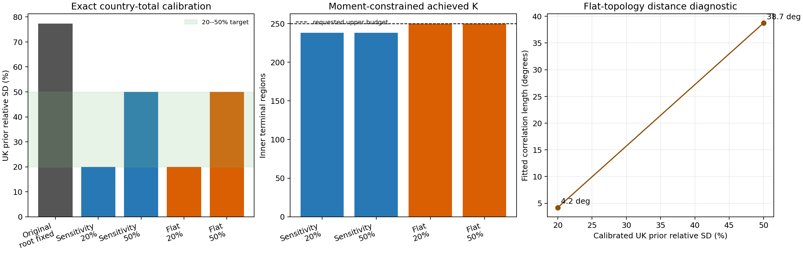

# Gamma--Beta UK prior calibration

This experiment calibrates the prior uncertainty of the UK country total on
the committed EUROPE grid. The aggregate is absolute prior flux times grid area
inside the country mask. The methane fixture is positive over the UK, so this
also equals the signed prior total for this demonstration.



## Exact aggregate calculation

For terminal-region scaling vector `x`, analytic covariance `C`, and UK mass in
each terminal region `w`,

```text
E[T_UK] = sum(w)
Var(T_UK) = w.T @ C @ w
relative_SD(T_UK) = sqrt(Var(T_UK)) / E[T_UK].
```

No finite-draw covariance estimate enters this calibration. For fixed topology
and split concentrations, aggregate variance is affine in the inner-land root
variance. Evaluating exact covariance at root variance zero and one therefore
gives the root solution directly.

The original depth policy has a root-fixed UK relative SD of
77.4%; restoring its original root
variance of one raises this to 148.2%. A non-negative root
variance can only add uncertainty, so neither the 20% nor 50% target is feasible
under those split contrasts.

## Controlled policy

The comparison policy is

```text
kappa(d) = min(96, 40 * 1.5**d)
minimum Beta shape = 1
maximum exact child scaling variance = 9
```

The existing priority queue skips a proposed split when either moment limit
fails, then continues with the next highest-weight admissible candidate. The
requested 250 inner regions are therefore an upper budget rather than a
promise to create unstable regions.

Only the inner-land root is calibrated. The independent inner-ocean root
variance is held fixed at 0.25; UK tuning
therefore cannot change ocean uncertainty or ocean split admissibility.

| Topology weight | UK target | Inner-land root variance | Achieved UK SD | Requested ocean/land | Achieved inner K | Min Beta shape | Max leaf variance | Fitted ell (deg) |
| --- | ---: | ---: | ---: | ---: | ---: | ---: | ---: | ---: |
| sensitivity | 20% | 0.0002781 | 20.00% | 3/247 | 238 | 1.32 | 2.51 | -- |
| sensitivity | 50% | 0.20226 | 50.00% | 3/247 | 238 | 1.32 | 3.22 | -- |
| flat | 20% | 0.00043921 | 20.00% | 130/120 | 250 | 1.04 | 2.6 | 4.2 |
| flat | 50% | 0.20245 | 50.00% | 130/120 | 250 | 1.04 | 2.6 | 38.7 |

The two targets do not identify a unique prior. Here the controlled split
policy fixes the allocation-contrast floor close to 20%; the shared inner-land
root then supplies the additional common-mode uncertainty needed to reach 50%.
The 20% calibration consequently has an almost fixed land root, whereas the
50% calibration has root variance about 0.20.

Sensitivity topology spends nearly all resolution over land because it uses
mean absolute footprint-times-flux sensitivity. Flat topology gives every
mapped grid cell equal selection weight and therefore allocates the 250-region
budget approximately evenly between inner ocean and land. These are different
topologies, not merely different covariance parameters.

## Effective distance scale

For the flat cases, a native-grid covariance

```text
exp(-abs(delta_lat) / ell) * exp(-abs(delta_lon) / ell)
```

is projected to the exact terminal regions with the expected-mass restriction,
then fitted to the Gamma--Beta inner-land correlation matrix.

- At 20% UK relative SD: correlation fit `ell=4.2` degrees, RMSE `0.2341`, target/model pair correlation `0.526` over 7140 inner-land pairs.
- At 50% UK relative SD: correlation fit `ell=38.72` degrees, RMSE `0.1569`, target/model pair correlation `0.531` over 7140 inner-land pairs.

This `ell` is descriptive, not an identity implied by flat weights. A dyadic
Gamma--Beta prior is organized by common-ancestor depth. Nearby grid cells on
opposite sides of an early tree boundary can be less correlated than more
distant grid cells sharing a recent ancestor. Irregular land support and
expected-flux split fractions add further departures from a distance-only
model. The shared inner-land root also acts as a continent-wide common mode.
The much larger fitted scale at 50% is consistent with that added common mode,
although the exponential model remains only a moderate approximation.

Degrees are retained because the diagnostic kernel is separable in latitude
and longitude. One latitude degree is roughly 111 km, but longitude distance
depends on latitude, so these fitted values should not be converted to a single
physical range without replacing the kernel by a physical-distance model.

## Interpretation and next checks

This produces numerically controlled priors at both requested UK uncertainty
levels while keeping `kappa <= 96`. It does not establish that this depth
profile is scientifically unique. One country total cannot identify base
kappa, depth growth, cap, stopping thresholds, and root variance separately.
The same diagnostics should next be checked for other countries, land/ocean
totals, and sectors. If country totals are intended as hard prior contracts,
country groups would provide a cleaner parameterization: a UK root variance of
0.04 or 0.25 gives 20% or 50% relative SD directly, while within-country kappa
would control only spatial allocation.
