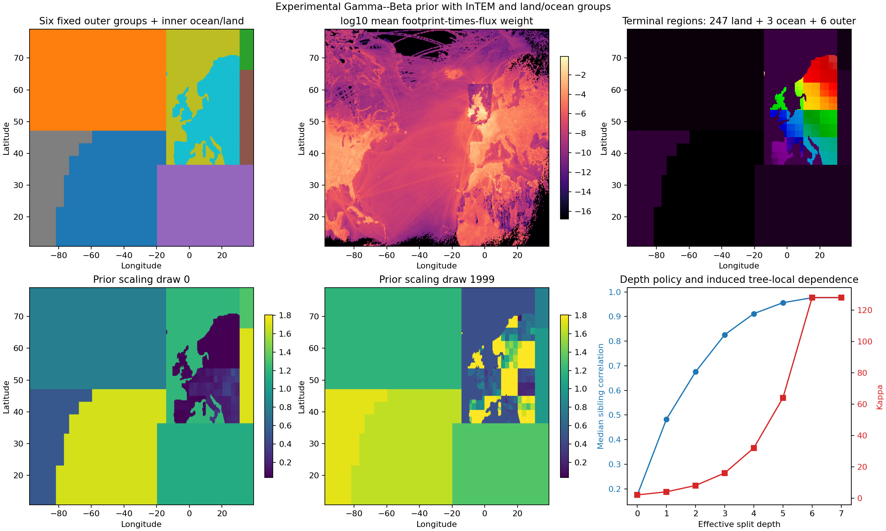
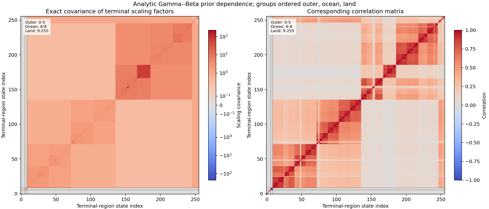
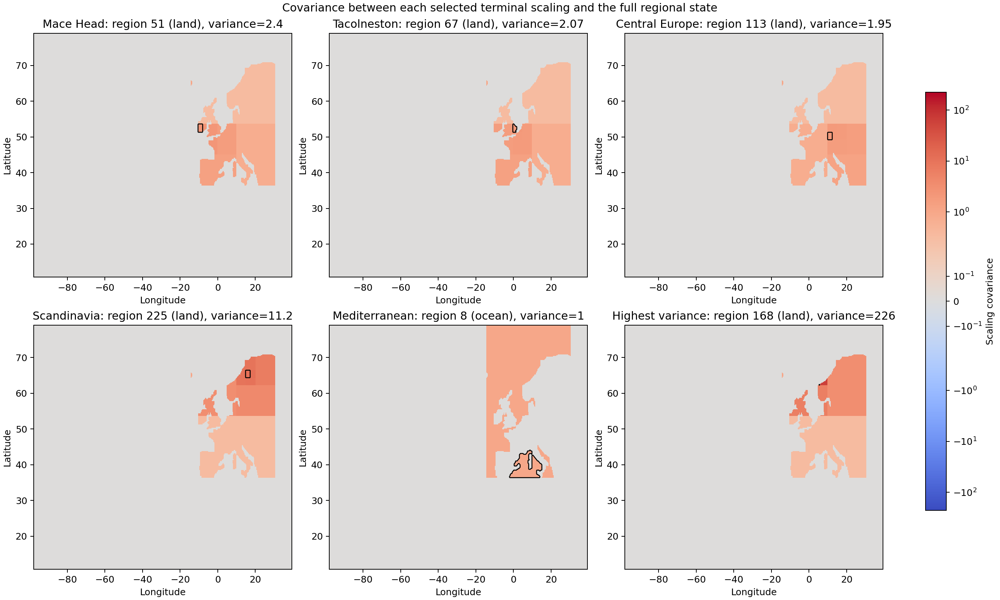
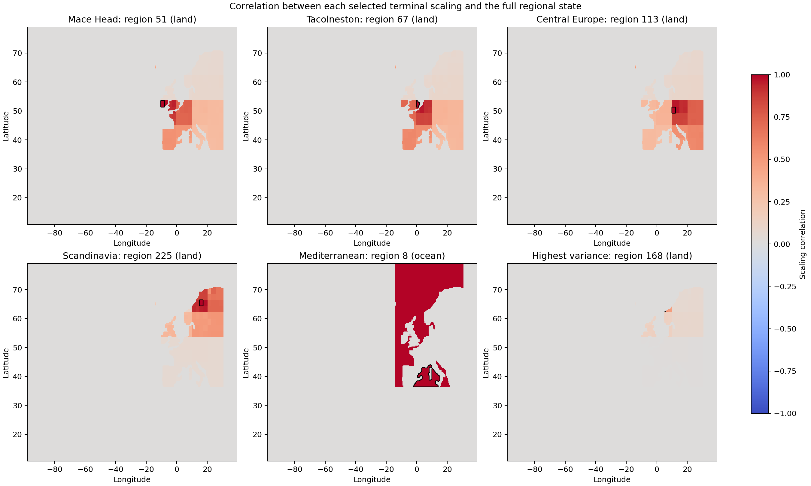
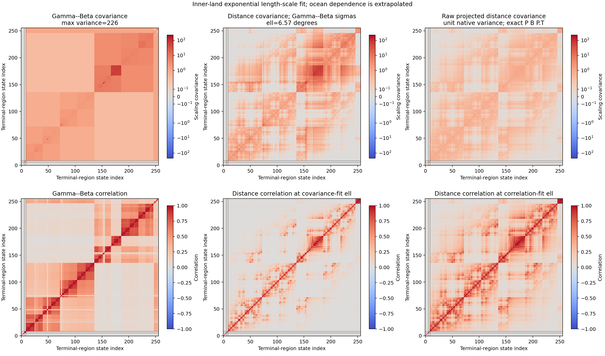
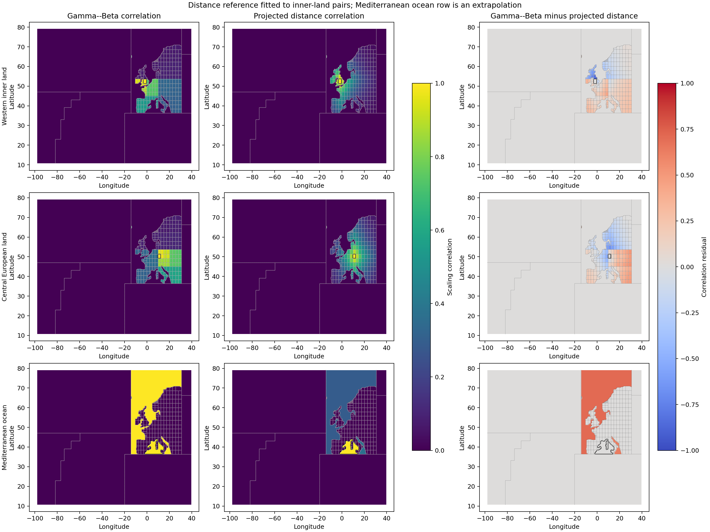

# InTEM land/ocean Gamma--Beta prior prototype

This prior-only demonstration uses absolute OGI test prior flux multiplied by
grid area as additive split mass. InTEM outer classes 0--5 remain fixed
geometries with uncertain Gamma root scalings. InTEM class 6 is split into
inner-ocean and inner-land groups; disconnected components receive separate
local Beta trees but share their semantic group's Gamma root draw.



## Configuration and topology

- draws: 2000
- depth policy: `kappa(d) = 2 * 2**d`
- kappa cap: 128.0
- semantic groups: 8
- component roots: 11
- fixed InTEM outer regions: 6
- inner land/ocean grid cells: 11314 / 12110
- inner land/ocean components: 2 / 3
- inner land/ocean total basis weight: 27.4554 / 0.083811
- allocated inner land/ocean regions: 247 / 3
- total inner-region budget: 250
- terminal regions: 256
- stochastic prior coordinates: 253
- stochastic Beta splits: 245

## Numerical checks

- maximum parent/child conservation error: 1.164153e-10
- maximum empirical leaf mean error from one: 0.2269
- expected-mass-weighted empirical leaf mean error: 0.0121
- kappa range: 2--128
- minimum Beta shape: 0.06856
- terminal scaling variance range: 0.25--226.2
- median terminal scaling variance: 3.122
- median off-diagonal inner-land correlation: 0.1234
- terminal scaling covariance rank: 253 of 256

| Effective depth | Splits | Kappa | Median sibling correlation | Median split-fraction SD |
| ---: | ---: | ---: | ---: | ---: |
| 0 | 2 | 2 | 0.176 | 0.252 |
| 1 | 4 | 4 | 0.483 | 0.208 |
| 2 | 7 | 8 | 0.676 | 0.154 |
| 3 | 11 | 16 | 0.826 | 0.117 |
| 4 | 16 | 32 | 0.912 | 0.084 |
| 5 | 31 | 64 | 0.956 | 0.061 |
| 6 | 59 | 128 | 0.976 | 0.041 |
| 7 | 115 | 128 | 0.977 | 0.042 |

Sibling correlations and split-fraction standard deviations in this table are
analytic. Correlation is not a function of kappa alone: it also depends on the
inherited parent variance and each split's expected-mass fraction.

## Exact terminal-state covariance

The following matrices are analytic, not empirical estimates from the 2,000
draws. Rows and columns are terminal-region scaling factors in forest leaf
order: six fixed outer regions, three ocean supports, then 247 land regions.
Black divider lines mark those semantic groups. Covariance colors use a
symmetric logarithmic normalization so both small and large values remain
visible.



Each map below takes one matrix row and broadcasts its values over the
corresponding terminal-region supports. The outlined region is the selected
state-vector element. Covariance is shown first; normalized correlation is
shown separately because scaling variances differ by nearly two orders of
magnitude.





## Exponential distance-covariance comparison

As a conventional reference, define a unit-variance covariance between native
grid locations `a` and `b` as

```text
B[a, b] = exp(-abs(lat[a] - lat[b]) / ell)
          exp(-abs(lon[a] - lon[b]) / ell).
```

The terminal scaling in region `r` is the expected-flux-mass-weighted native
scaling, so the restriction is

```text
P[r, a] = expected_mass[a] / sum(expected_mass in r)
```

inside region `r` and zero elsewhere. The regional distance covariance is then
computed exactly as `B_P = P B P.T`. The separable implementation applies this
without materializing the full native-grid covariance. It therefore integrates
over the actual terminal-region supports rather than approximating each region
by a centroid.

Only unique off-diagonal inner-land pairs enter the least-squares fits. Six
InTEM outer regions remain separate hard groups, while inner land and inner
ocean are the other two groups; native covariance is zero across group
boundaries. The fitted land scale is applied to ocean only as an extrapolation.

Two fits answer different questions:

- covariance fit with Gamma--Beta marginal standard deviations fixed:
  `ell = 6.568` degrees, RMSE
  `2.079`, relative RMSE
  `0.3928`, target/model pair
  correlation `0.9206` over
  30381 pairs;
- correlation fit with every marginal standard deviation fixed to one:
  `ell = 12.92` degrees, RMSE
  `0.2141`, relative RMSE
  `0.596`, target/model pair
  correlation `0.5750` over
  30381 pairs.



The first covariance fit normalizes the projected matrix to correlation and
then restores every Gamma--Beta regional standard deviation, including the
maximum variance of 226.2.
It diagnoses only the dependence shape. The third covariance panel is the raw
`P B P.T` result with unit native-grid variance; its largest regional-average
variance is 1.
A further group-scale reference sets regional standard deviation to one for
inner land/ocean and 0.5 for each outer region, giving maximum variance
1. Both are different
priors, not alternative fits with the Gamma--Beta marginals.

The maps compare Gamma--Beta correlation with the normalized regional
correlation obtained from `P B P.T`. Both matrix rows are therefore displayed
on exactly the same terminal regions. Thin black-and-white lines mark every
terminal boundary because smoothly varying regional values can otherwise hide
the piecewise-constant boxes. They include two land regions and one ocean
region so the shared-ocean-root behavior is visible. The ocean row is not
evidence for an ocean length scale because no ocean pairs were fit.



This is a useful baseline but not a definitive spatial model. Projection now
preserves irregular and disconnected support geometry, but one common scale in
latitude and longitude degrees is not isotropic in physical distance. A
stronger version would use a physical-distance kernel on a suitable projected
coordinate system before applying the same restriction. More importantly,
geographic distance alone is a weak scientific reason for flux correlation. A
similarity-space construction could add land cover, sector, climatology, or
other prior features; observation-derived features would need filtering or
held-out data to avoid leakage.

## Interpretation

Increasing kappa with depth narrows fine split fractions around their expected
prior-flux allocation. Leaves that share a recent ancestor therefore tend to
move together more strongly. This is tree-local dependence: two geographically
adjacent terminal regions separated by an old tree boundary need not have the
same covariance as siblings.

The cap of 128 makes deep split fractions very tight: at a diverging split the
normalized left/right cross-moment multiplier is `128 / 129`, about 0.992.
That does not make terminal variances uniformly small. Unequal expected-mass
fractions and repeated same-branch multipliers produce scaling variances from
0.25 to 226 in
this layout. The covariance and correlation plots therefore give a more useful
picture than kappa alone.

Region counts use a different quantity from the Gamma--Beta conservation mass.
The allocation and weighted best-first refinement use mean absolute TAC/MHD
footprint-times-flux sensitivity, matching the standard constrained-basis
weight construction. Gamma--Beta split means continue to use absolute prior
flux times grid area. This prevents a geometrically complex but low-sensitivity
ocean mask from consuming most of the resolution budget.

The terminal-region count is a geometric count, not the current prior's number
of independent coordinates. Disconnected components within one semantic group
share its Gamma root. In particular, the three terminal ocean components share
one ocean root scaling because none receives an internal split at this weight
allocation. Giving those components independent totals would require separate
component roots or a group-level allocation split.

These are covariances of dimensionless scaling factors. Prior-flux covariance
would multiply matrix entry `(a, b)` by the expected flux masses of regions
`a` and `b`; tiny-mass regions with large scaling variance would then receive
less visual weight. The shared ocean root also makes its three unsplit supports
identical random variables, so the terminal scaling covariance is singular.
This is why the ocean map looks especially poor. Credible alternatives are to
give disconnected ocean components independent roots, place a separate
Dirichlet/Beta allocation layer above component roots, or replace the shared
root with an explicit spatial/similarity covariance. If the intended model is
one ocean coefficient, the three supports should instead be represented as one
state-vector element.

The variance of 226 is also not fixed by increasing kappa alone. It comes from
repeated multiplicative allocation along highly unequal branches. Possible
controls include requiring minimum Beta shape parameters rather than merely
capping kappa, stopping or rejecting extreme-mass splits, solving kappa from a
target terminal variance/correlation, or using a covariance model with fixed
marginal variances. Each changes the prior and should be assessed on region
flux totals as well as dimensionless scaling factors.

The maximum unweighted leaf-mean error is sensitive to tiny expected-mass
regions with heavy scaling-factor tails. The expected-mass-weighted diagnostic
is the relevant check for their effect on total prior flux.

The six outer geometries are fixed, but their scaling factors remain uncertain.
This prototype does not yet infer the active partition, use observations, or
construct a PyMC likelihood.
