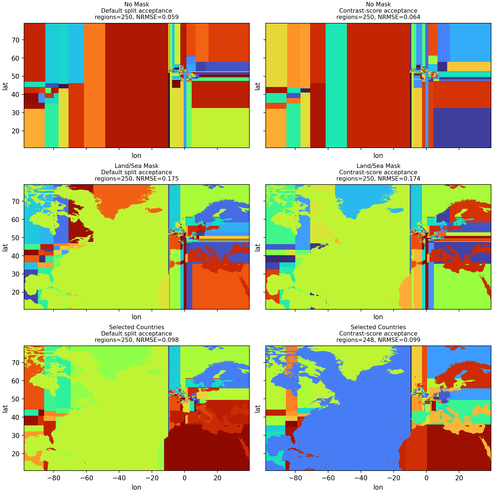
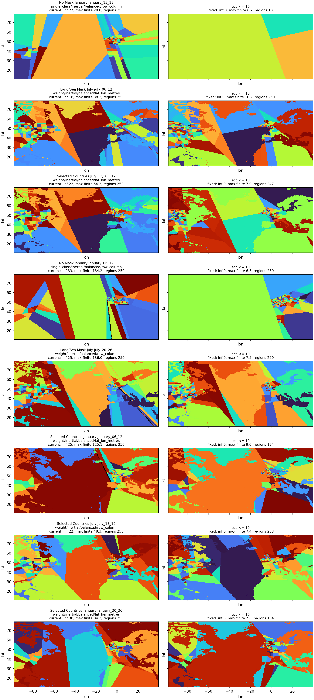

# Constrained Basis Algorithm Options

This page explains the lower-level constrained basis algorithms and compares 250-target-region variants on Blue Pebble OpenGHG data.

## How The Algorithm Is Built

The constrained basis path is a small orchestration framework rather than one fixed algorithm. The caller supplies a two-dimensional importance field, `weights`, and a two-dimensional `region_classes` mask. The algorithm partitions each mapped class independently, then offsets labels so basis labels are globally unique and never cross class boundaries.

The independently variable pieces are:

- **Region classes**: no mask, land/ocean, countries, grouped countries, or any caller-supplied class field.
- **Class allocation**: explicit per-class counts, automatic allocation by class total weight, or automatic allocation by cell count. The Blue Pebble score matrix below uses only weight allocation for masked objectives.
- **Greedy orchestration**: repeatedly split the currently highest-weight partition until the target is reached or no acceptable split remains.
- **Partition step**: axis-parallel row/column splits or inertial principal-axis splits.
- **Split mode**: the generated evidence below uses weight-balanced splits near half parent weight.
- **Geometry**: row/column index geometry or local lat/lon metre geometry for split-shape decisions.
- **Split stopping**: optional policies that reject proposed child regions. When stopping is enabled, the requested region count is an upper target.

The comparison also includes legacy `bucketbasisfunction` and `quadtreebasisfunction` rows generated from the same training weights. Their actual region counts can differ from the 250 target. `bucketbasisfunction` is shown as `weighted/bucket`; in this codebase the `weighted_algorithm` alias uses the land/sea weighted bucket splitter, so it is grouped with the land/sea objective. `quadtreebasisfunction` is shown as `quadtree` and grouped with the no-mask objective. Fixed-outer rows keep the package EUROPE InTEM outer regions fixed and build the inner region with quadtree or weighted/bucket splitting.

The important separation is that `weights` define contribution/importance, while `geometry` defines physical coordinates for split shape. Lat/lon geometry does not change contribution weights, class allocation, or posterior weighting. The Blue Pebble generator builds these weights with the same multi-site footprint-times-flux reduction used by the production `basis_functions_wrapper` path.

Axis-parallel contrast rows append `/contrast` to the candidate label. They use the mass-preserving contrast score with `tau=1`, identity design covariance, and `min_contrast_lambda=1.0e-18`. This is an uncalibrated ranking/debugging threshold, not a calibrated expected-information-gain value.

For the no-mask score rows below, allocation is reported as `single_class` because there is only one class. The generator uses the normal weight-allocation API internally, but no inter-class allocation decision is being tested in that case.

Current API routing is narrower than this option matrix. The core constrained
algorithm can compose split-stopping policies such as `MinChildWeightShare`,
`MinChildTargetWeightShare`, and `MaxChildPCAEccentricity`, and those policies
can return fewer regions than the requested target. Higher-level basis wrappers
currently expose only `split_acceptance="none"` and
`split_acceptance="contrast_score"`; child-share stopping thresholds are not
available through `.ini`, `run_hbmcmc.py`, or RHIME config options.

## Option Shorthand

Candidate labels use the format `allocation/split_step/split_mode/geometry`. The objective group is shown separately because no mask, land/sea mask, and selected-country mask answer different scientific basis-design questions.

| shorthand | meaning |
|---|---|
| `no_mask` | one class over the full domain; no hard class boundary is imposed |
| `land_sea` | two hard classes, land and ocean |
| `selected_countries` | ocean, selected countries, and `other_land` are separate classes |
| `fixed_outer` | package EUROPE InTEM outer regions are fixed; only the inner region is generated |
| `full_domain` | candidate generated across the full EUROPE domain |
| `single_class` | the no-mask allocation case; there is no inter-class allocation decision |
| `weight` | allocate target regions to classes by total training weight |
| `axis_parallel` | split a region with a row- or column-aligned cut |
| `inertial` | split a region using its principal weighted axis |
| `balanced` | choose splits near half of the parent-region weight |
| `row_column` | use grid row/column coordinates when evaluating split shape |
| `lat_lon_metres` | use local metre-scaled longitude/latitude coordinates for split shape |
| `weighted/bucket` | legacy `bucketbasisfunction`; uses the land/sea weighted bucket algorithm |
| `quadtree` | legacy `quadtreebasisfunction`; recursively subdivides the grid without a class mask |
| `contrast` | optional axis-parallel split gate using the mass-preserving contrast score |
| `CV` | cross-validation; here, temporal holdout scoring with one shared basis per month/split |
| `NRMSE` | RMSE divided by the RMS of the full-grid held-out modelled observation |
| `fp` | OpenGHG/NAME footprint field |
| `H` | basis sensitivity matrix produced by projecting `fp * flux` onto basis regions |
| `CH4` | methane |
| `NAME` | the Numerical Atmospheric-dispersion Modelling Environment transport model |
| `TAC`, `MHD` | Tacolneston and Mace Head measurement sites |

## Blue Pebble Cross-Validation Data

The script reads footprints and CH4 flux from OpenGHG store `shared_store_zarr` on Blue Pebble. It uses TAC 185m and MHD 10m EUROPE NAME inert footprints, and the monthly `edgarv80_wetchartsv131` CH4 flux product.

January and July 2019 are scored separately. Each month uses three temporal CV splits: a one-week holdout starting on days 6, 13, 20, with a two-day buffer excluded before and after the held-out week. For each month/split, one shared basis is built from the combined remaining TAC and MHD in-month training footprints, matching the production multi-site basis objective. Held-out scores are then reported separately for TAC and MHD.

Masked constrained candidates use `weight` allocation and the constrained splitters use the `balanced` weight-partitioning mode only, so the generated evidence focuses on the options used for the current recommendation. Contrast-score diagnostics use only training footprints and prior flux/mass weights; they do not use observed mole fractions, residuals, or held-out footprints.

Per-score-site/month aggregate scores are written to `docs/plans/ogi_048_basis_option_scores.csv`, split-level scores are written to `docs/plans/ogi_048_basis_option_split_scores.csv`, and overall all-score-site/month/split scores are written to `docs/plans/ogi_048_basis_option_overall_scores.csv`. The split-level table contains 264 scored rows and includes `basis_training_sites`, `basis_train_observations`, and `score_site_holdout_observations` to make the shared-basis training set explicit.

Constrained split-history diagnostics are written to `docs/plans/ogi_048_basis_option_split_history.csv.gz`. Final-region shape diagnostics for all candidates are written to `docs/plans/ogi_048_basis_option_region_diagnostics.csv.gz`; those include bounding-box aspect ratio, fill fraction, 4-neighbour connected-component counts, grid compactness, and PCA eccentricity.

Current-vs-eccentricity-guard case diagnostics are written to `docs/plans/ogi_048_basis_option_eccentricity_fix_cases.csv`. The guarded cases use `MaxChildPCAEccentricity(max_child_pca_eccentricity=10)` as a split-stopping policy, so the requested 250 regions becomes an upper target.

## Representative Input Fields

The log-scale maps below show the representative monthly prior flux and the combined training `fp_x_flux` field used to construct the first displayed basis split. The `fp_x_flux` field is normalized before candidate generation, but the plotted field is the unnormalized footprint-times-flux product.

## Region Class Modes

The plots below use three class modes. The selected-country mode treats ocean as one class, keeps selected large European-domain countries as separate classes, and groups all remaining land as `other_land`. The selected countries are: UK, Ireland, France, Germany, Italy, Belgium, Netherlands.

## Held-Out Forward-Model Compression Score

A normal multiplicative prior basis exactly reproduces the prior modelled observations when all basis coefficients are one: summing projected `H` over all regions gives the same `sum(fp * flux)` as the full grid. That direct RMSE is therefore a trivial zero and is not useful for comparing basis shapes.

The score used here is a held-out prior-flux observation-space compression score. For each candidate basis, the prior flux field is approximated by one cell-mean value per basis region. Held-out modelled observations from this projected flux field are compared with held-out modelled observations from the full grid. Lower held-out CV NRMSE means the shared basis preserves the full-grid prior-flux observation response more efficiently on footprints that were not used to construct the basis weights.

Only this held-out CV score is included in these tables and plots. It is still not a posterior-quality metric and does not replace posterior or synthetic-recovery tests.

## Best Representative Basis Maps

The map figure shows the best overall held-out CV candidates by objective, using one representative January basis split for display. No-mask and land/sea rows show the best three full-domain constrained candidates plus the matching full-domain legacy option. Selected-country has no legacy counterpart, so it shows the best four constrained candidates. Fixed-outer rows show the available fixed-outer reference candidates.

### Default Versus Contrast Axis-Parallel Maps

The paired maps below use the representative January split and one like-for-like option: full-domain constrained basis, weight allocation, axis-parallel row/column splitting, balanced split mode, and a 250-region target. The no-mask row is labelled `single_class` in tables because no inter-class allocation is needed, but it uses the same weight-allocation path internally. Rows show no mask, land/sea, and selected-country masks; columns compare default split acceptance with the contrast-score gate.

### Narrow-Region Diagnostics

The table below lists the highest-eccentricity final regions among constrained inertial candidates. These diagnostics are not ranking scores; they are included to trace the narrow regions visible in the masked inertial maps.

| objective | month | split | candidate | region | cells | bbox aspect | fill | components | PCA ecc. | compactness |
|---|---|---|---|---:|---:|---:|---:|---:|---:|---:|
| Land/Sea Mask | July | july_06_12 | weight/inertial/balanced/lat_lon_metres | 15 | 2 | 11.00 | 0.18 | 2 | inf | 0.393 |
| Selected Countries | July | july_06_12 | weight/inertial/balanced/lat_lon_metres | 15 | 2 | 11.00 | 0.18 | 2 | inf | 0.393 |
| Selected Countries | July | july_13_19 | weight/inertial/balanced/row_column | 227 | 2 | 7.00 | 0.29 | 2 | inf | 0.393 |
| Selected Countries | January | january_20_26 | weight/inertial/balanced/lat_lon_metres | 236 | 3 | 6.00 | 0.50 | 2 | inf | 0.377 |
| Land/Sea Mask | January | january_06_12 | weight/inertial/balanced/row_column | 118 | 6 | 6.00 | 1.00 | 1 | inf | 0.385 |
| Land/Sea Mask | January | january_06_12 | weight/inertial/balanced/lat_lon_metres | 129 | 6 | 6.00 | 1.00 | 1 | inf | 0.385 |
| Land/Sea Mask | January | january_20_26 | weight/inertial/balanced/row_column | 4 | 6 | 6.00 | 1.00 | 1 | inf | 0.385 |
| Selected Countries | January | january_20_26 | weight/inertial/balanced/row_column | 5 | 6 | 6.00 | 1.00 | 1 | inf | 0.385 |

### Eccentricity-Guarded Diagnostic Cases

The figure below rebuilds an objective-balanced set of worst current inertial settings with the same month, split, objective, split mode, and geometry. Each objective first contributes the setting containing its worst infinite-eccentricity region and the setting containing its worst finite-eccentricity region; those setting-level summaries may still include other infinite-eccentricity regions. The remaining rows are filled by the global worst distinct settings. The left column is the current algorithm, with the worst current region outlined. The right column adds `MaxChildPCAEccentricity`; it rejects proposed child partitions whose PCA eccentricity is infinite or above the threshold.

| case | objective | month | split | option | current regions | fixed regions | current inf ecc | fixed inf ecc | current max finite ecc | fixed max finite ecc | current multi-comp | fixed multi-comp |
|---:|---|---|---|---|---:|---:|---:|---:|---:|---:|---:|---:|
| 1 | No Mask | January | january_13_19 | single_class/inertial/balanced/row_column | 250 | 10 | 27 | 0 | 28.8 | 6.2 | 18 | 2 |
| 2 | Land/Sea Mask | July | july_06_12 | weight/inertial/balanced/lat_lon_metres | 250 | 250 | 18 | 0 | 38.2 | 10.2 | 69 | 66 |
| 3 | Selected Countries | July | july_06_12 | weight/inertial/balanced/lat_lon_metres | 250 | 247 | 22 | 0 | 54.2 | 7.0 | 75 | 59 |
| 4 | No Mask | January | january_06_12 | single_class/inertial/balanced/row_column | 250 | 250 | 33 | 0 | 134.2 | 6.5 | 21 | 22 |
| 5 | Land/Sea Mask | July | july_20_26 | weight/inertial/balanced/row_column | 250 | 250 | 25 | 0 | 136.0 | 7.5 | 76 | 58 |
| 6 | Selected Countries | January | january_06_12 | weight/inertial/balanced/lat_lon_metres | 250 | 194 | 25 | 0 | 125.1 | 9.0 | 49 | 55 |
| 7 | Selected Countries | July | july_13_19 | weight/inertial/balanced/row_column | 250 | 233 | 22 | 0 | 48.3 | 7.4 | 64 | 67 |
| 8 | Selected Countries | January | january_20_26 | weight/inertial/balanced/lat_lon_metres | 250 | 184 | 30 | 0 | 84.2 | 7.6 | 59 | 52 |

## Grouped Scores For 250-Region Options

The heatmap shows the mean split score for each held-out site/month context, grouped by objective. The ranked plot uses the overall score averaged over all TAC/MHD January/July split rows for each candidate.

### Axis-Parallel Contrast Gate Diagnostics

The table below pairs each full-domain axis-parallel baseline with its contrast-gated counterpart. The contrast score uses `tau=1` and identity design covariance, so `lambda` and `delta_eig` are useful here only as uncalibrated split-ranking quantities.

| objective | option | baseline regions | contrast regions | rejected splits | baseline CV NRMSE | contrast CV NRMSE | delta NRMSE | median lambda |
|---|---|---:|---:|---:|---:|---:|---:|---:|
| Land/Sea Mask | weight/axis_parallel/balanced/lat_lon_metres | 250.0 | 250.0 | 248 | 0.1644 | 0.1636 | -0.0008 | 1.985e-17 |
| Land/Sea Mask | weight/axis_parallel/balanced/row_column | 250.0 | 250.0 | 267 | 0.1802 | 0.1799 | -0.0003 | 1.819e-17 |
| No Mask | single_class/axis_parallel/balanced/lat_lon_metres | 250.0 | 250.0 | 264 | 0.1462 | 0.1425 | -0.0036 | 1.819e-17 |
| No Mask | single_class/axis_parallel/balanced/row_column | 250.0 | 250.0 | 258 | 0.1595 | 0.1571 | -0.0024 | 1.826e-17 |
| Selected Countries | weight/axis_parallel/balanced/lat_lon_metres | 250.0 | 237.0 | 468 | 0.1233 | 0.1231 | -0.0003 | 8.849e-18 |
| Selected Countries | weight/axis_parallel/balanced/row_column | 250.0 | 242.0 | 484 | 0.1257 | 0.1254 | -0.0002 | 8.554e-18 |

### Fixed-Outer Diagnostics

The fixed-outer rows hold the package EUROPE outer regions fixed and build the inner region with the listed legacy splitter. The weighted/bucket fixed-inner diagnostic uses a cropped land/sea mask so land/sea separation remains aligned after cropping.

| fixed candidate | full-domain comparator | fixed regions | full regions | fixed CV NRMSE | full CV NRMSE | delta NRMSE |
|---|---|---:|---:|---:|---:|---:|
| fixed_outer/weighted/bucket | Land/Sea Mask weighted/bucket | 255.8 | 249.8 | 0.1961 | 0.1515 | 0.0446 |
| fixed_outer/quadtree | No Mask quadtree | 255.0 | 250.5 | 0.2001 | 0.1865 | 0.0137 |

### Overall Held-Out CV Scores

| objective | rank | candidate | regions | score rows | basis splits | CV NRMSE | CV RMSE | CV bias | CV corr |
|---|---:|---|---:|---:|---:|---:|---:|---:|---:|
| No Mask | 1 | single_class/inertial/balanced/row_column | 250.0 | 12 | 6 | 0.1260 | 3.304e-09 | 1.814e-10 | 0.9622 |
| No Mask | 2 | single_class/axis_parallel/balanced/lat_lon_metres/contrast | 250.0 | 12 | 6 | 0.1425 | 4.734e-09 | -2.028e-09 | 0.9493 |
| No Mask | 3 | single_class/axis_parallel/balanced/lat_lon_metres | 250.0 | 12 | 6 | 0.1462 | 5.070e-09 | -1.961e-09 | 0.9496 |
| No Mask | 4 | single_class/inertial/balanced/lat_lon_metres | 250.0 | 12 | 6 | 0.1471 | 3.924e-09 | 2.658e-10 | 0.9461 |
| No Mask | 5 | single_class/axis_parallel/balanced/row_column/contrast | 250.0 | 12 | 6 | 0.1571 | 5.305e-09 | -2.590e-09 | 0.9426 |
| Land/Sea Mask | 1 | weight/inertial/balanced/lat_lon_metres | 250.0 | 12 | 6 | 0.1081 | 3.251e-09 | -6.270e-10 | 0.9716 |
| Land/Sea Mask | 2 | weight/inertial/balanced/row_column | 250.0 | 12 | 6 | 0.1122 | 3.508e-09 | -8.167e-10 | 0.9702 |
| Land/Sea Mask | 3 | weighted/bucket | 249.8 | 12 | 6 | 0.1515 | 3.487e-09 | 1.377e-09 | 0.9732 |
| Land/Sea Mask | 4 | weight/axis_parallel/balanced/lat_lon_metres/contrast | 250.0 | 12 | 6 | 0.1636 | 5.846e-09 | -3.755e-09 | 0.9477 |
| Land/Sea Mask | 5 | weight/axis_parallel/balanced/lat_lon_metres | 250.0 | 12 | 6 | 0.1644 | 5.944e-09 | -3.632e-09 | 0.9467 |
| Selected Countries | 1 | weight/inertial/balanced/lat_lon_metres | 250.0 | 12 | 6 | 0.0974 | 2.257e-09 | 7.614e-11 | 0.9817 |
| Selected Countries | 2 | weight/inertial/balanced/row_column | 250.0 | 12 | 6 | 0.0997 | 2.283e-09 | -9.827e-11 | 0.9780 |
| Selected Countries | 3 | weight/axis_parallel/balanced/lat_lon_metres/contrast | 237.0 | 12 | 6 | 0.1231 | 3.803e-09 | -1.913e-09 | 0.9721 |
| Selected Countries | 4 | weight/axis_parallel/balanced/lat_lon_metres | 250.0 | 12 | 6 | 0.1233 | 3.780e-09 | -1.886e-09 | 0.9704 |
| Selected Countries | 5 | weight/axis_parallel/balanced/row_column/contrast | 242.0 | 12 | 6 | 0.1254 | 3.924e-09 | -1.755e-09 | 0.9725 |
| Fixed Outer Regions | 1 | fixed_outer/weighted/bucket | 255.8 | 12 | 6 | 0.1961 | 4.622e-09 | 2.075e-09 | 0.9216 |
| Fixed Outer Regions | 2 | fixed_outer/quadtree | 255.0 | 12 | 6 | 0.2001 | 4.969e-09 | 1.950e-09 | 0.9214 |

### Best Held-Out CV Scores By Site, Month, And Objective

| objective | score site | month | rank | candidate | regions | CV splits | CV NRMSE | CV RMSE | CV bias | CV corr |
|---|---|---|---:|---|---:|---:|---:|---:|---:|---:|
| No Mask | MHD | January | 1 | single_class/axis_parallel/balanced/lat_lon_metres | 250.0 | 3 | 0.1868 | 1.063e-09 | -1.763e-10 | 0.9129 |
| No Mask | MHD | January | 2 | single_class/axis_parallel/balanced/lat_lon_metres/contrast | 250.0 | 3 | 0.2017 | 1.125e-09 | -2.304e-10 | 0.8965 |
| No Mask | MHD | July | 1 | single_class/axis_parallel/balanced/row_column/contrast | 250.0 | 3 | 0.1231 | 2.540e-09 | 4.831e-11 | 0.9616 |
| No Mask | MHD | July | 2 | single_class/axis_parallel/balanced/lat_lon_metres/contrast | 250.0 | 3 | 0.1266 | 2.617e-09 | 1.337e-10 | 0.9611 |
| No Mask | TAC | January | 1 | single_class/inertial/balanced/lat_lon_metres | 250.0 | 3 | 0.0670 | 4.134e-09 | -1.586e-09 | 0.9865 |
| No Mask | TAC | January | 2 | single_class/inertial/balanced/row_column | 250.0 | 3 | 0.0678 | 4.057e-09 | -1.672e-09 | 0.9861 |
| No Mask | TAC | July | 1 | single_class/inertial/balanced/row_column | 250.0 | 3 | 0.0822 | 4.951e-09 | 4.845e-10 | 0.9858 |
| No Mask | TAC | July | 2 | single_class/axis_parallel/balanced/lat_lon_metres/contrast | 250.0 | 3 | 0.0830 | 4.930e-09 | -3.934e-10 | 0.9830 |
| Land/Sea Mask | MHD | January | 1 | weight/inertial/balanced/lat_lon_metres | 250.0 | 3 | 0.1566 | 9.795e-10 | 5.015e-10 | 0.9564 |
| Land/Sea Mask | MHD | January | 2 | weight/inertial/balanced/row_column | 250.0 | 3 | 0.1636 | 1.084e-09 | -1.178e-10 | 0.9447 |
| Land/Sea Mask | MHD | July | 1 | weight/axis_parallel/balanced/lat_lon_metres | 250.0 | 3 | 0.1100 | 2.355e-09 | -1.224e-09 | 0.9849 |
| Land/Sea Mask | MHD | July | 2 | weight/inertial/balanced/row_column | 250.0 | 3 | 0.1144 | 2.346e-09 | 1.073e-09 | 0.9742 |
| Land/Sea Mask | TAC | January | 1 | weighted/bucket | 250.0 | 3 | 0.0468 | 2.664e-09 | -5.966e-10 | 0.9916 |
| Land/Sea Mask | TAC | January | 2 | weight/inertial/balanced/lat_lon_metres | 250.0 | 3 | 0.0726 | 4.372e-09 | -1.638e-09 | 0.9823 |
| Land/Sea Mask | TAC | July | 1 | weighted/bucket | 249.7 | 3 | 0.0659 | 4.000e-09 | 3.574e-10 | 0.9876 |
| Land/Sea Mask | TAC | July | 2 | weight/inertial/balanced/lat_lon_metres | 250.0 | 3 | 0.0842 | 5.269e-09 | -2.298e-09 | 0.9856 |
| Selected Countries | MHD | January | 1 | weight/inertial/balanced/lat_lon_metres | 250.0 | 3 | 0.1765 | 1.132e-09 | 8.927e-10 | 0.9686 |
| Selected Countries | MHD | January | 2 | weight/inertial/balanced/row_column | 250.0 | 3 | 0.1873 | 9.993e-10 | 3.575e-10 | 0.9480 |
| Selected Countries | MHD | July | 1 | weight/axis_parallel/balanced/lat_lon_metres | 250.0 | 3 | 0.0808 | 1.654e-09 | -3.061e-10 | 0.9863 |
| Selected Countries | MHD | July | 2 | weight/axis_parallel/balanced/lat_lon_metres/contrast | 238.0 | 3 | 0.0856 | 1.757e-09 | -5.695e-10 | 0.9855 |
| Selected Countries | TAC | January | 1 | weight/inertial/balanced/row_column | 250.0 | 3 | 0.0446 | 2.404e-09 | -6.625e-10 | 0.9912 |
| Selected Countries | TAC | January | 2 | weight/inertial/balanced/lat_lon_metres | 250.0 | 3 | 0.0449 | 2.427e-09 | -7.002e-10 | 0.9910 |
| Selected Countries | TAC | July | 1 | weight/inertial/balanced/lat_lon_metres | 250.0 | 3 | 0.0526 | 3.191e-09 | -1.187e-09 | 0.9957 |
| Selected Countries | TAC | July | 2 | weight/inertial/balanced/row_column | 250.0 | 3 | 0.0583 | 3.541e-09 | -1.296e-09 | 0.9949 |
| Fixed Outer Regions | MHD | January | 1 | fixed_outer/quadtree | 255.0 | 3 | 0.1903 | 1.306e-09 | 7.248e-10 | 0.9411 |
| Fixed Outer Regions | MHD | January | 2 | fixed_outer/weighted/bucket | 255.7 | 3 | 0.1965 | 1.348e-09 | 8.400e-10 | 0.9438 |
| Fixed Outer Regions | MHD | July | 1 | fixed_outer/quadtree | 255.0 | 3 | 0.4473 | 9.129e-09 | 6.848e-09 | 0.7713 |
| Fixed Outer Regions | MHD | July | 2 | fixed_outer/weighted/bucket | 256.0 | 3 | 0.4489 | 9.175e-09 | 6.802e-09 | 0.7627 |
| Fixed Outer Regions | TAC | January | 1 | fixed_outer/weighted/bucket | 255.7 | 3 | 0.0401 | 2.183e-09 | -2.945e-10 | 0.9936 |
| Fixed Outer Regions | TAC | January | 2 | fixed_outer/quadtree | 255.0 | 3 | 0.0592 | 3.354e-09 | -6.775e-10 | 0.9889 |
| Fixed Outer Regions | TAC | July | 1 | fixed_outer/weighted/bucket | 256.0 | 3 | 0.0987 | 5.781e-09 | 9.522e-10 | 0.9864 |
| Fixed Outer Regions | TAC | July | 2 | fixed_outer/quadtree | 255.0 | 3 | 0.1038 | 6.086e-09 | 9.065e-10 | 0.9845 |

## Interpretation

- Lower held-out CV NRMSE means the basis preserves the prior forward model better under a region-mean flux-field approximation on held-out footprints.
- Balanced splits often help when the score is dominated by high-contribution areas, but they are not guaranteed to produce visually regular regions.
- Region classes impose hard boundaries, which can help interpretability but can also spend regions on low-contribution classes.
- Lat/lon metre geometry is a physical-coordinate correction. It can change region shapes, especially for inertial or high-latitude splits, but it is not itself a weight-balancing rule.
- The objective groups should not be read as one single efficiency race. No mask, land/sea, selected-country masks, and fixed outer regions are often chosen for scientific or reporting reasons as well as basis efficiency.
- Split-stopping policies can return fewer than 250 actual regions. Contrast rows should therefore be read with their actual region counts and rejection counts, not just their nominal target.

## What This Does Not Prove

These scores do not show whether an inversion posterior improves. For that, use a posterior or posterior-equivalent test: prior/error-weighted `H`, observation-error weighting, linear-Gaussian posterior covariance and resolution, synthetic truth recovery, or paired HPC-CI posterior runs.
