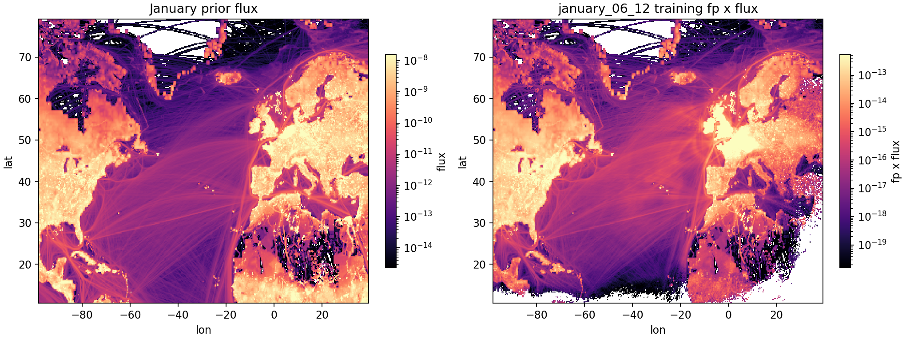
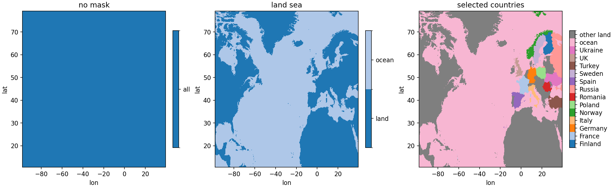
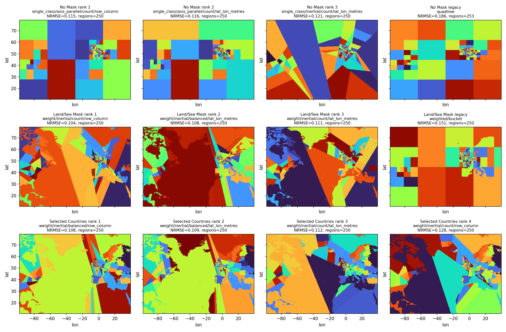
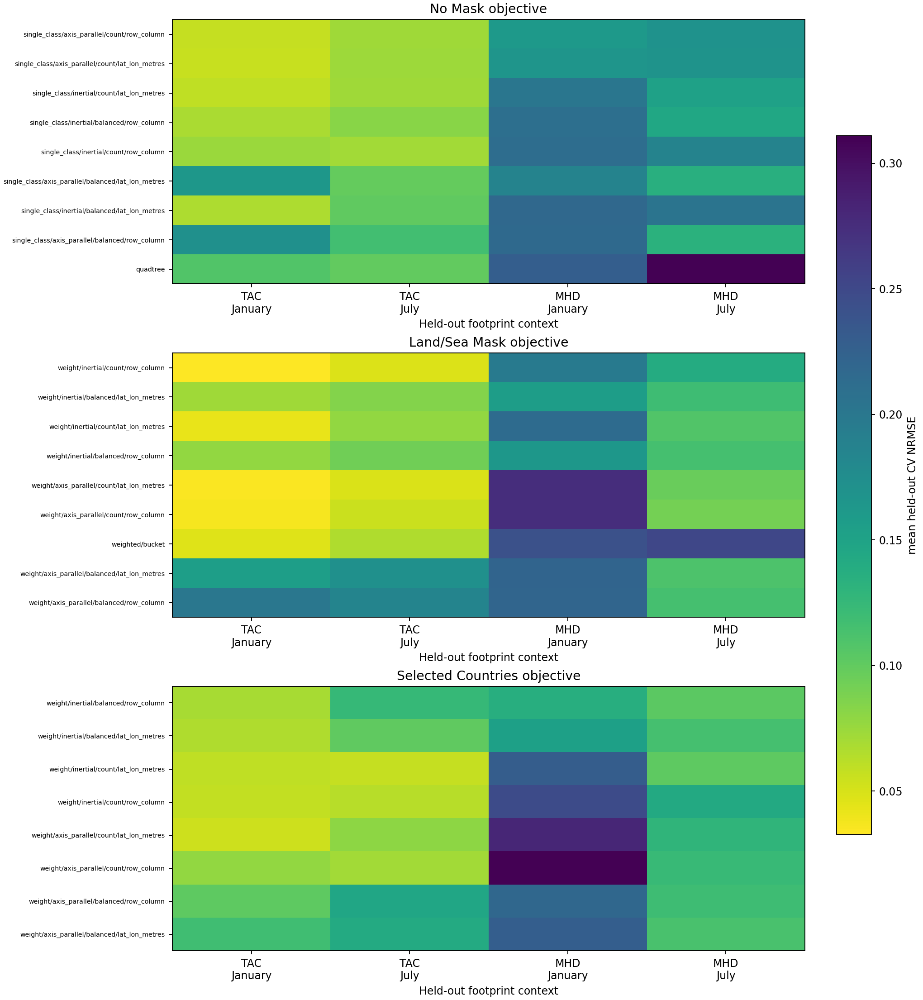
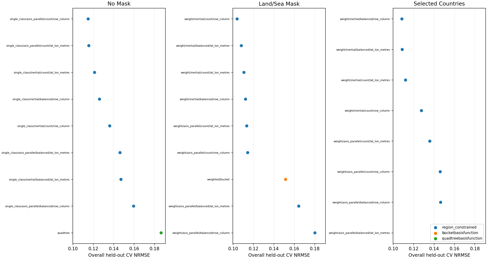

# Constrained Basis Algorithm Options

This page explains the lower-level constrained basis algorithms and compares 250-target-region variants on Blue Pebble OpenGHG data.

## How The Algorithm Is Built

The constrained basis path is a small orchestration framework rather than one fixed algorithm. The caller supplies a two-dimensional importance field, `weights`, and a two-dimensional `region_classes` mask. The algorithm partitions each mapped class independently, then offsets labels so basis labels are globally unique and never cross class boundaries.

The independently variable pieces are:

- **Region classes**: no mask, land/ocean, countries, grouped countries, or any caller-supplied class field.
- **Class allocation**: explicit per-class counts, automatic allocation by class total weight, or automatic allocation by cell count. The Blue Pebble score matrix below uses only weight allocation for masked objectives.
- **Greedy orchestration**: repeatedly split the currently highest-weight partition until the target is reached or no acceptable split remains.
- **Partition step**: axis-parallel row/column splits or inertial principal-axis splits.
- **Split mode**: count-based splits or balanced splits near half parent weight.
- **Geometry**: row/column index geometry or local lat/lon metre geometry for split-shape decisions.
- **Split stopping**: optional policies that reject proposed child regions. When stopping is enabled, the requested region count is an upper target.

The comparison also includes legacy `bucketbasisfunction` and `quadtreebasisfunction` rows generated from the same training weights. Their actual region counts can differ from the 250 target. `bucketbasisfunction` is shown as `weighted/bucket`; in this codebase the `weighted_algorithm` alias uses the land/sea weighted bucket splitter, so it is grouped with the land/sea objective. `quadtreebasisfunction` is shown as `quadtree` and grouped with the no-mask objective.

The important separation is that `weights` define contribution/importance, while `geometry` defines physical coordinates for split shape. Lat/lon geometry does not change contribution weights, class allocation, or posterior weighting. The Blue Pebble generator builds these weights with the same multi-site footprint-times-flux reduction used by the production `basis_functions_wrapper` path.

For the no-mask score rows below, allocation is reported as `single_class` because there is only one class. The generator uses the normal weight-allocation API internally, but no inter-class allocation decision is being tested in that case.

## Option Shorthand

Candidate labels use the format `allocation/split_step/split_mode/geometry`. The objective group is shown separately because no mask, land/sea mask, and selected-country mask answer different scientific basis-design questions.

| shorthand | meaning |
|---|---|
| `no_mask` | one class over the full domain; no hard class boundary is imposed |
| `land_sea` | two hard classes, land and ocean |
| `selected_countries` | ocean, selected countries, and `other_land` are separate classes |
| `single_class` | the no-mask allocation case; there is no inter-class allocation decision |
| `weight` | allocate target regions to classes by total training weight |
| `axis_parallel` | split a region with a row- or column-aligned cut |
| `inertial` | split a region using its principal weighted axis |
| `count` | choose splits by child cell counts |
| `balanced` | choose splits near half of the parent-region weight |
| `row_column` | use grid row/column coordinates when evaluating split shape |
| `lat_lon_metres` | use local metre-scaled longitude/latitude coordinates for split shape |
| `weighted/bucket` | legacy `bucketbasisfunction`; uses the land/sea weighted bucket algorithm |
| `quadtree` | legacy `quadtreebasisfunction`; recursively subdivides the grid without a class mask |
| `CV` | cross-validation; here, temporal holdout scoring with one shared basis per month/split |
| `NRMSE` | RMSE divided by the RMS of the full-grid held-out modelled observation |
| `fp` | OpenGHG/NAME footprint field |
| `H` | basis sensitivity matrix produced by projecting `fp * flux` onto basis regions |
| `CH4` | methane |
| `NAME` | the Numerical Atmospheric-dispersion Modelling Environment transport model |
| `TAC`, `MHD` | Tacolneston and Mace Head measurement sites |

## Blue Pebble Cross-Validation Data

The script reads footprints and CH4 flux from OpenGHG store `shared_store_zarr` on Blue Pebble. It uses TAC 185m and MHD 10m EUROPE NAME inert footprints, and the monthly `edgarv80_wetchartsv131` CH4 flux product.

January and July 2019 are scored separately. Each month uses three temporal CV splits: a one-week holdout starting on days 6, 13, 20, with a two-day buffer excluded before and after the held-out week. For each month/split, one shared basis is built from the combined remaining TAC and MHD in-month training footprints, matching the production multi-site basis objective. Held-out scores are then reported separately for TAC and MHD.

Masked constrained candidates use `weight` allocation only, so the generated evidence focuses on the allocation mode used for the current recommendation.

Per-score-site/month aggregate scores are written to `docs/plans/ogi_048_basis_option_scores.csv`, split-level scores are written to `docs/plans/ogi_048_basis_option_split_scores.csv`, and overall all-score-site/month/split scores are written to `docs/plans/ogi_048_basis_option_overall_scores.csv`. The split-level table contains 312 scored rows and includes `basis_training_sites`, `basis_train_observations`, and `score_site_holdout_observations` to make the shared-basis training set explicit.

## Representative Input Fields

The log-scale maps below show the representative monthly prior flux and the combined training `fp_x_flux` field used to construct the first displayed basis split. The `fp_x_flux` field is normalized before candidate generation, but the plotted field is the unnormalized footprint-times-flux product.

## Region Class Modes

The plots below use three class modes. The selected-country mode treats ocean as one class, keeps selected large European-domain countries as separate classes, and groups all remaining land as `other_land`. The selected countries are: UK, France, Germany, Spain, Italy, Poland, Ukraine, Sweden, Norway, Finland, Turkey, Romania, Russia.

## Held-Out Forward-Model Compression Score

A normal multiplicative prior basis exactly reproduces the prior modelled observations when all basis coefficients are one: summing projected `H` over all regions gives the same `sum(fp * flux)` as the full grid. That direct RMSE is therefore a trivial zero and is not useful for comparing basis shapes.

The score used here is a held-out prior-flux observation-space compression score. For each candidate basis, the prior flux field is approximated by one cell-mean value per basis region. Held-out modelled observations from this projected flux field are compared with held-out modelled observations from the full grid. Lower held-out CV NRMSE means the shared basis preserves the full-grid prior-flux observation response more efficiently on footprints that were not used to construct the basis weights.

Only this held-out CV score is included in these tables and plots. It is still not a posterior-quality metric and does not replace posterior or synthetic-recovery tests.

## Best Representative Basis Maps

The map figure shows the best overall held-out CV candidates by objective, using one representative January basis split for display. No-mask and land/sea rows show the best three constrained candidates plus the matching legacy option. Selected-country has no legacy counterpart, so it shows the best four constrained candidates.

## Grouped Scores For 250-Region Options

The heatmap shows the mean split score for each held-out site/month context, grouped by objective. The ranked plot uses the overall score averaged over all TAC/MHD January/July split rows for each candidate.

### Overall Held-Out CV Scores

| objective | rank | candidate | regions | score rows | basis splits | CV NRMSE | CV RMSE | CV bias | CV corr |
|---|---:|---|---:|---:|---:|---:|---:|---:|---:|
| No Mask | 1 | single_class/axis_parallel/count/row_column | 250.0 | 12 | 6 | 0.1149 | 3.192e-09 | 4.716e-10 | 0.9744 |
| No Mask | 2 | single_class/axis_parallel/count/lat_lon_metres | 250.0 | 12 | 6 | 0.1156 | 3.180e-09 | 5.317e-10 | 0.9742 |
| No Mask | 3 | single_class/inertial/count/lat_lon_metres | 250.0 | 12 | 6 | 0.1212 | 3.024e-09 | 3.251e-10 | 0.9615 |
| No Mask | 4 | single_class/inertial/balanced/row_column | 250.0 | 12 | 6 | 0.1260 | 3.304e-09 | 1.814e-10 | 0.9622 |
| No Mask | 5 | single_class/inertial/count/row_column | 250.0 | 12 | 6 | 0.1361 | 3.368e-09 | 6.705e-10 | 0.9524 |
| Land/Sea Mask | 1 | weight/inertial/count/row_column | 250.0 | 12 | 6 | 0.1040 | 2.147e-09 | 4.150e-10 | 0.9817 |
| Land/Sea Mask | 2 | weight/inertial/balanced/lat_lon_metres | 250.0 | 12 | 6 | 0.1081 | 3.251e-09 | -6.270e-10 | 0.9716 |
| Land/Sea Mask | 3 | weight/inertial/count/lat_lon_metres | 250.0 | 12 | 6 | 0.1106 | 2.646e-09 | 3.566e-10 | 0.9819 |
| Land/Sea Mask | 4 | weight/inertial/balanced/row_column | 250.0 | 12 | 6 | 0.1122 | 3.508e-09 | -8.167e-10 | 0.9702 |
| Land/Sea Mask | 5 | weight/axis_parallel/count/lat_lon_metres | 250.0 | 12 | 6 | 0.1134 | 2.054e-09 | 4.552e-10 | 0.9729 |
| Selected Countries | 1 | weight/inertial/balanced/row_column | 250.0 | 12 | 6 | 0.1085 | 3.768e-09 | -9.790e-10 | 0.9646 |
| Selected Countries | 2 | weight/inertial/balanced/lat_lon_metres | 250.0 | 12 | 6 | 0.1088 | 3.385e-09 | -5.445e-10 | 0.9744 |
| Selected Countries | 3 | weight/inertial/count/lat_lon_metres | 250.0 | 12 | 6 | 0.1121 | 2.489e-09 | -5.627e-11 | 0.9768 |
| Selected Countries | 4 | weight/inertial/count/row_column | 250.0 | 12 | 6 | 0.1277 | 2.767e-09 | -7.820e-12 | 0.9716 |
| Selected Countries | 5 | weight/axis_parallel/count/lat_lon_metres | 250.0 | 12 | 6 | 0.1359 | 3.046e-09 | 2.529e-10 | 0.9715 |

### Best Held-Out CV Scores By Site, Month, And Objective

| objective | score site | month | rank | candidate | regions | CV splits | CV NRMSE | CV RMSE | CV bias | CV corr |
|---|---|---|---:|---|---:|---:|---:|---:|---:|---:|
| No Mask | MHD | January | 1 | single_class/axis_parallel/count/row_column | 250.0 | 3 | 0.1606 | 1.264e-09 | 6.617e-10 | 0.9615 |
| No Mask | MHD | January | 2 | single_class/axis_parallel/count/lat_lon_metres | 250.0 | 3 | 0.1655 | 1.278e-09 | 7.668e-10 | 0.9598 |
| No Mask | MHD | July | 1 | single_class/axis_parallel/balanced/row_column | 250.0 | 3 | 0.1330 | 2.767e-09 | 4.628e-10 | 0.9595 |
| No Mask | MHD | July | 2 | single_class/axis_parallel/balanced/lat_lon_metres | 250.0 | 3 | 0.1358 | 2.834e-09 | 4.703e-10 | 0.9583 |
| No Mask | TAC | January | 1 | single_class/axis_parallel/count/lat_lon_metres | 250.0 | 3 | 0.0560 | 3.302e-09 | -7.940e-10 | 0.9898 |
| No Mask | TAC | January | 2 | single_class/axis_parallel/count/row_column | 250.0 | 3 | 0.0570 | 3.355e-09 | -9.321e-10 | 0.9897 |
| No Mask | TAC | July | 1 | single_class/inertial/count/row_column | 250.0 | 3 | 0.0717 | 4.046e-09 | 1.456e-09 | 0.9883 |
| No Mask | TAC | July | 2 | single_class/inertial/count/lat_lon_metres | 250.0 | 3 | 0.0723 | 4.226e-09 | 9.763e-10 | 0.9876 |
| Land/Sea Mask | MHD | January | 1 | weight/inertial/balanced/lat_lon_metres | 250.0 | 3 | 0.1566 | 9.795e-10 | 5.015e-10 | 0.9564 |
| Land/Sea Mask | MHD | January | 2 | weight/inertial/balanced/row_column | 250.0 | 3 | 0.1636 | 1.084e-09 | -1.178e-10 | 0.9447 |
| Land/Sea Mask | MHD | July | 1 | weight/axis_parallel/count/row_column | 250.0 | 3 | 0.0908 | 1.925e-09 | 1.482e-09 | 0.9904 |
| Land/Sea Mask | MHD | July | 2 | weight/axis_parallel/count/lat_lon_metres | 250.0 | 3 | 0.0959 | 1.997e-09 | 1.354e-09 | 0.9899 |
| Land/Sea Mask | TAC | January | 1 | weight/inertial/count/row_column | 250.0 | 3 | 0.0328 | 1.872e-09 | -3.782e-10 | 0.9963 |
| Land/Sea Mask | TAC | January | 2 | weight/axis_parallel/count/lat_lon_metres | 250.0 | 3 | 0.0348 | 1.884e-09 | -7.661e-10 | 0.9954 |
| Land/Sea Mask | TAC | July | 1 | weight/inertial/count/row_column | 250.0 | 3 | 0.0476 | 2.810e-09 | -2.891e-10 | 0.9959 |
| Land/Sea Mask | TAC | July | 2 | weight/axis_parallel/count/lat_lon_metres | 250.0 | 3 | 0.0480 | 2.769e-09 | 2.143e-10 | 0.9958 |
| Selected Countries | MHD | January | 1 | weight/inertial/balanced/row_column | 250.0 | 3 | 0.1360 | 9.121e-10 | -4.194e-11 | 0.9578 |
| Selected Countries | MHD | January | 2 | weight/inertial/balanced/lat_lon_metres | 250.0 | 3 | 0.1532 | 9.749e-10 | 6.143e-10 | 0.9692 |
| Selected Countries | MHD | July | 1 | weight/inertial/count/lat_lon_metres | 250.0 | 3 | 0.1020 | 2.069e-09 | 1.047e-09 | 0.9909 |
| Selected Countries | MHD | July | 2 | weight/inertial/balanced/row_column | 250.0 | 3 | 0.1034 | 2.078e-09 | 1.148e-09 | 0.9803 |
| Selected Countries | TAC | January | 1 | weight/axis_parallel/count/lat_lon_metres | 250.0 | 3 | 0.0545 | 2.954e-09 | -1.207e-09 | 0.9892 |
| Selected Countries | TAC | January | 2 | weight/inertial/count/row_column | 250.0 | 3 | 0.0588 | 3.121e-09 | -1.087e-09 | 0.9842 |
| Selected Countries | TAC | July | 1 | weight/inertial/count/lat_lon_metres | 250.0 | 3 | 0.0574 | 3.448e-09 | -6.097e-10 | 0.9946 |
| Selected Countries | TAC | July | 2 | weight/inertial/count/row_column | 250.0 | 3 | 0.0629 | 3.778e-09 | -1.159e-09 | 0.9929 |

## Interpretation

- Lower held-out CV NRMSE means the basis preserves the prior forward model better under a region-mean flux-field approximation on held-out footprints.
- Balanced splits often help when the score is dominated by high-contribution areas, but they are not guaranteed to produce visually regular regions.
- Region classes impose hard boundaries, which can help interpretability but can also spend regions on low-contribution classes.
- Lat/lon metre geometry is a physical-coordinate correction. It can change region shapes, especially for inertial or high-latitude splits, but it is not itself a weight-balancing rule.
- The three objective groups should not be read as one single efficiency race. No mask, land/sea, and selected-country masks are often chosen for scientific or reporting reasons as well as basis efficiency.
- Split-stopping policies are not included in the score matrix because they can return fewer than 250 actual regions, making direct comparison less clean.

## What This Does Not Prove

These scores do not show whether an inversion posterior improves. For that, use a posterior or posterior-equivalent test: prior/error-weighted `H`, observation-error weighting, linear-Gaussian posterior covariance and resolution, synthetic truth recovery, or paired HPC-CI posterior runs.
