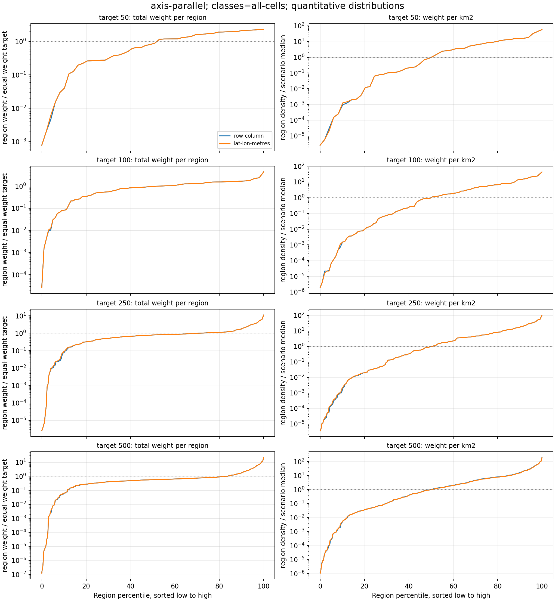
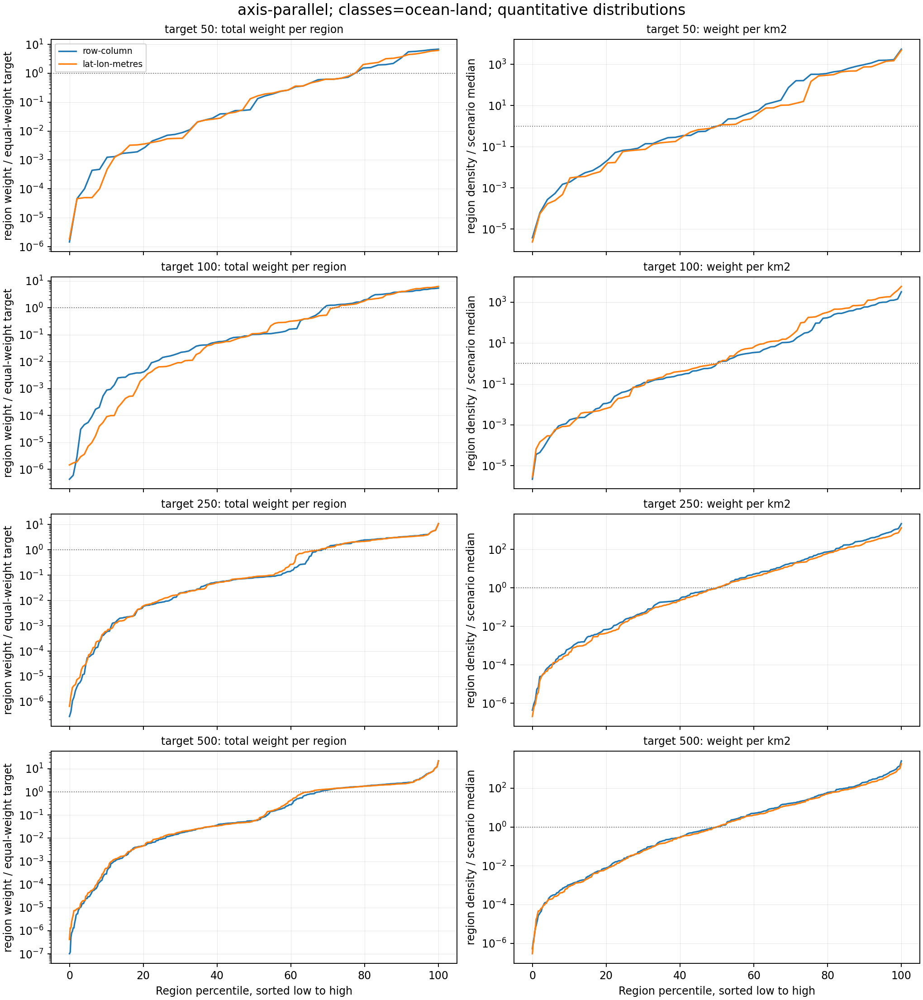
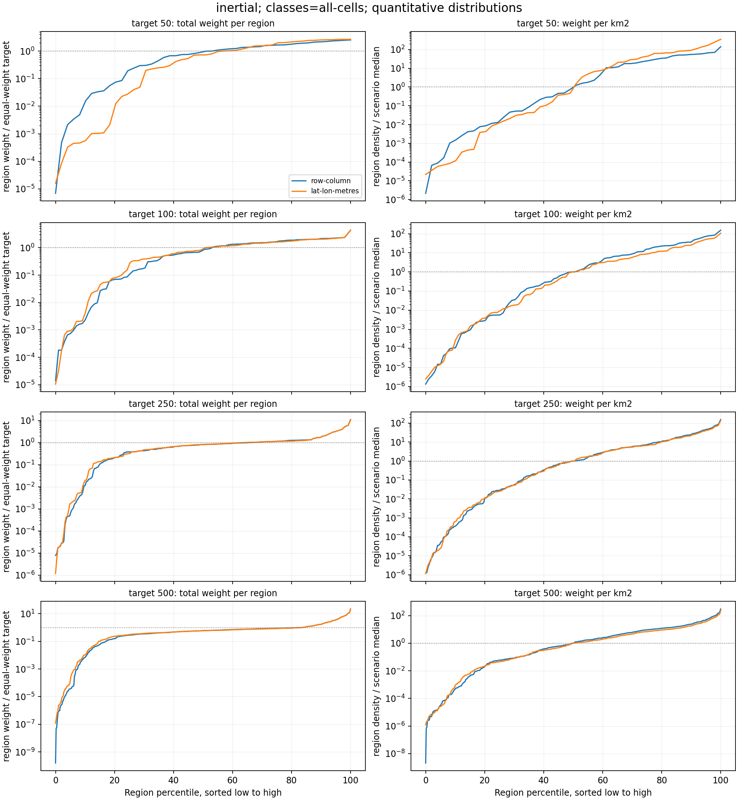
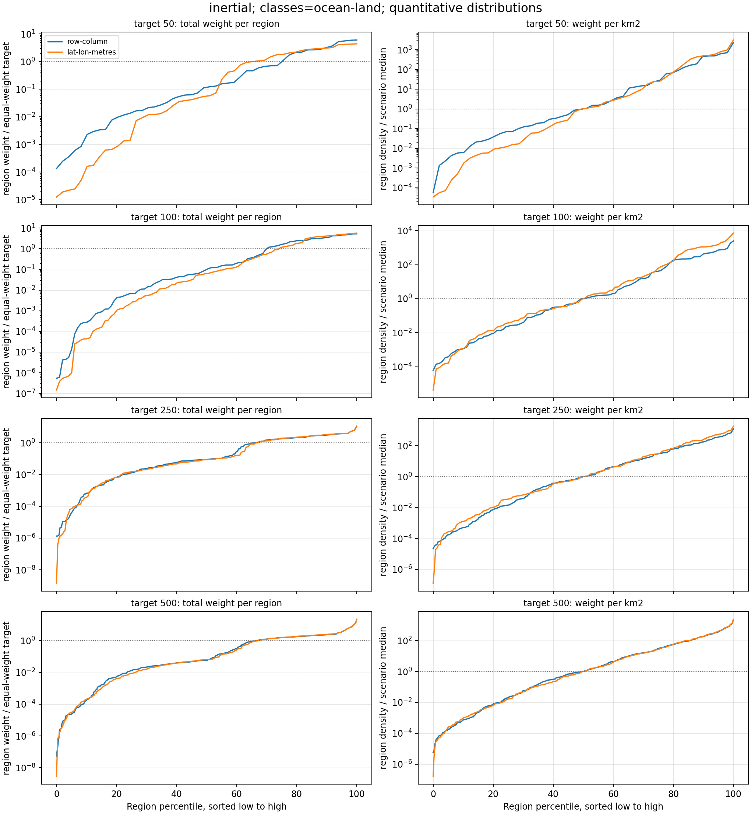
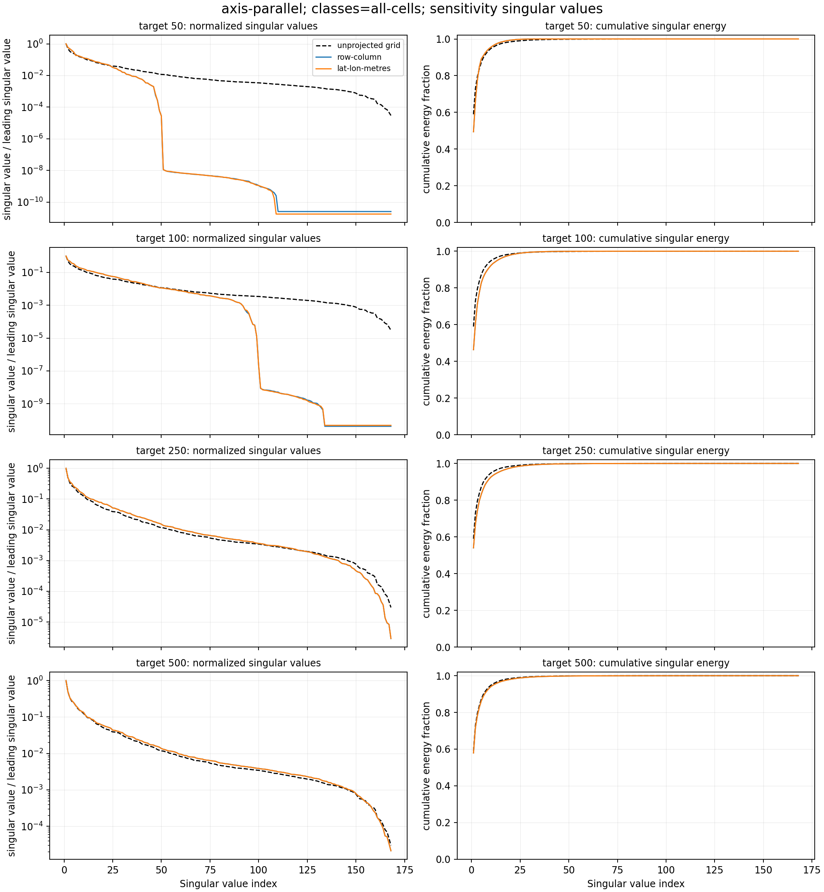
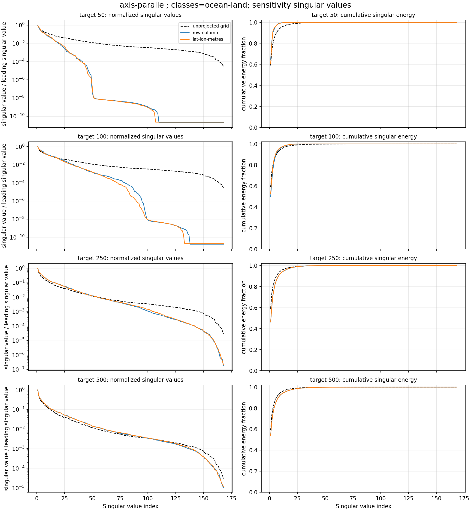
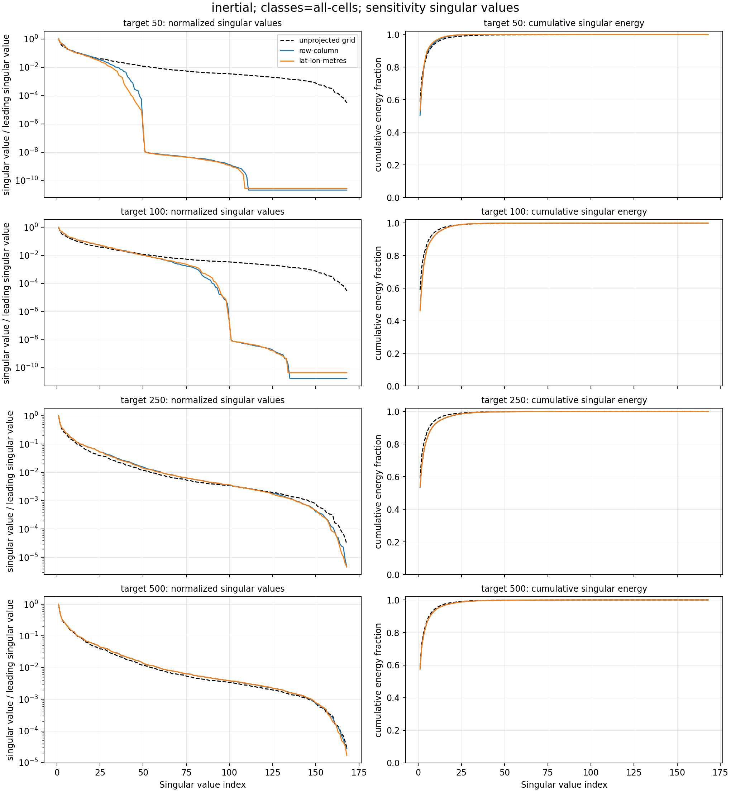
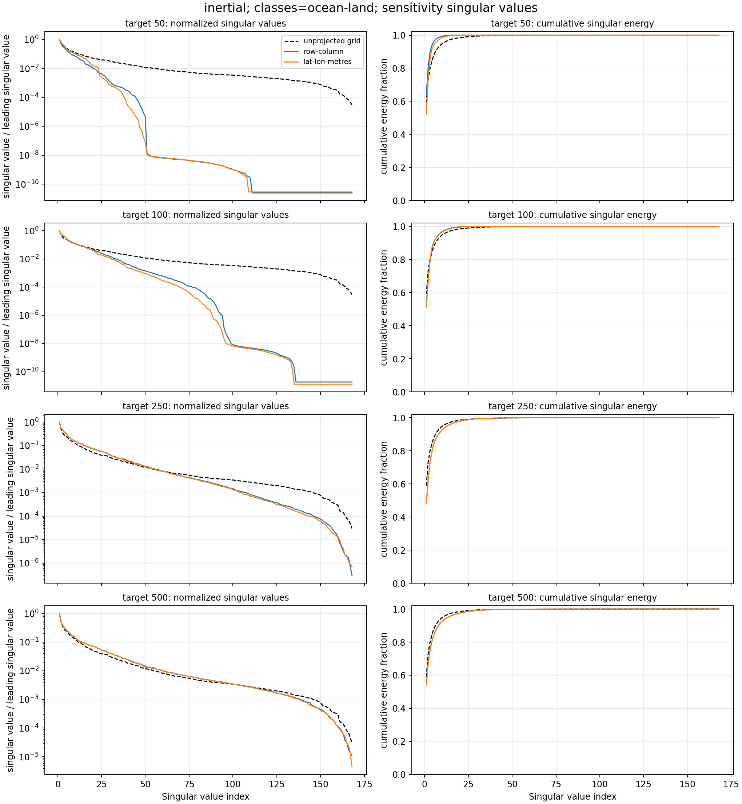

# OGI-048 Visual Evidence: Lat/Lon Split Geometry

Generated from repository test data on the EUROPE grid.

Inputs:

- Flux: `tests/data/flux_total_ch4_europe_edgar7_2019-01-01_2019-12-31_data.nc`.
- Footprint: `tests/data/footprints_tac_europe_name_185m_2019-01-01_2019-01-07_data.nc`.
- Region classes: `tests/data/country_EUROPE.nc`, using country code `0` as an `ocean`/non-country proxy and positive country codes as `land`.
- Existing baseline plots: `bucket_ch4-test_basis_EUROPE_2019.nc` and `quadtree_ch4-test_basis_EUROPE_2019.nc`.

Method:

- Each generated map is wrapped in a `BasisFunctions.from_flat_basis(...)` object before plotting; the script checks the object state dimension and flat-basis round trip.
- `row-column` uses the old count-based coordinate system with no `SplitGeometry`.
- `lat-lon-metres` uses `LatLonGridGeometry.from_dataarray(weights)`.
- `axis-parallel` uses `AxisParallelSplitStep(balanced=False, clean_splits=True, ...)`.
- `inertial` uses `InertialSplitStep(balanced=False, ...)`.
- Class allocation uses `allocation="area"` so the ocean/land split changes class boundaries but not contribution-weight allocation.
- Flux, footprint, and country fixtures have near-identical grids; the script checks dimensions and coordinates before assigning a common test grid.
- Generated labels are checked so no basis label crosses the configured `all`, `ocean`, or `land` class boundary.
- Quantitative metrics use the same normalized footprint-times-flux weights as the splitter, plus spherical latitude/longitude cell-area estimates for density plots.
- Per-region metrics are written to `docs/plans/ogi_048_region_metrics.csv` and scenario summaries to `docs/plans/ogi_048_summary_metrics.csv`.
- Sensitivity singular values use time-resolved `fp_x_flux` from the TAC test footprint and are written to `docs/plans/ogi_048_sensitivity_singular_values.csv` with summaries in `docs/plans/ogi_048_sensitivity_summary.csv`.
- These are algorithm-level visual checks only; PR #482 does not add config or wrapper routing for geometry.

## Generated Basis Matrices

### Axis Parallel All Cells

### Axis Parallel Ocean Land

### Inertial All Cells

### Inertial Ocean Land

## Quantitative Region Metrics

The quantitative plots sort individual generated basis regions from low to high. The left column shows total region weight divided by the equal-weight target for that scenario; higher lower-tail values and lower spread mean fewer very-low-weight regions. The right column shows region weight per estimated square kilometre, normalized by that scenario's median density.

Zero-valued metrics, if present, are clipped to the plotting floor on the log-scale plots.

Readout: in this count-based setup, lat/lon geometry is mainly a geometric correction. It does not systematically improve per-region weight distributions. Axis-parallel all-cell summaries are nearly unchanged, while ocean/land and inertial cases are mixed. That suggests weight-balance improvements should come from balanced splitting, allocation, or split-stopping policy choices rather than geometry alone.

### Axis Parallel All Cells Quantitative

### Axis Parallel Ocean Land Quantitative

### Inertial All Cells Quantitative

### Inertial Ocean Land Quantitative

## Paired Quantitative Summary

For `p10 weight/equal`, higher is better for avoiding low-weight basis regions. For `weight CV`, `weight Gini`, and `density CV`, lower means less spread. These count-based runs are not expected to optimize region weights directly.

| split step | classes | target | p10 weight/equal row | p10 weight/equal metres | weight CV row | weight CV metres | weight Gini row | weight Gini metres | density CV row | density CV metres |
|---|---|---:|---:|---:|---:|---:|---:|---:|---:|---:|
| axis-parallel | all-cells | 50 | 0.039 | 0.039 | 0.771 | 0.771 | 0.439 | 0.439 | 1.786 | 1.786 |
| axis-parallel | all-cells | 100 | 0.082 | 0.082 | 0.713 | 0.713 | 0.380 | 0.380 | 1.718 | 1.718 |
| axis-parallel | all-cells | 250 | 0.076 | 0.092 | 1.225 | 1.224 | 0.485 | 0.484 | 2.052 | 2.052 |
| axis-parallel | all-cells | 500 | 0.061 | 0.063 | 1.894 | 1.894 | 0.590 | 0.589 | 2.547 | 2.546 |
| axis-parallel | ocean-land | 50 | 0.001 | 4.36e-04 | 1.853 | 1.697 | 0.775 | 0.756 | 2.628 | 2.908 |
| axis-parallel | ocean-land | 100 | 8.42e-04 | 8.76e-05 | 1.560 | 1.661 | 0.732 | 0.750 | 2.611 | 2.690 |
| axis-parallel | ocean-land | 250 | 5.64e-04 | 6.01e-04 | 1.588 | 1.548 | 0.725 | 0.713 | 2.691 | 2.554 |
| axis-parallel | ocean-land | 500 | 2.85e-04 | 4.96e-04 | 2.023 | 1.997 | 0.751 | 0.738 | 3.051 | 2.958 |
| inertial | all-cells | 50 | 0.015 | 5.58e-04 | 0.810 | 0.964 | 0.463 | 0.537 | 1.626 | 1.908 |
| inertial | all-cells | 100 | 0.002 | 0.004 | 0.889 | 0.845 | 0.491 | 0.467 | 1.926 | 1.980 |
| inertial | all-cells | 250 | 0.011 | 0.019 | 1.240 | 1.237 | 0.510 | 0.504 | 2.153 | 2.118 |
| inertial | all-cells | 500 | 0.007 | 0.011 | 1.900 | 1.898 | 0.610 | 0.603 | 2.602 | 2.592 |
| inertial | ocean-land | 50 | 0.002 | 1.49e-04 | 1.676 | 1.378 | 0.750 | 0.690 | 2.992 | 3.053 |
| inertial | ocean-land | 100 | 2.77e-04 | 4.38e-05 | 1.554 | 1.694 | 0.733 | 0.763 | 2.724 | 2.874 |
| inertial | ocean-land | 250 | 6.64e-04 | 3.78e-04 | 1.537 | 1.566 | 0.708 | 0.718 | 2.538 | 2.596 |
| inertial | ocean-land | 500 | 1.83e-04 | 2.08e-04 | 2.005 | 2.015 | 0.744 | 0.750 | 2.971 | 2.997 |

## Sensitivity Matrix Singular Values

The unprojected grid sensitivity matrix is built as observations by grid cells from time-resolved `fp_x_flux`. Projected matrices are computed with `BasisFunctions.sensitivity(fp_x_flux)` for each generated basis. Plots compare singular values normalized by the leading singular value and cumulative singular-energy fraction, so they focus on spectrum shape rather than raw scale.

Unprojected grid baseline: 168 observations by 114563 grid-cell states; stable rank 1.696, effective rank 5.193, rank99 25.

Readout: increasing the target region count has a clearer effect on the projected H spectrum than switching from row/column to lat/lon-metre geometry. Geometry changes some low-target ocean/land and inertial spectra, but the paired stable-rank, effective-rank, and rank99 metrics do not show a consistent improvement from geometry alone.

### Axis Parallel All Cells Sensitivity Svd

### Axis Parallel Ocean Land Sensitivity Svd

### Inertial All Cells Sensitivity Svd

### Inertial Ocean Land Sensitivity Svd

### Paired Sensitivity Summary

Stable rank and effective rank summarize spectrum spread; `rank99` is the number of singular modes needed for 99% of singular energy. Higher rank metrics mean the projected H keeps more independent observation-space modes, though this does not by itself imply better posterior behavior.

| split step | classes | target | stable rank row | stable rank metres | effective rank row | effective rank metres | rank99 row | rank99 metres |
|---|---|---:|---:|---:|---:|---:|---:|---:|
| axis-parallel | all-cells | 50 | 2.023 | 2.023 | 5.780 | 5.780 | 18 | 18 |
| axis-parallel | all-cells | 100 | 2.157 | 2.157 | 7.427 | 7.427 | 26 | 26 |
| axis-parallel | all-cells | 250 | 1.852 | 1.851 | 6.470 | 6.466 | 29 | 29 |
| axis-parallel | all-cells | 500 | 1.727 | 1.727 | 5.522 | 5.521 | 28 | 28 |
| axis-parallel | ocean-land | 50 | 1.559 | 1.646 | 3.393 | 3.512 | 9 | 10 |
| axis-parallel | ocean-land | 100 | 2.005 | 1.895 | 5.910 | 5.345 | 17 | 16 |
| axis-parallel | ocean-land | 250 | 2.164 | 2.157 | 7.482 | 7.418 | 26 | 26 |
| axis-parallel | ocean-land | 500 | 1.849 | 1.848 | 6.445 | 6.421 | 29 | 29 |
| inertial | all-cells | 50 | 1.979 | 1.864 | 5.674 | 5.251 | 18 | 17 |
| inertial | all-cells | 100 | 2.130 | 2.165 | 7.014 | 7.166 | 25 | 25 |
| inertial | all-cells | 250 | 1.869 | 1.854 | 6.561 | 6.447 | 30 | 29 |
| inertial | all-cells | 500 | 1.736 | 1.733 | 5.600 | 5.572 | 28 | 28 |
| inertial | ocean-land | 50 | 1.555 | 1.918 | 3.434 | 4.483 | 10 | 12 |
| inertial | ocean-land | 100 | 1.899 | 1.959 | 5.335 | 5.368 | 16 | 15 |
| inertial | ocean-land | 250 | 2.084 | 2.066 | 7.138 | 7.064 | 27 | 26 |
| inertial | ocean-land | 500 | 1.845 | 1.851 | 6.405 | 6.426 | 29 | 29 |

## Scenario Summary

| split step | classes | geometry | target regions | actual regions |
|---|---|---|---:|---:|
| axis-parallel | all-cells | row-column | 50 | 50 |
| axis-parallel | all-cells | row-column | 100 | 100 |
| axis-parallel | all-cells | row-column | 250 | 250 |
| axis-parallel | all-cells | row-column | 500 | 500 |
| axis-parallel | all-cells | lat-lon-metres | 50 | 50 |
| axis-parallel | all-cells | lat-lon-metres | 100 | 100 |
| axis-parallel | all-cells | lat-lon-metres | 250 | 250 |
| axis-parallel | all-cells | lat-lon-metres | 500 | 500 |
| axis-parallel | ocean-land | row-column | 50 | 50 |
| axis-parallel | ocean-land | row-column | 100 | 100 |
| axis-parallel | ocean-land | row-column | 250 | 250 |
| axis-parallel | ocean-land | row-column | 500 | 500 |
| axis-parallel | ocean-land | lat-lon-metres | 50 | 50 |
| axis-parallel | ocean-land | lat-lon-metres | 100 | 100 |
| axis-parallel | ocean-land | lat-lon-metres | 250 | 250 |
| axis-parallel | ocean-land | lat-lon-metres | 500 | 500 |
| inertial | all-cells | row-column | 50 | 50 |
| inertial | all-cells | row-column | 100 | 100 |
| inertial | all-cells | row-column | 250 | 250 |
| inertial | all-cells | row-column | 500 | 500 |
| inertial | all-cells | lat-lon-metres | 50 | 50 |
| inertial | all-cells | lat-lon-metres | 100 | 100 |
| inertial | all-cells | lat-lon-metres | 250 | 250 |
| inertial | all-cells | lat-lon-metres | 500 | 500 |
| inertial | ocean-land | row-column | 50 | 50 |
| inertial | ocean-land | row-column | 100 | 100 |
| inertial | ocean-land | row-column | 250 | 250 |
| inertial | ocean-land | row-column | 500 | 500 |
| inertial | ocean-land | lat-lon-metres | 50 | 50 |
| inertial | ocean-land | lat-lon-metres | 100 | 100 |
| inertial | ocean-land | lat-lon-metres | 250 | 250 |
| inertial | ocean-land | lat-lon-metres | 500 | 500 |

## Notes For PR Review

- The clearest visual difference is expected at high latitudes, where one degree of longitude is physically shorter than one degree at lower latitudes.
- The ocean/land split should prevent a generated label from crossing the ocean/land class boundary.
- Inertial splits use physical coordinates for projection only when `LatLonGridGeometry` is supplied.
- In this count-based setup, geometry changes the shape and physical interpretation of splits but does not by itself make the greedy priority weight-balanced.
- Sensitivity singular values compare observation-space rank retention, not spatial smoothness or posterior uncertainty directly.
- Color values are label IDs, so colors are useful for shape inspection but should not be interpreted as stable region identity across panels.
