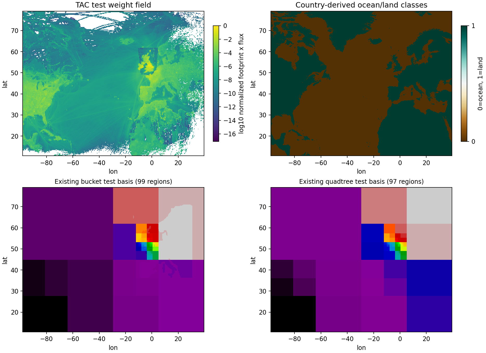
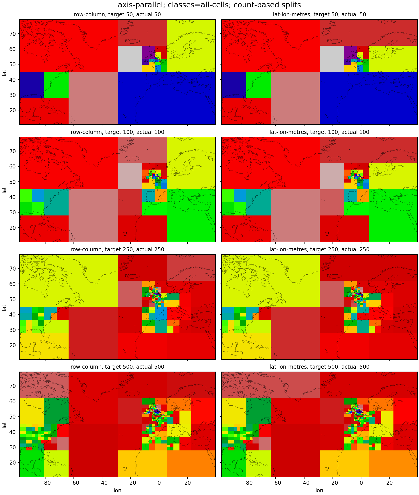
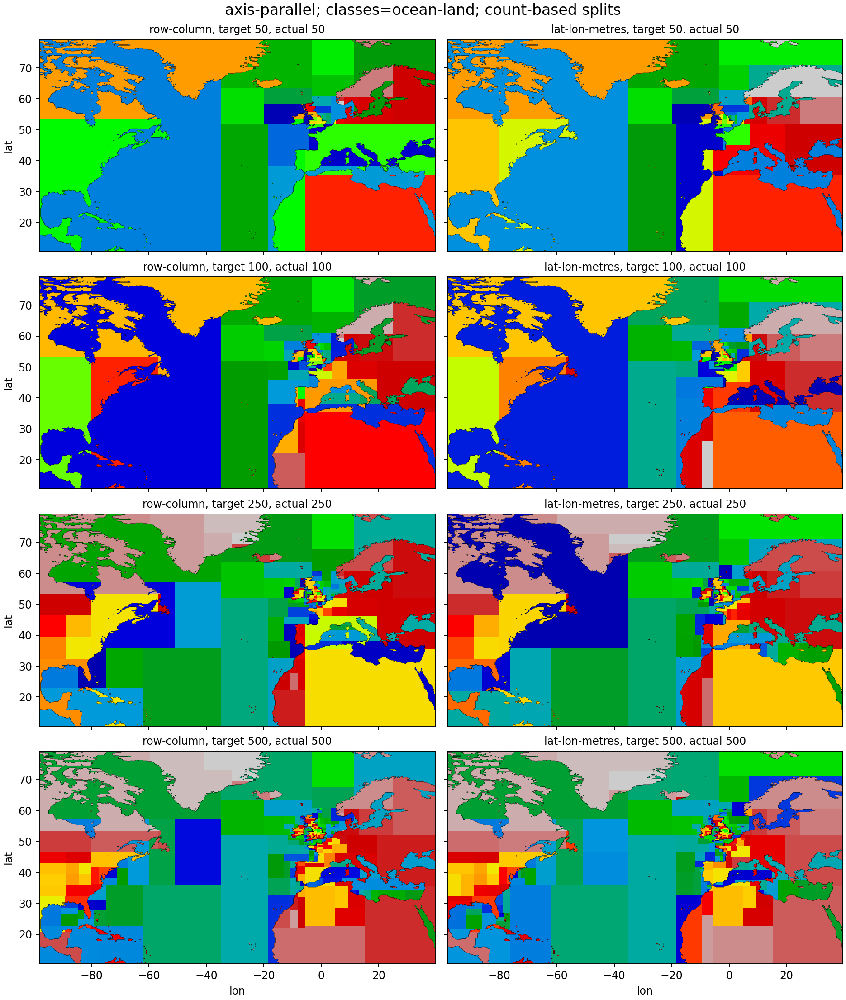
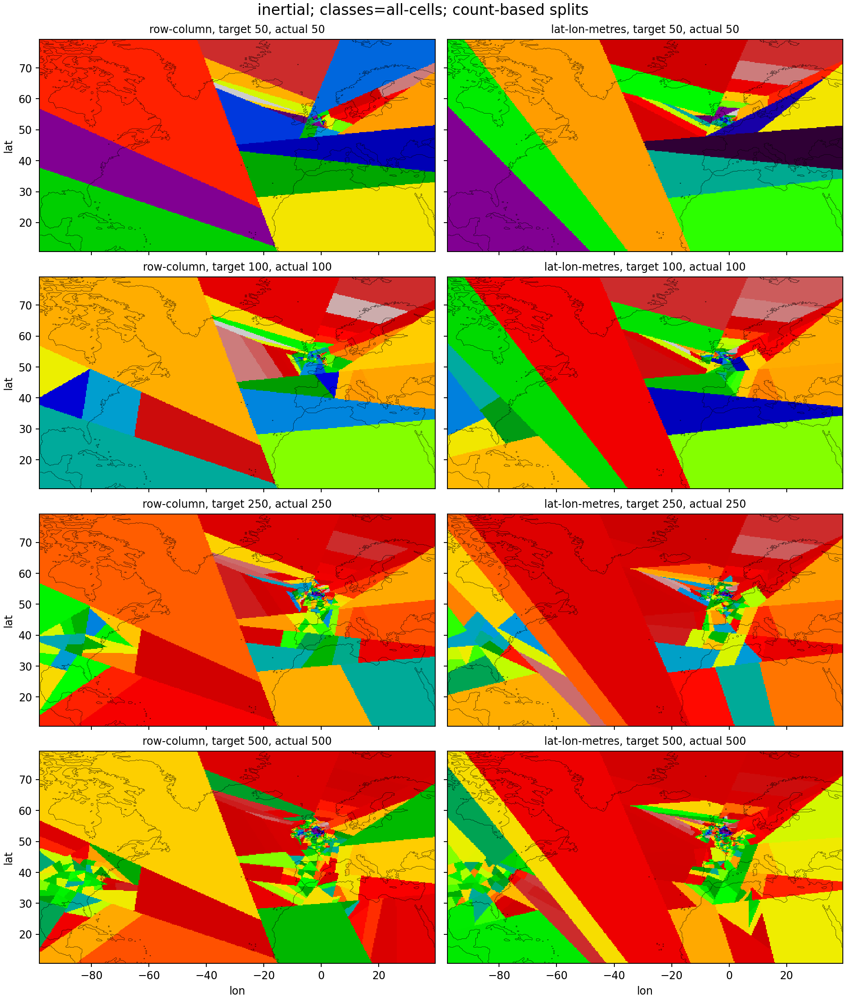
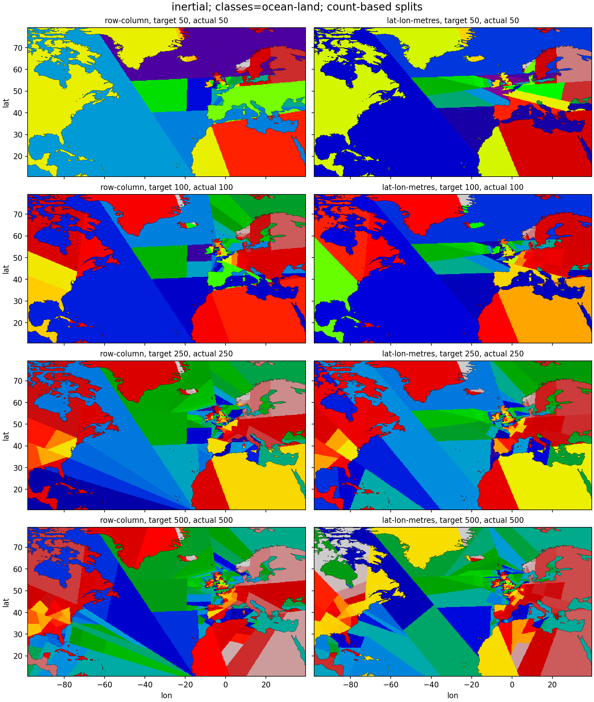

# OGI-048 Visual Evidence: Lat/Lon Split Geometry

Generated from repository test data on the EUROPE grid.

Inputs:

- Flux: `tests/data/flux_total_ch4_europe_edgar7_2019-01-01_2019-12-31_data.nc`.
- Footprint: `tests/data/footprints_tac_europe_name_185m_2019-01-01_2019-01-07_data.nc`.
- Region classes: `tests/data/country_EUROPE.nc`, using country code `0` as an `ocean`/non-country proxy and positive country codes as `land`.
- Existing baseline plots: `bucket_ch4-test_basis_EUROPE_2019.nc` and `quadtree_ch4-test_basis_EUROPE_2019.nc`.

Method:

- Each generated map is wrapped in a `BasisFunctions.from_flat_basis(...)` object before plotting; the script checks the object state dimension and flat-basis round trip.
- `row-column` uses the old count-based coordinate system with no `SplitGeometry`.
- `lat-lon-metres` uses `LatLonGridGeometry.from_dataarray(weights)`.
- `axis-parallel` uses `AxisParallelSplitStep(balanced=False, clean_splits=True, ...)`.
- `inertial` uses `InertialSplitStep(balanced=False, ...)`.
- Class allocation uses `allocation="area"` so the ocean/land split changes class boundaries but not contribution-weight allocation.
- Flux, footprint, and country fixtures have near-identical grids; the script checks dimensions and coordinates before assigning a common test grid.
- Generated labels are checked so no basis label crosses the configured `all`, `ocean`, or `land` class boundary.
- These are algorithm-level visual checks only; PR #482 does not add config or wrapper routing for geometry.

## Generated Basis Matrices

### Axis Parallel All Cells

### Axis Parallel Ocean Land

### Inertial All Cells

### Inertial Ocean Land

## Scenario Summary

| split step | classes | geometry | target regions | actual regions |
|---|---|---|---:|---:|
| axis-parallel | all-cells | row-column | 50 | 50 |
| axis-parallel | all-cells | row-column | 100 | 100 |
| axis-parallel | all-cells | row-column | 250 | 250 |
| axis-parallel | all-cells | row-column | 500 | 500 |
| axis-parallel | all-cells | lat-lon-metres | 50 | 50 |
| axis-parallel | all-cells | lat-lon-metres | 100 | 100 |
| axis-parallel | all-cells | lat-lon-metres | 250 | 250 |
| axis-parallel | all-cells | lat-lon-metres | 500 | 500 |
| axis-parallel | ocean-land | row-column | 50 | 50 |
| axis-parallel | ocean-land | row-column | 100 | 100 |
| axis-parallel | ocean-land | row-column | 250 | 250 |
| axis-parallel | ocean-land | row-column | 500 | 500 |
| axis-parallel | ocean-land | lat-lon-metres | 50 | 50 |
| axis-parallel | ocean-land | lat-lon-metres | 100 | 100 |
| axis-parallel | ocean-land | lat-lon-metres | 250 | 250 |
| axis-parallel | ocean-land | lat-lon-metres | 500 | 500 |
| inertial | all-cells | row-column | 50 | 50 |
| inertial | all-cells | row-column | 100 | 100 |
| inertial | all-cells | row-column | 250 | 250 |
| inertial | all-cells | row-column | 500 | 500 |
| inertial | all-cells | lat-lon-metres | 50 | 50 |
| inertial | all-cells | lat-lon-metres | 100 | 100 |
| inertial | all-cells | lat-lon-metres | 250 | 250 |
| inertial | all-cells | lat-lon-metres | 500 | 500 |
| inertial | ocean-land | row-column | 50 | 50 |
| inertial | ocean-land | row-column | 100 | 100 |
| inertial | ocean-land | row-column | 250 | 250 |
| inertial | ocean-land | row-column | 500 | 500 |
| inertial | ocean-land | lat-lon-metres | 50 | 50 |
| inertial | ocean-land | lat-lon-metres | 100 | 100 |
| inertial | ocean-land | lat-lon-metres | 250 | 250 |
| inertial | ocean-land | lat-lon-metres | 500 | 500 |

## Notes For PR Review

- The clearest visual difference is expected at high latitudes, where one degree of longitude is physically shorter than one degree at lower latitudes.
- The ocean/land split should prevent a generated label from crossing the ocean/land class boundary.
- Inertial splits use physical coordinates for projection only when `LatLonGridGeometry` is supplied.
- Color values are label IDs, so colors are useful for shape inspection but should not be interpreted as stable region identity across panels.
