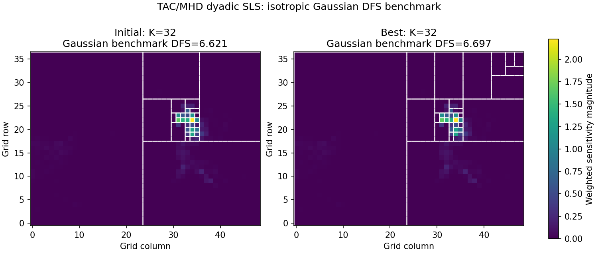

# Why optimise basis partitions?

- A fixed grid spends state-vector capacity where observations carry little information.
- A partition can instead concentrate resolution where footprint-flux sensitivities support it.
- The immediate question is practical: **can local search improve a useful, physically structured starting partition?**

---

# This POC tests one narrow claim

## It demonstrates

- deterministic TAC/MHD design construction
- a proxy-greedy (K=32) dyadic initializer
- stochastic local improvement of Gaussian benchmark DFS
- reproducible search traces and partition visualisation

## It does not claim

- posterior inference over partitions
- an optimal or inferred number of regions
- a Bocquet-consistent projected prior covariance
- production-equivalent observation error treatment

---

# TAC/MHD footprints and annual CH\(_4\) flux build the design

1. Load 23 MHD and 24 TAC hourly observations in frozen regression order.
2. Form fine-grid contributions
   \[
   G_{ic}=\mathrm{footprint}_{ic}\,\mathrm{flux}_c\,10^9.
   \]
3. Use the fixed benchmark
   \[
   R=\operatorname{diag}\{\max(\mathrm{error},\mathrm{min\_error})^2\}.
   \]
4. Sum-coarsen (G) by a factor of 8: (47\times293\times391\rightarrow47\times37\times49).

`min_error` is a minimum-mismatch floor, not the inferred production total-error process.

*Method: `demo_data.py`; frozen fixtures under `tests/data`.*

---

# The search starts from a proxy-greedy (K=32) partition

For candidate tile (v):

\[
h_{iv}=\sum_{c\in v}G_{ic},
\qquad
s_v=\frac{1}{a_v}\sum_i R_{ii}^{-1}h_{iv}^2.
\]

**Cells are summed before squaring.** The initializer repeatedly applies the split with the largest proxy gain until 32 active regions remain.

The displayed background is
\[
\log\!\left(1+\sqrt{\sum_i G_{ic}^2/R_{ii}}\right),
\]
a useful context field rather than the complete tile score.

*Method: `initializers.py`, `objectives.py`, `tac_mhd_sls.gif`.*

---

# Fixed-(K) search changes shape without changing dimension

1. Merge one active sibling pair.
2. Split another compatible active tile.
3. Score the candidate with Gaussian benchmark DFS:

\[
D(P)=K-\operatorname{tr}\!\left[
(B_P^{-1}+H_P^T R^{-1}H_P)^{-1}B_P^{-1}
\right].
\]

Improvements are accepted; losses (L) may be accepted with probability \(\exp(-L/T)\). The run used 100 pilot proposals, 300 evaluations, and a cooling schedule ending with zero-temperature polishing.

This is stochastic optimisation, **not posterior sampling**.

*Method: `proposals.py`, `search.py`, `tac_mhd_sls_manifest.json`; DFS inspired by Bocquet, Wu & Chevallier.*

---

# Local search improved the benchmark from the greedy start

| Diagnostic recomputation | Initial | Best |
|---|---:|---:|
| Combined TAC/MHD DFS | 6.6213868511 | 6.6969787847 |
| MHD-only DFS | 2.2306430146 | 2.2599799610 |
| TAC-only DFS | 4.7197859243 | 4.7464773740 |

Site-only values are separate recomputations and are not additive contributions to combined DFS.

*Source: `tac_mhd_sls_summary.png`, `tac_mhd_sls_manifest.json`.*

---

# Full-week data scale variable-\(K\) search to 333 observations

- 165 MHD + 168 TAC aligned hourly rows; no missing-hour imputation
- contributions: \(333\times293\times391\rightarrow333\times37\times49\) at factor 8
- start: \(K=24\), DFS \(=5.8787660714\)
- best utility state: \(K=31\), DFS/utility \(=5.8968695574\), zero penalty
- final search state: \(K=21\), DFS \(=5.8772821075\)
- 600 evaluations; 366 accepted; about 1 s excluding rendering

\[
U(P)=D(P)-\lambda\max\{0,K(P)-32\}.
\]

The run uses independent split/merge plus 20% paired moves. Because the reported best state is below the free threshold, its penalty is zero. Here \(\lambda=0.03\) shapes exploration above \(K=32\); it is **not a prior, posterior, or proof that \(K=31\) is optimal**.

A same-seed sensitivity check gave a non-monotone response in \(K\) and DFS across \(\lambda\), showing that the finite stochastic path and temperature calibration dominate; \(\lambda\) does not provide a stable estimate of \(K\).

Hourly error benchmark:

- MHD combines repeatability with within-hour variability. Singleton MHD hours retain zero variability because repeatability remains positive.
- TAC uses pooled variability; zero pooled variability is replaced by the site median.
- The percentile minimum-error floor is selected for every row: MHD 165/165, floor 43.210 ppb versus observed hourly errors 1.485–26.063 ppb; TAC 168/168, floor 42.863 ppb versus 0.467–16.360 ppb.

Therefore the detailed hourly error differences do not affect \(R\) in this selected benchmark. The fixed covariance remains non-production. The GIF and trace track persistent best DFS separately from best utility.

*Source: `tac_mhd_week_variable_k_summary.png`, `tac_mhd_week_variable_k_manifest.json`.*

---

# The covariance is deliberately provisional

## Current benchmark

\[
B_P=\tau^2 I_K
\]

The same isotropic regional covariance is used for every partition.

## Scale-consistent target

\[
B_P=PBP^T
\]

Start from a fine-grid covariance (B) and project it for each partition. Reusing one numerical (B_P) breaks the Bocquet construction's transformation assumption.

The implementation already accepts a partition-dependent covariance builder; the search machinery need not change.

*Method: `objectives.py`; covariance design inspired by Bocquet, Wu & Chevallier.*

---

# The core POC now covers fixed and variable \(K\)

## Working now

- exact unpadded dyadic tree and multiscale pre-summed design
- proxy-greedy and random initializers
- fixed-\(K\) paired search on the 47-row fixture
- variable-\(K\) independent split/merge moves
- full-week 333-row TAC/MHD adapter

## Next experiments

1. **Land/sea:** diagnose boundary crossing and test an explicit constraint.
2. **Prior consistency:** implement \(B_P=PBP^T\) and compare conclusions.
3. **Search robustness:** use multiple seeds, longer runs, and decouple schedule calibration from utility.
4. **Posterior integration:** only after the optimisation benchmark is understood.

*Status: `dyadic_sls_hackathon.md`; background: `dyadic_partition_inference.md`.*

---

# Takeaway

**The design-score gain persisted on a larger, variable-\(K\), full-week run, but the selected \(K\) remained unstable.**

The next tests are search robustness, projected-prior consistency, land/sea treatment, and posterior integration.
