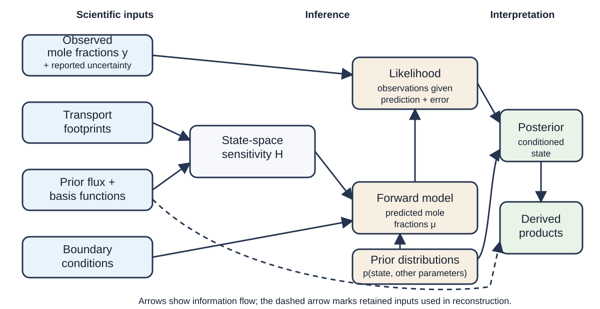

How an Atmospheric Inversion Works
==================================

An atmospheric inversion asks which surface fluxes are consistent with a set
of atmospheric mole-fraction observations, a model of atmospheric transport,
and stated assumptions about the fluxes and errors. RHIME answers this question
with a posterior distribution over a finite set of flux-scaling state
parameters and, depending on the selected recipe, boundary-condition and error
parameters.

The result is not a direct measurement of every flux grid cell. It is a
conditional estimate: the observations directly constrain combinations of the
state that the observing network and transport connect to those observations.
Prior relationships can also update correlated state parameters indirectly.
This page explains that path before you choose a RHIME workflow.

From observations to a posterior
--------------------------------

ter the model. The likelihood and prior distributions produce a posterior. Posterior samples and retained scientific inputs produce derived products.
   :width: 100%
   :align: center

   Project-authored conceptual schematic maintained with these docs. The
   source--receptor relationship follows Seibert and Frank (2004), and the
   Bayesian inversion structure follows Ganesan et al. (2014); full references
   are listed below. The dashed arrow indicates that derived products may also
   use retained inputs and reconstruction metadata. The diagram is a general
   map, not the specification of a particular RHIME recipe.

The journey has seven parts:

1. **Observe atmospheric mole fractions.** Each observation represents a gas
   measurement at a site and inlet over a sampling or averaging interval. This
   introduction focuses on surface observations: direct measurements of
   atmospheric mole fraction at a fixed location. The reported uncertainty
   describes measurement information available to the inversion; it does not
   include every possible model error.

2. **Describe where the sampled air has been.** A transport model supplies a
   footprint for each observation. A footprint is a receptor-oriented
   sensitivity: it describes how a surface flux at an upstream place and time
   would influence the mole fraction at the measurement. It is not a flux map.
   This source--receptor interpretation is described by `Seibert and Frank
   (2004) <https://doi.org/10.5194/acp-4-51-2004>`_.

3. **Choose a reference flux and a state representation.** A prior flux is the
   chosen reference surface-exchange field for this inversion, before the
   selected observations update its state parameters. A basis or state
   operator defines how a finite state vector maps onto the gridded field. RHIME
   combines the footprint, reference flux, and basis representation into a
   sensitivity matrix, conventionally called :math:`H`. The meaning of one state
   parameter depends on the selected basis operator; it is not always one
   independently estimated grid cell. Reducing a spatial field to a state
   vector can leave unresolved variability, as discussed by `Kaminski et al. (2001)
   <https://doi.org/10.1029/2000JD900581>`_.

4. **Represent air entering the regional domain.** A finite regional transport
   calculation does not describe the complete earlier history of an air mass.
   Boundary conditions represent mole fractions entering the model domain.
   A recipe may keep their contribution fixed or infer scaling state parameters
   for it.

5. **Run the forward model.** The model maps proposed state parameters to
   predicted mole fractions at the observation points. In a simple
   one-component case, its mean has the form

   .. math::

      \mu = Hx + H_{bc}b + o,

   where :math:`x` contains the flux-scaling state, :math:`H_{bc}b` is an
   optional scaled boundary contribution, and :math:`o` represents any
   additional offset selected by the recipe. A multisector recipe sums one
   :math:`Hx` contribution per
   sector. The :doc:`standard and multisector model page
   <concrete_rhime_model>` gives the equations and exact components for those
   recipes; :doc:`co2_model_family` routes advanced CO₂-family readers.

6. **Compare predictions with observations.** The likelihood states how the
   observed mole fractions are distributed around the forward-model mean. Its
   error model may combine reported observation error with explicitly selected
   model--data mismatch or covariance terms. A fitted mismatch term absorbs
   differences represented by that likelihood; it does not identify whether a
   difference came from transport, fluxes, observations, or another structural
   error.

7. **Condition the state on the data.** Probability distributions on the state
   and other inferred parameters are combined with the likelihood to
   form the posterior. RHIME samples this distribution. Posterior samples can
   then be summarized as scaling estimates, reconstructed flux fields,
   predicted observations, regional totals, or other recipe-supported derived
   products. Hierarchical treatment of atmospheric-inversion uncertainties in
   this modelling lineage is described by `Ganesan et al. (2014)
   <https://doi.org/10.5194/acp-14-3855-2014>`_.

Two different things are often called a “prior”: the **prior flux** is the
reference physical field, while a **prior distribution** expresses uncertainty
about a scaling state parameter or another inferred parameter. RHIME commonly
uses both.

What the result is conditional on
---------------------------------

The posterior is conditional on the observations that were selected and on
the chosen footprints, prior flux, basis or state representation, boundary
conditions, probability distributions, and likelihood. Only uncertainties
represented in that model can be propagated into its posterior. Transport,
boundary, representation, and shared structural errors do not become uncertain
merely because the sampler returns a distribution.

Sensitivity is uneven. A state direction with weak or no sensitivity through
:math:`H` receives little or no direct likelihood information. Its posterior is
then governed mainly by its prior structure and by any correlations or
hierarchy coupling it to informed state directions. Different sectors or
regions can also produce similar signals at the available sites. Consequently,
a close fit in observation space does not by itself:

* prove that a particular source or sector caused an observed signal;
* validate the transport, boundary conditions, or prior flux;
* resolve flux patterns finer than the data and state representation support;
* show that a narrow posterior includes unrepresented systematic uncertainty;
  or
* turn a derived product into an independent observation.

Finite transport windows and transport-model limitations in regional
Lagrangian inversions are discussed by `Vojta et al. (2022)
<https://doi.org/10.5194/gmd-15-8295-2022>`_. These limits make prior- and
posterior-predictive checks, convergence diagnostics, sensitivity tests, and
comparison with independent information part of scientific interpretation,
not optional decoration.

Choose your next page
---------------------

* To select standard, multisector, CO₂-only, or linked CO₂/O₂ guidance, use
  :doc:`model_recipes`.
* To run a standard one-component or multisector inversion, start with the
  current :doc:`RHIME terminology and Python quickstart <rhime>` and use the
  :doc:`command-line guide <cli>` when you prefer a configuration file.
* To separate preparation, prior prediction, sampling, diagnosis, and
  postprocessing into inspectable artifacts, follow :doc:`staged_workflow`.
* To inspect standard or multisector equations, variable roles, priors, and
  likelihood choices, read :doc:`concrete_rhime_model`.
* To understand the data expected by established and legacy workflows,
  continue to :doc:`getting_started`.

Glossary
--------

Atmospheric mole fraction
   The amount of a gas relative to the amount of air in a sample. It is the
   observed quantity used by these inversions.

Flux and emission
   A flux is exchange across the surface and can be signed, including uptake.
   An emission is a one-way release to the atmosphere. Use the term matching
   the physical process.

Footprint
   The sensitivity of one receptor observation to upstream surface fluxes over
   space and time, calculated by an atmospheric transport model.

Prior flux
   A reference surface-flux field used to construct the forward sensitivity
   and reconstruct physical fluxes.

Prior distribution
   A probability distribution for an inferred state parameter or other
   parameter before the selected observations are used.

Boundary condition
   Mole fractions assigned to air entering from outside the domain or
   predating the finite transport window. Transport maps these values to a
   receptor contribution that forms part of the modelled background.

Basis function, state, and scaling
   Basis functions define how a finite **state vector** maps onto the flux
   grid. RHIME projects gridded footprint--reference-flux sensitivity into the
   matching state-space :math:`H`. A scaling is one possible state parameter that
   modifies the corresponding reference flux.

Forward model
   The calculation that maps proposed flux, boundary, and other state parameters
   to predicted mole fractions at the observations.

Likelihood
   The probability model for the observations conditional on the forward-model
   prediction and the selected error model.

Posterior
   The joint probability distribution of inferred quantities after combining
   the prior distributions with the likelihood for the selected observations.

Model--data mismatch
   A likelihood term representing differences between modelled and observed
   mole fractions beyond the reported observation error. It does not diagnose
   their physical cause.

Posterior predictive
   Simulated observations drawn from the fitted probability model. They support
   checks of whether the fitted model reproduces selected observation-space
   summaries, but do not independently validate transport or source
   attribution. They are not additional measurements.

Derived product
   A quantity calculated from inversion inputs and posterior samples, such as a
   scaled flux field or regional total. Its interpretation inherits the
   inversion's assumptions and limits.

References
----------

* Ganesan, A. L. et al. (2014), “Characterization of uncertainties in
  atmospheric trace gas inversions using hierarchical Bayesian methods”,
  *Atmospheric Chemistry and Physics*, `doi:10.5194/acp-14-3855-2014
  <https://doi.org/10.5194/acp-14-3855-2014>`_.
* Kaminski, T. et al. (2001), “On aggregation errors in atmospheric transport
  inversions”, *Journal of Geophysical Research: Atmospheres*,
  `doi:10.1029/2000JD900581 <https://doi.org/10.1029/2000JD900581>`_.
* Seibert, P. and Frank, A. (2004), “Source-receptor matrix calculation with a
  Lagrangian particle dispersion model in backward mode”, *Atmospheric
  Chemistry and Physics*, `doi:10.5194/acp-4-51-2004
  <https://doi.org/10.5194/acp-4-51-2004>`_.
* Vojta, M. et al. (2022), “A comprehensive evaluation of the use of
  Lagrangian particle dispersion models for inverse modeling of greenhouse gas
  emissions”, *Geoscientific Model Development*, `doi:10.5194/gmd-15-8295-2022
  <https://doi.org/10.5194/gmd-15-8295-2022>`_.
