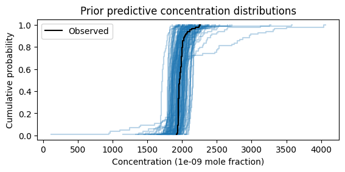
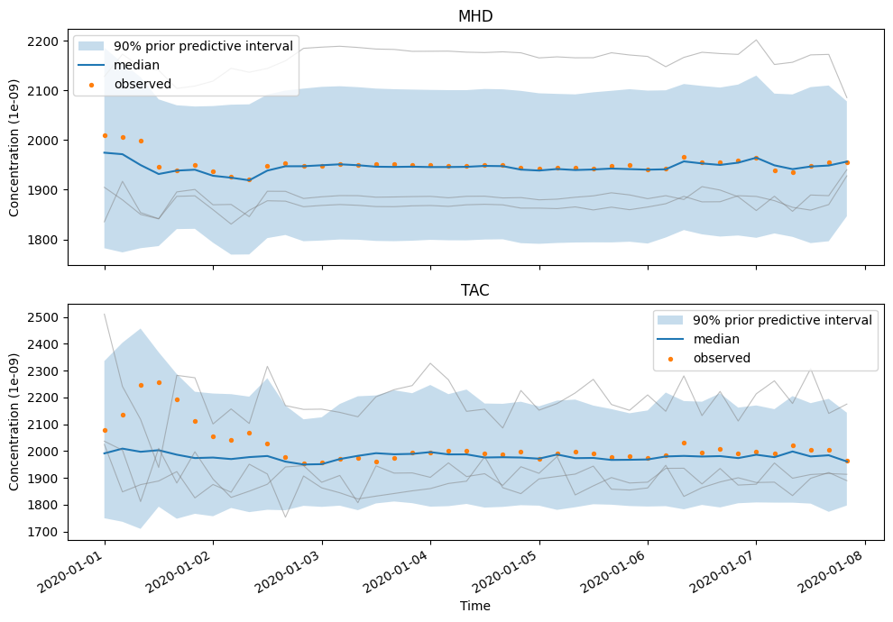
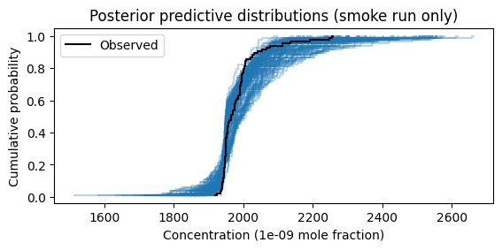

Prior predictive checking tutorial
==================================

This tutorial prepares a standard RHIME inversion, samples simulated
concentrations without sampling a posterior, and uses the result to decide
whether the configured priors and observation model are scientifically
plausible. It then samples the posterior from the same prepared data.

The code and recorded plots form one stateful session. You can
:jupyter-download-notebook:`download it as a Jupyter notebook <prior_predictive_checking>`
to rerun or modify locally after populating the companion store. Run either
the shell commands or their notebook equivalents below, not both.
The downloaded notebook contains the executable cells and recorded text;
rerun it to display plots, and use this page for interpretation and caveats.

.. jupyter-kernel:: python3
   :id: prior_predictive_checking

A prior predictive check asks what observations the complete model could
generate before its unknown parameters are conditioned on the observed
concentrations. RHIME predictions remain conditional on the prepared sites,
times, footprints, flux inventories, boundary inputs, and measurement-error
estimates. The check considers the priors and likelihood together: a prior
that looks innocuous by itself can imply implausible concentrations after
transport, boundary conditions, and model-data mismatch are combined. The
check is a scientific judgement, not a binary test or proof that the priors
are correct.

If ``pollution_events_from_obs=True``, the configured mismatch scale also uses
the observed concentrations. The resulting simulations are a data-dependent
conditional check, not a wholly pre-data prior predictive distribution.

This workflow currently supports the staged ``standard`` and ``multisector``
recipes. This tutorial uses ``standard``. The CO₂ model family does not have a
staged CLI route; in particular, do not treat PyMC's generic prior-predictive
sampling as a substitute for a predictive implementation for models whose
likelihood is represented by a ``Potential``.

Prerequisites
-------------

Install the package and populate the companion tutorial store by following
the :doc:`standard tutorial prerequisites <rhime_standard_tutorial>`. The
commands below use its one-week CH₄ configuration. A different standard RHIME
INI can be substituted once that example works.

The companion-data instructions change into the data checkout while populating
the store. Return to the ``openghg_inversions`` checkout root before continuing;
all remaining shell commands use paths relative to that directory. Then choose
paths for the configuration and artifacts:

.. code-block:: bash

   CONFIG=openghg_inversions/rhime/config/standard_tutorial.ini
   RUN=outputs/prior-check

If the command is not installed in the active environment, prefix each
invocation with ``pixi run -e dev`` from a source checkout. The :doc:`CLI guide
<cli>` describes the supported environment alternatives.

Prepare the data once
---------------------

Run the preparation stage:

.. code-block:: bash

   openghg-inversions prepare \
     --config "$CONFIG" \
     --model standard \
     --output-dir "$RUN/prepare"

This writes ``prepared-inputs.nc`` and ``prepare-manifest.json`` beneath
``$RUN/prepare``. The prepared artifact fixes the observations, sites, times,
footprints, prior flux, boundary conditions, basis, and sensitivities used by
the subsequent stages. It does not contain posterior samples.

In the notebook, use the installed configuration resource and run the same
CLI through the kernel's Python environment. The optional environment
variables let the output recorder isolate its artifacts and record provenance;
locally, outputs go to ``outputs/prior-check``:

.. jupyter-input::

   from importlib.resources import as_file, files
   import json
   import os
   from pathlib import Path
   import subprocess
   import sys

   run = Path(os.environ.get("OPENGHG_TUTORIAL_OUTPUT_PATH", "outputs/prior-check"))
   resource = files("openghg_inversions.rhime").joinpath("config/standard_tutorial.ini")

   def stage(command, *arguments):
       completed = subprocess.run(
           [sys.executable, "-m", "openghg_inversions.cli", command, *map(str, arguments)],
           capture_output=True, text=True,
       )
       if completed.returncode:
           raise RuntimeError(completed.stdout + completed.stderr)
       return completed.stdout

   with as_file(resource) as config:
       stage("prepare", "--config", config, "--model", "standard",
             "--output-dir", run / "prepare")
   prepared_path = run / "prepare/prepared-inputs.nc"
   preparation_manifest = run / "prepare/prepare-manifest.json"
   {
       "OpenGHG Inversions commit": os.environ.get("OPENGHG_TUTORIAL_CODE_REF", "local checkout"),
       "tutorial data": os.environ.get("OPENGHG_TUTORIAL_DATA_TAG", "v1.0.0"),
       "prepared inputs written": prepared_path.is_file(),
   }

.. jupyter-output::

   {'OpenGHG Inversions commit': 'ca468831c6603e4b368680953086c69a6b490d03',
    'tutorial data': 'v1.0.0',
    'prepared inputs written': True}

Generate prior predictions
--------------------------

Start with 500 simulated datasets to see the distribution's broad shape and
tails:

.. code-block:: bash

   openghg-inversions prior-predictive \
     --config "$CONFIG" \
     --model standard \
     --prepared-inputs "$RUN/prepare/prepared-inputs.nc" \
     --preparation-manifest "$RUN/prepare/prepare-manifest.json" \
     --draws 500 \
     --output-dir "$RUN/prior-predictive" \
     --strict

Five hundred draws are illustrative. Increase the count or repeat the check
when rare tails or high-dimensional extreme-series behaviour matters to the
scientific question.

The command builds the configured PyMC model and calls prior-predictive
sampling, but it does not call NUTS or sample a posterior. It writes:

* ``prior-predictive.nc``, a native xarray ``DataTree`` trace artifact; and
* ``prior-predictive-readiness.json``, a machine-readable check result.

``--strict`` exits nonzero if model construction fails or sampled values are
non-finite. A ``pass`` means only that the model produced finite values. It
does **not** mean that the simulated concentrations, variability, or extremes
are scientifically plausible.

The notebook equivalent runs the same finite-value check:

.. jupyter-input::

   with as_file(resource) as config:
       stage("prior-predictive", "--config", config, "--model", "standard",
             "--prepared-inputs", prepared_path,
             "--preparation-manifest", preparation_manifest,
             "--draws", 500, "--output-dir", run / "prior-predictive", "--strict")
   readiness = json.loads((run / "prior-predictive/prior-predictive-readiness.json").read_text())
   {"status": readiness["status"], "message": readiness["message"]}

.. jupyter-output::

   {'status': 'pass', 'message': 'Prior predictive produced 500 finite draws.'}

Inspect the artifact
--------------------

Load the result and inspect its groups and variable names before plotting:

.. jupyter-input::

   from openghg_inversions.serialization import load_trace
   from openghg_inversions.inversion_data import RhimePreparedInputs

   prior = load_trace(run / "prior-predictive/prior-predictive.nc")
   prepared = RhimePreparedInputs.load(prepared_path)
   observations = prepared.inv_inputs["mf"]
   concentration_units = observations.attrs.get("units", "mole fraction")
   {
       "groups": list(prior.children),
       "prior variables": sorted(prior["prior"].data_vars),
       "replicated observations": sorted(prior["prior_predictive"].data_vars),
   }

.. jupyter-output::

   {'groups': ['prior', 'prior_predictive', 'observed_data', 'constant_data'],
    'prior variables': ['bc', 'epsilon', 'mu', 'mu_bc', 'sigma', 'x'],
    'replicated observations': ['y']}

The output should include at least ``prior``, ``prior_predictive``, and
``observed_data``. A missing group means the expected prior-check artifact was
not produced; inspect the readiness JSON and command output before continuing.

The important distinction is:

``prior``
   Samples of parameters and deterministic latent quantities. In the standard
   model, ``mu`` is the flux-derived contribution to the conditional mean,
   ``mu_bc`` is the boundary contribution when boundary conditions are
   enabled, and ``offset`` is present when an offset is enabled. Their sum is
   the latent conditional-mean concentration for each parameter draw.
   ``epsilon`` is the modelled observation-error scale.

``prior_predictive``
   Replicated observations. ``y`` includes the latent expected concentration
   and a new draw from the configured observation model. It is therefore the
   quantity to compare with plausible measurements.

``observed_data``
   The actual concentrations supplied to the likelihood. Overlaying them gives
   context, but prior predictions need not closely reproduce the observed
   series.

For example, compare the distribution of replicated and observed
concentrations:

.. jupyter-input::

   import arviz_plots as azp
   import matplotlib.pyplot as plt

   azp.plot_ppc_dist(
       prior,
       group="prior_predictive",
       var_names=["y"],
       kind="ecdf",
       num_samples=100,
       backend="matplotlib",
       visuals={"remove_axis": False,
                "observed_dist": {"color": "black", "label": "Observed"}},
   )
   plt.gca().set_title("Prior predictive concentration distributions")
   plt.gca().set_xlabel(f"Concentration ({concentration_units} mole fraction)")
   plt.gca().set_ylabel("Cumulative probability")
   plt.gca().legend()
   plt.show()
   "Prior predictive ECDFs: 100 simulated datasets and the observations."

.. jupyter-output::

   'Prior predictive ECDFs: 100 simulated datasets and the observations.'

   Each simulated curve pools both sites and all times; the black curve is
   observed data. Compare magnitudes and tails, not just agreement with the
   observed curve.

``observed_dist`` is explicit because ArviZ hides observed data by default for
a prior predictive plot. This uses the ArviZ 1.x plotting package installed
with the current OpenGHG Inversions dependencies. A flattened comparison can conceal a failure
at one site or during one period, so also inspect the labelled structure. The
prepared artifact supplies the authoritative site/time measurement index:

.. jupyter-input::

   import numpy as np

   measurement_index = prepared.inv_inputs.indexes["nmeasure"]
   sites = measurement_index.get_level_values("site")
   times = measurement_index.get_level_values("time")
   predictions = (
       prior["prior_predictive"]["y"]
       .stack(sample=("chain", "draw"))
       .transpose("sample", "nmeasure")
   )

   site_names = sites.unique().tolist()
   figure, axes = plt.subplots(len(site_names), 1, figsize=(10, 7), squeeze=False)
   for axis, site in zip(axes.flat, site_names):
       positions = np.flatnonzero(sites == site)
       intervals = predictions.isel(nmeasure=positions).quantile(
           [0.05, 0.5, 0.95], dim="sample"
       )
       axis.fill_between(
           times[positions],
           intervals.sel(quantile=0.05),
           intervals.sel(quantile=0.95),
           alpha=0.25,
           label="90% prior predictive interval",
       )
       axis.plot(times[positions], intervals.sel(quantile=0.5), label="median")
       trajectories = predictions.isel(sample=[0, 1, 2], nmeasure=positions)
       axis.plot(
           times[positions],
           trajectories.transpose("nmeasure", "sample"),
           color="0.5",
           alpha=0.5,
           linewidth=0.8,
       )
       axis.scatter(times[positions], observations.isel(nmeasure=positions), s=8,
                    label="observed")
       axis.set_title(site)
       axis.set_xlabel("Time")
       axis.set_ylabel(f"Concentration ({concentration_units})")
       axis.legend()
   figure.autofmt_xdate()
   figure.tight_layout()
   plt.show()
   {"sites": site_names, "concentration units": concentration_units}

.. jupyter-output::

   {'sites': ['MHD', 'TAC'], 'concentration units': '1e-09'}

Here ``1e-09`` denotes a mole-fraction scale of 10⁻⁹, or parts per billion
(ppb); a plotted value of 2000 therefore means 2000 ppb, not 2000 mol/mol.
For other data, use their recorded units rather than assuming this scale.

   Prior predictive intervals, median, and three complete simulated series at
   each site, with observed concentrations. These are pointwise intervals,
   not a simultaneous 90% band for a whole trajectory.

The example produces one panel for MHD and one for TAC. Each panel should show
the observed CH₄ series, three complete simulated series, and the pointwise
90% prior predictive interval in the units printed above. Treat the panels as
a decision point. For example, if a displayed complete series or a substantial
part of the predictive interval has negative CH₄ concentrations, or has
excursions that are incompatible with the configured flux and boundary
scenario, stop and revise the responsible prior or mismatch model. If the
simulated ranges and structures are scientifically defensible, record that
judgement and its basis before continuing. Agreement with every observed point
is not the success criterion.

What to look for
----------------

Judge simulations in the physical units and scientific context of the run.
Useful questions include:

* Do simulated concentrations have plausible magnitudes, signs, variability,
  and extremes?
* Are site-to-site differences and temporal patterns compatible with what the
  transport and boundary inputs could produce?
* Does a meaningful fraction of draws put mass on impossible or scientifically
  absurd outcomes?
* Do individual full simulated series reveal failures hidden by marginal
  intervals or density plots?
* Can an implausible feature be traced to flux scaling, boundary scaling,
  offsets, or the model-data mismatch prior?

The aim is not to make every observation fall inside an extremely wide band.
A useful weakly informative model can generate extreme-but-plausible datasets
while assigning little mass to impossible ones. Choose summaries related to
the scientific question and known failure modes; no finite collection of plots
checks every implication of a model.

Revise and repeat
-----------------

If the simulations are implausible, change the relevant prior or model option
in the configuration and repeat both ``prepare`` and ``prior-predictive`` in a
new output directory. Prior settings are part of the preparation manifest's
configuration identity, so a manifest from the previous configuration is
intentionally rejected. Record why each change is scientifically justified;
repeatedly tuning a prior only to mimic the observed series turns the exercise
into data-dependent model fitting.

Sample the posterior from the checked data
------------------------------------------

When the prior predictive behaviour is credible, pass the same prepared input
and manifest to the posterior stage:

The packaged tutorial configuration uses only 50 tuning and 50 retained draws,
two chains, and disabled convergence checks. Those settings demonstrate the
workflow but are not adequate for scientific interpretation. Increase the
sampler settings and enable convergence checks for a scientific run.
Sampler-only changes do not invalidate the prepared artifact; changes to the
scientific preparation, model, or prior settings require a new preparation.

.. code-block:: bash

   openghg-inversions sample \
     --config "$CONFIG" \
     --model standard \
     --prepared-inputs "$RUN/prepare/prepared-inputs.nc" \
     --preparation-manifest "$RUN/prepare/prepare-manifest.json" \
     --output-dir "$RUN/sample"

This rebuilds the same configured model from the authenticated prepared data,
runs the configured sampler, and writes ``posterior.nc`` and
``sample-manifest.json``. It reuses the data artifact, not the in-memory PyMC
graph from the prior-predictive process.

In the notebook, explicitly reuse the same artifact and manifest:

.. jupyter-input::

   with as_file(resource) as config:
       stage("sample", "--config", config, "--model", "standard",
             "--prepared-inputs", prepared_path,
             "--preparation-manifest", preparation_manifest,
             "--output-dir", run / "sample")
   posterior = load_trace(run / "sample/posterior.nc")
   {"posterior samples": {name: posterior["posterior"].sizes[name]
                          for name in ("chain", "draw")}}

.. jupyter-output::

   {'posterior samples': {'chain': 2, 'draw': 50}}

Next run the staged convergence check:

.. code-block:: bash

   openghg-inversions diagnose \
     --posterior "$RUN/sample/posterior.nc" \
     --sample-manifest "$RUN/sample/sample-manifest.json" \
     --output-dir "$RUN/diagnose"

Inspect the resulting diagnostics, trace behaviour, effective sample sizes,
R-hat, and divergences before interpreting the posterior; see the
:ref:`staged convergence-check contract <staged-convergence-check>`. Then
perform a posterior predictive check:

.. jupyter-input::

   stage("diagnose", "--posterior", run / "sample/posterior.nc",
         "--sample-manifest", run / "sample/sample-manifest.json",
         "--output-dir", run / "diagnose")
   diagnostics = json.loads((run / "diagnose/sampler-convergence.json").read_text())
   {"status": diagnostics["status"], "message": diagnostics["message"]}

.. jupyter-output::

   {'status': 'fail',
    'message': 'Posterior convergence thresholds were exceeded.'}

The deliberately short smoke run is not expected to pass convergence checks.
The next plot demonstrates the mechanics only; it is not evidence that this
posterior is reliable. For scientific work, obtain adequate diagnostics first.

.. jupyter-input::

   azp.plot_ppc_dist(
       posterior,
       group="posterior_predictive",
       var_names=["y"],
       kind="ecdf",
       num_samples=100,
       backend="matplotlib",
       visuals={"remove_axis": False,
                "observed_dist": {"color": "black", "label": "Observed"}},
   )
   plt.gca().set_title("Posterior predictive distributions (smoke run only)")
   plt.gca().set_xlabel(f"Concentration ({concentration_units} mole fraction)")
   plt.gca().set_ylabel("Cumulative probability")
   plt.gca().legend()
   plt.show()
   "Posterior predictive ECDFs: illustration only, not a converged scientific result."

.. jupyter-output::

   'Posterior predictive ECDFs: illustration only, not a converged scientific result.'

   Posterior predictive comparison from the 50-draw smoke run. Apparent
   agreement with observations cannot compensate for inadequate convergence.

Prior and posterior predictive checks answer different questions. The first
tests whether the model's implications before parameter fitting are plausible,
conditional on the prepared inputs described above; the second assesses how
well the fitted model can reproduce relevant features of the observations.
Neither replaces sampler diagnostics, sensitivity analysis, or independent
scientific validation. A prior predictive check is also not simulation-based
calibration, which repeatedly simulates and refits data to test an inference
procedure.

Further reading
---------------

* PyMC, `Prior and Posterior Predictive Checks
  <https://www.pymc.io/projects/docs/en/v5.7.2/learn/core_notebooks/posterior_predictive.html>`_.
* ArviZ, `plot_ppc_dist API
  <https://python.arviz.org/projects/plots/en/stable/api/generated/arviz_plots.plot_ppc_dist.html>`_.
* Stan User's Guide, `Posterior and Prior Predictive Checks
  <https://mc-stan.org/docs/stan-users-guide/posterior-predictive-checks.html>`_.
* Gabry, J. et al. (2019), “Visualization in Bayesian workflow”,
  `doi:10.1111/rssa.12378 <https://doi.org/10.1111/rssa.12378>`_.
* Gelman, A. et al. (2020), “Bayesian Workflow”,
  `arXiv:2011.01808 <https://arxiv.org/abs/2011.01808>`_.

Refreshing the recorded outputs
-------------------------------

From a clean checkout, maintainers can refresh this notebook's text and plots
with the shared recorder:

.. code-block:: console

   $ pixi run -e dev python -m scripts.record_tutorial_outputs --tutorial prior_predictive_checking

The opt-in recorder downloads and verifies the pinned companion data,
populates an isolated store, executes the notebook, and saves displayed PNGs
under ``docs/_static/tutorials``. Review and commit both the refreshed RST and
images. Ordinary documentation builds render the recorded results without
downloading data or sampling; see the :doc:`standard tutorial
<rhime_standard_tutorial>` for the recorder's provenance contract.
