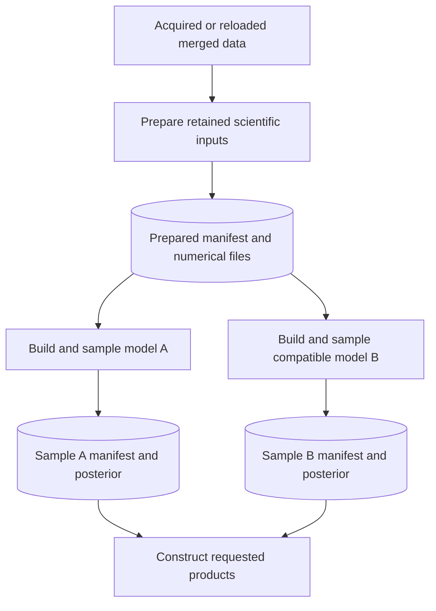

# Design

## Context

This supersedes the OPE-207 plan accepted in [PR #787](https://github.com/openghg/openghg_inversions/pull/787);
see [proposal.md](proposal.md). The inspected base is `devel` at `9b8cac81`.
The unmerged PR #798 is prototype evidence, not
an accepted implementation or artifact contract. The existing change remains
marked superseded rather than archived as completed.

Read this document first, then the three short [execution](specs/recipe-execution/spec.md),
[preparation](specs/prepared-recipe-handoff/spec.md) and
[sample](specs/sampled-recipe-handoff/spec.md) contracts for acceptance details.
The first review decision is the API and ownership below, not a helper hierarchy.

## Goals / Non-Goals

**Goals:** One readable scientific sequence per family; one path for each saved
handoff; reuse prepared science across compatible model choices; reconstruct
products from saved scientific meaning. Follow the repository's
[RHIME development rules](../../../docs/development/rhime_model_development.rst)
and [array ownership rules](../../../docs/plans/numerical_data_ownership_and_execution_boundaries.md).

**Non-goals:** A workflow engine, stage inheritance, plugin registry, universal
recipe class, new numerical codecs, new scientific models or MAP implementation.
Import isolation is separate: graph-free replay forbids graph construction, not
imports of modules that happen to import PyMC.

## Decisions

### 1. A saved handoff is a manifest path

Proposed public Python usage; `preparation`, `model_a`, `model_b` and
`sampler_options` are already resolved choices. These names illustrate the new
API, not functions currently installed:

```python
from openghg_inversions.rhime import standard_stages
from openghg_inversions.rhime.specs import RhimeOutputSpec

prepared = standard_stages.prepare(preparation, output_dir="run/prepared")
a = standard_stages.sample(
    prepared, model=model_a, sampler_options=sampler_options, output_dir="run/a"
)
b = standard_stages.sample(
    prepared, model=model_b, sampler_options=sampler_options, output_dir="run/b"
)
result = standard_stages.postprocess(
    a, output=RhimeOutputSpec(output_format="basic", output_path="run/products")
)
```

`prepared`, `a` and `b` are absolute `Path` values naming completed manifests.
The manifest owns its data references. There is no `config, prepared_inputs,
prepared_manifest` triple, handoff wrapper with a path property, or second output
destination beside `output.output_path`. In-memory products remain available when
no write is requested; requesting a write without a destination is an error.

This activity diagram shows the whole scientific process. A full runner takes
the same preparation/build/inference/products route in memory, omitting the
manifest writes and reads. Each sampling invocation below includes construction.



Prior prediction consumes `prepared, model` plus explicit predictive/check
options and its report destination; it does not need future MCMC/output choices.
Diagnosis remains independently callable with a posterior, optional supported
sample manifest and convergence options. A small CLI selection table chooses the
concrete family module once. Partial families need not implement every operation.

The corresponding proposed CLI calls retain existing command names and remove
the repeated numerical paths:

```sh
openghg-inversions prepare --model standard --config preparation.ini --output-dir run/prepared
openghg-inversions sample --preparation-manifest run/prepared/prepare-manifest.json --config model-a.ini --output-dir run/a
openghg-inversions postprocess --sample-manifest run/a/sample-manifest.json --config products.ini --output-dir run/products
```

The latter two derive family from the authenticated manifest; an optional explicit
family must agree. `model-a.ini` supplies model/sampler choices and `products.ini`
only product choices. One shared config file remains possible. CLI overrides are
resolved once, including mapping `--output-dir` into the sole output policy.

### 2. Choices belong to the phase that can act on them

| Owner | Examples | What passes to the next phase |
| --- | --- | --- |
| Preparation | Acquisition, requested dates/sites, averaging, filters, inventory, basis, `bc_freq`, baked minimum-error values | Prepared arrays and facts about how they were produced |
| Model and inference | Scaling/BC/offset priors, likelihood selection, inference strategy, sampler options | Posterior plus actual model/sampler provenance and scientific output meaning |
| Products | Format, reporting mask, naming, destination and save choices | Scientific result and requested products |

Resolution is explicit and has no I/O or lazy-array computation. The CLI may read
one familiar configuration file and resolve the applicable phase sections; a
staged command does not demand unrelated sections or include them in preparation
identity. A full configured run resolves each applicable section once. Inputs
that cannot apply to the selected phase fail there; irrelevant sections in a
shared file are not presented as options to that phase.

Reuse existing `RhimeModelSpec`, `RhimeOutputSpec`, prepared-input types and
family configuration parsing where their meanings fit. Define bounded immutable
preparation/sampler choices where needed; do not add a universal resolved-config
container. Some old model fields repeat prepared facts (species, domain, source
layout): derive a local builder view from the prepared facts, and reject a caller's
conflicting claim rather than letting it overwrite them. A requested prior is a
new choice; the original requested observation window is a recorded fact.

Copy/freeze nested sampler keyword values at the choice boundary with faithful
list/tuple and supported array-value round trips. Create one local runtime sampler
per inference invocation. Reject `idata_kwargs` keys `coords` and `dims` during
resolution and at the direct sampling boundary; registered model coordinates and
declared variable dimensions remain authoritative.
Keep potentially lazy scientific arrays borrowed, with explicit joint
materialization in construction or serialization, never in configuration access.

### 3. Concrete functions contain the science; stages contain file boundaries

| Concrete owner | Work visible there |
| --- | --- |
| `rhime/preparation.py` and the family preparation module | Filter; derive retained labels; align options; construct basis and sensitivities; assemble inputs |
| `rhime/standard.py`, `rhime/multisector.py`, CO2 model/runner modules | Select required arrays; materialize together; build the scientific graph; execute the appropriate inference |
| `rhime/outputs.py`, family result functions and CO2 output modules | Construct results/products from live or authenticated saved output meaning |
| `rhime/standard_stages.py`, `rhime/multisector_stages.py`, `rhime/co2/stages.py` | Read/authenticate; call the concrete science; write a complete handoff/report |
| Existing artifact/authentication helpers | Versions, relative paths, digests and publication mechanics; no scientific dispatch |

The standard/multisector stage modules are proposed replacements for the combined
`_standard_stages.py`. This is an ownership map, not one new class per row.
Keep a little repeated sequencing when it makes each family readable. Remove
forwarding-only `construct_*`/`build_*` layers and CO2 configuration aliases.
Use the same verb for the same operation across families; preserve differences
that describe different mathematics, such as cached CO2 inference.

The following is pseudocode for one concrete standard family, with conceptual
helper names. Shared file readers return validated records; the family codec loads
numerical data. Full runners call the scientific functions directly.

```python
def prepare(preparation, *, output_dir):
    merged = retrieve_or_reload_rhime_data(preparation)
    prepared = prepare_standard_inputs(merged, preparation)
    # Filtering and retained-site alignment live inside this scientific operation.
    return write_prepared_handoff(prepared, preparation, output_dir)

def sample(prepared_manifest, *, model, sampler_options, output_dir):
    record = authenticate_prepared_record(prepared_manifest)
    prepared = load_standard_inputs(record)
    validate_standard_compatibility(prepared, record.facts, model)
    run_spec = standard_run_spec(record.facts, model, output=no_products)
    started = timer_start()
    built = build_standard_rhime_model_result(prepared=prepared, run_spec=run_spec)
    sampler = sampler_options.create_sampler()
    posterior = sample_rhime_model(built, sampler)
    return write_sample_handoff(
        prepared_manifest, posterior, output_dir=output_dir,
        model_choices=model, output_contract=built.output_contract,
        sampler_provenance=capture_sampler_provenance(sampler),
        build_and_sample_seconds=timer_seconds(started)
    )

def postprocess(sample_manifest, *, output):
    record = authenticate_sample_record(sample_manifest)
    prepared, posterior = load_standard_replay_inputs(record)
    validate_standard_output_associations(record, prepared, posterior, output)
    result = make_standard_rhime_result(
        prepared=prepared, idata=posterior,
        run_spec=standard_run_spec(record.preparation_facts, record.model_choices, output),
        sampler_provenance=record.sampler_provenance,
        output_contract=record.output_contract,
        build_and_sample_seconds=record.build_and_sample_seconds
    )
    make_standard_rhime_outputs(result=result, prepared=prepared)
    return result
```

Consolidate materialization into `build_*_rhime_model_result` with an optional
already-materialized input for established direct callers; custom complete-model
builders still receive borrowed, potentially lazy preparation. This replaces a
wrapper that only materializes then forwards. `make_*_rhime_result` remains a
different operation: it must work without a model for replay. Its replay input
needs only sampler provenance, not a live sampler or callable reconstruction.
Adapt result/output metadata construction to accept that explicit provenance;
keep a live sampler available to existing direct callers, but never instantiate
one merely to replay. `record.preparation_facts` above is loaded from the bound
prepared manifest, not a second serialized copy. Persist actual model choices
and execution metadata; assemble `RhimeRunSpec` locally from those facts.

The local no-products output spec makes existing `RhimeRunSpec` useful for
construction without requesting products at sampling time. Fix the current
`validate_model_build_result` early return for `output_format="none"`: always
validate registration and declared roles; validate a particular requested format
when it is requested. A custom model supporting only `none` remains valid, but
cannot claim unsupported replay products.

CO2's configured full route consumes the same resolved model/sampler/output policy
as its stages. Move `_run_spec`/output setup out of the stage module to the existing
configuration/output owners. Preserve raw runner trace returns. The cached runner
keeps its matched graph, sigma-then-state step, cache updates, prediction and
annotations together; sharing operations must not replace it with generic sampling.

### 4. Records contain facts and references, not an executable configuration

| Record | Minimum contents | Deliberately absent |
| --- | --- | --- |
| Prepared | Version/family; numerical refs and digests; requested window and production choices; retained sites/averaging; units/state layout; baked policy; optional coherent CO2 companion | Future sampler, product policy, full-config equality gate |
| Sampled | Version/family/inference kind; exact prepared-manifest reference and digest; posterior reference/digest; actual model/sampler provenance; bounded replay context; scientific output contract | Original config requirement, live model/steps, separate `output-binding.json` |

Replay context is the small family-owned data needed by existing result functions,
including original dates and retained metadata; never recover dates from min/max
surviving observations. It references immutable preparation facts rather than
copying conflicting versions of them. Record effective configuration for provenance
only: it is not a general-purpose decoder or substitute for typed replay fields.
Callable module/name and arguments are descriptive; replay never imports or
executes them. A custom output that needs execution cannot claim saved replay.

Embed the existing standard/multisector `OutputContract` representation, retaining
its parser and association checks; do not create another output-role schema. CO2
keeps its authenticated trace/affine meaning rather than pretending to be a
multiplicative result. The family-specific payload is deliberately bounded.

```mermaid
sequenceDiagram
    actor Caller
    participant Stage as Concrete postprocess
    participant Files as Artifact helpers
    participant Science as Family outputs
    Caller->>Stage: sample manifest + output choices
    Stage->>Files: Read record; validate versions, refs and digests
    Files-->>Stage: Authenticated record and file locations
    Stage->>Science: Load family inputs and posterior
    Science-->>Stage: Numerical replay inputs
    Stage->>Science: Validate roles, labels, units and requested products
    Stage->>Science: Construct result and products
    Science-->>Caller: Result and requested outputs
```

A manifest uses ordinary relative references from its own directory, including
`../prepared/prepare-manifest.json` from a sibling sample directory. All required
dependencies, including transitive numerical files, are authenticated. Reject
absolute, URI and environment-derived saved references; never consult CWD or
`RUN_ROOT`. Moving the complete referenced tree preserves meaning. A sample
directory alone is not promised to be portable; copying large data is explicit.
The dependency tree is the referenced files, not a new allowed-root registry.

Owned writes stay within the explicit operation destination, which must not
overwrite a published handoff or dependency. Write all numerical files, validate
them, then publish the complete manifest last; errors may leave incomplete files
but no completed handoff. This does not require a transaction engine or concurrent
writers to the same destination. Structural/version and digest checks precede
posterior loading; scientific association checks follow loading and precede any
product writes. A content digest authenticates an association, not the scientific
validity of arbitrary data or the identity of an untrusted author.

### 5. Reuse ends where preparation has encoded a scientific choice

| Proposed change after preparation | Reuse? | Reason |
| --- | --- | --- |
| Standard/multisector scaling, BC or offset prior | Yes, if required arrays/layout exist | Graph-time priors do not rebuild sensitivities |
| Supported likelihood or use of an available minimum-error floor | Yes, if required inputs exist | Check the concrete component's requirements; missing `H_bc`/`min_error` fails |
| Observations, filters, averaging, inventory, basis, `bc_freq` or baked minimum-error values | No | Changes numerical preparation |
| CO2 independent BC/offset prior or compatible mismatch choices | Yes | Leaves the coherent reduced flux calculation intact |
| Native CO2 flux prior/covariance or its reduction operator/projection | No | Prior moments, effective sensitivity, affine intercept and unresolved covariance were derived together |
| Model-specific covariance cache/eigenbasis inputs | Only with matching or rebuilt cache | A valid prepared checkpoint does not validate an unrelated derived cache |
| Product names, destination or compatible reporting mask | Yes, from the sample | Does not change completed inference |

In particular, substituting retained CO2 prior arrays does not produce a coherent
new reduction. Preparation and any native-flux affine companion must agree.
Per-site numeric options validate all supplied values (even dropped-site entries),
require retained coverage, then select retained labels before strict components.
Preparation aligns its own metadata; model options such as per-site mismatch
amplitudes or `tau_hours` are checked at inference against those retained labels.
Do not reintroduce a full-config hash to avoid these concrete compatibility checks.

### 6. Extensions follow the same short route without new framework contracts

| Future addition | Concrete implementation route | Scientific work still required |
| --- | --- | --- |
| Nested stages | Load its prepared inputs; call `build_nested_rhime_model_result`; use nested result/products; add only supported CLI operations | Record/authenticate native grids, projections and output meaning without flattening them into standard inputs |
| Linked CO2/O2 stages | Reuse existing prepared save/load and ordinary/cached runners; expose their shared joint construction, inference and prediction for stages | Bind joint output meaning; preserve species/site groups, shared state, coupled error policy and one joint trace rather than copying station-only CO2 products |
| MAP command | Load/authenticate preparation; build an appropriate ordinary graph; call optimizer; construct a MAP result | Decide point-estimate products and optimizer behavior; do not disguise it as chain/draw posterior or optimize a cached sampling-specific graph by assumption |

For example, a future MAP command can visibly read as
`load_prepared -> build_model -> optimize -> make_map_result`. It needs no
`sample` implementation. If it later needs saved replay, define a MAP result
contract separately; this change's saved inference is explicitly MCMC.

## Risks / Trade-offs

- Shared files can be deleted independently → fail clearly on missing/changed
  dependencies; document how to move/copy the whole tree. No hidden file copying.
- Replay records can drift into serialized application state → admit only fields
  needed by concrete result construction; test replay with original config and
  graph constructors unavailable.
- Phase splitting can merely relocate complexity → require the visible sequences
  above and delete superseded wrappers/aliases in the same implementation slice.
- Scientific coupling limits reuse → use the compatibility table and independent
  scientific references, especially for CO2 reductions and cached inference.
- A broad review can repeat OPE-207 → agree API, records and reuse cases first;
  require one working standard vertical slice before multiplying it across families.

## Migration Plan

This is one planning PR with three bounded capabilities, not three sequential
spec approvals. Mark the old change superseded; do not sync its requirements or
archive it as implemented. PR #798 remains evidence; this PR does not merge or
close it automatically.

Implementation is sequenced in [tasks.md](tasks.md). Start with shared scientific
operations/configuration and a standard end-to-end proof. Keep each handoff
writer, reader and caller together in its implementation PR; port multisector and
CO2 in subsequent reviewable slices after that proof. Avoid a fixed PR count that
forces half-working APIs or a framework-first delivery.

Reset unused stage/setup Python APIs and scientific-stage envelopes/identities;
give new envelopes unambiguous versions and reject older/down-labelled records.
Retain numerical prepared/posterior codecs, product schemas, direct scientific
customization and the optional pre-filter acquisition cache. Preserve diagnosis's
separately declared historical sample schemas (1/2 on the inspected base); its report schema
and support policy are not the scientific handoff contract. Existing readiness
error/catch behavior is specified in the execution capability.
Prototype schema 3 from PR #798 is not an additional mandatory compatibility target.

Keep installed command names and configuration vocabulary where useful, but
replace repeated staged data/config flags with one manifest argument and relevant
phase options. Update CLI help, examples, cookiecutter and acceptance tests
together; document the new call forms and next-minor staged reset. No aliases for
unused Python conventions and no premature `openghg-run` reference. Rollback of
an implementation release restores its code/API together; no automatic conversion
of old/new scientific-stage artifacts is promised.
